# 从零开始学习路线总图

> 本页是整个站点的**总入口**：回答"我要从零学机器人，第一步迈在哪里，然后走哪条路"。
> 体系按大学本科→研究生的教材脉络组织，分为四个阶段。旧版"博士培养"深度内容全部保留为第三阶进阶层。

---

## 一句话路线

**第〇阶补地基（数学+编程+机器人通识）→ 第一阶上本科课（自控原理+SLAM入门+ROS2）→ 第二阶读研究生书（优化+估计+规控）→ 第三阶冲前沿（本站原版深水区 430 篇）**

---

## 四阶段总览

| 阶段 | 名字 | 你将获得 | 对应教材体系 | 预计时长（每天 2-3 h） |
|---|---|---|---|---|
| 第〇阶 | 零基础筑基 | 大学一年级核心数学 + 会写 C++/Python + 认识机器人 | 同济高数/线代、浙大概率论、C++ Primer、Craig 导论 | 4-6 个月 |
| 第一阶 | 本科核心 | 会用控制理论、跑通 SLAM 与 ROS2 工程 | 胡寿松《自动控制原理》、高翔《视觉SLAM十四讲》 | 4-6 个月 |
| 第二阶 | 研究生进阶 | 优化/估计/规划的理论根基 | Boyd《凸优化》、Thrun《概率机器人》、郑大钟《线性系统理论》 | 6-12 个月 |
| 第三阶 | 前沿/博士 | 直通科研与工程前沿 | 论文与开源项目精读（本站原版 430 篇深水区） | 持续 |

> 🌸 品牌意象「樱雷」：樱 = 筑基的耐心，雷 = 前沿的锋芒——Sakura Robotics Lab 一路陪伴你。

---

## 第〇阶 · 零基础筑基（全部为本站新写章节）

三条线可以**并行**推进：数学线 + 编程线每天各 1-1.5 小时，周末补机器人通识。

### 数学线（01_数学/00_大学基础筑基/）

### 编程线（02_C++基础与进阶/）

### 机器人通识线（07_机器人学导论/）

> 🎌 三条线并行推进：数学 + 编程每天各 1-1.5 小时，周末补通识。每章学时与链接见下方表格。

#### 数学线章节表

| 章节 | 学什么 | 学时 |
|---|---|---|
| [00_零基础数学学习地图](../01_数学/00_大学基础筑基/00_零基础数学学习地图.md) | 为什么机器人要数学 + 全线地图 | 0.5 h |
| [10_微积分I](../01_数学/00_大学基础筑基/10_微积分I_极限与一元微分.md) | 极限、导数、链式法则 | 12-16 h |
| [20_微积分II](../01_数学/00_大学基础筑基/20_微积分II_积分_级数与多元入门.md) | 积分、微分方程、梯度、泰勒 | 12-16 h |
| [30_线性代数I](../01_数学/00_大学基础筑基/30_线性代数I_矩阵与线性方程组.md) | 向量、矩阵、高斯消元 | 10-14 h |
| [40_线代II](../01_数学/00_大学基础筑基/40_线性代数II_特征值_二次型与正定性.md) | 特征值、二次型、正定性 | 10-14 h |
| [50_概率与统计基础](../01_数学/00_大学基础筑基/50_概率与统计基础.md) | 贝叶斯、正态分布、协方差 | 12-16 h |
| [60_数值方法与复变速成](../01_数学/00_大学基础筑基/60_数值方法与复变速成.md) | 迭代法、牛顿法、复数与旋转 | 8-12 h |

#### 编程线章节表

| 章节 | 学什么 | 学时 |
|---|---|---|
| [00_C++学习地图与环境搭建](../02_C++基础与进阶/00_零基础入门/00_零基础C++学习地图与环境搭建.md) | 装好环境，跑通 hello world | 2-4 h |
| [10_第一个程序与类型](../02_C++基础与进阶/00_零基础入门/10_第一个程序_变量与基本类型.md) | 变量、类型、cin/cout | 8-12 h |
| [20_控制流与函数](../02_C++基础与进阶/00_零基础入门/20_控制流_函数与程序结构.md) | 分支循环、函数、递归 | 8-12 h |
| [30_数组string与vector](../02_C++基础与进阶/00_零基础入门/30_数组_string与vector.md) | 数据的容器 | 8-12 h |
| [40_指针引用与内存模型](../02_C++基础与进阶/00_零基础入门/40_指针_引用与内存模型.md) | 内存是怎么回事 | 10-14 h |
| [50_类与对象初步](../02_C++基础与进阶/00_零基础入门/50_类与对象初步.md) | 把机器人抽象成类 | 8-12 h |
| [60_STL与小项目](../02_C++基础与进阶/00_零基础入门/60_STL容器算法与实战小项目.md) | map/sort/lambda + 毕业小项目 | 10-14 h |
| [10_Python与NumPy](../02_C++基础与进阶/15_Python与工具链/10_Python与NumPy入门_面向机器人.md) | 机器人工程师的第二语言 | 8-12 h |
| [20_Linux命令行与Git](../02_C++基础与进阶/15_Python与工具链/20_Linux命令行与Git入门.md) | 机器人开发的生存环境 | 8-12 h |

#### 通识线章节表

| 章节 | 学什么 | 学时 |
|---|---|---|
| [00_机器人学导论_学习地图](../07_机器人学导论/00_机器人学导论_学习地图.md) | Craig 教材怎么用 | 0.5 h |
| [10_什么是机器人](../07_机器人学导论/10_什么是机器人_组成分类与发展.md) | 感知-决策-执行、自由度、分类 | 4-6 h |
| [20_空间描述与坐标变换](../07_机器人学导论/20_空间描述与坐标变换.md) | **旋转矩阵与齐次变换（全站最重要章节之一）** | 12-16 h |
| [30_机械臂正运动学入门](../07_机器人学导论/30_机械臂正运动学入门.md) | D-H 参数与 2R 机械臂完整推导 | 10-14 h |
| [40_ROS2初体验](../07_机器人学导论/40_ROS2初体验_小海龟仿真.md) | 装上 ROS2，让小海龟画圆 | 8-12 h |

### 第〇阶毕业标准

- [ ] 手推能对 $x^2\sin x$ 求导、能对 $xe^x$ 分部积分
- [ ] 手算 3×3 高斯消元不出错；能解释为什么协方差矩阵半正定
- [ ] C++ 能独立写出 100 行以内的小程序（类+vector+sort）
- [ ] Python+NumPy 能画出带噪声数据的直方图
- [ ] 能在纸上推导 2R 机械臂末端位置公式
- [ ] ROS2 小海龟能按你的指令画圆

---

## 第一阶 · 本科核心

进入各方向的第一层。每个方向先读它的《学习路径与教材映射》文档（各方向导航页第一位）：

| 想做的机器人 | 进入方向 | 主教材 | 本站入口 |
|---|---|---|---|
| 机械臂抓取 | 运动控制 | 胡寿松自控 → Craig → Modern Robotics | [运动控制方向_学习路径与教材映射](../05_运动控制/运动控制方向_学习路径与教材映射.md) |
| 自动驾驶/无人机 | 移动机器人规控 | 胡寿松自控 → 龚建伟 MPC → LaValle | [移动规控方向_学习路径与教材映射](../04_移动机器人规控/移动规控方向_学习路径与教材映射.md) |
| 导航定位建图 | SLAM | 高翔《视觉SLAM十四讲》 | [SLAM方向_学习路径与教材映射](../03_SLAM/SLAM方向_学习路径与教材映射.md) |
| 会学习的机器人 | 具身智能 | Sutton & Barto《强化学习》 | [具身智能方向_学习路径与教材映射](../06_具身智能/具身智能方向_学习路径与教材映射.md) |
| 补理论内功 | 数学 | 第一阶：ODE/多元微积分 → 第二阶 Boyd 凸优化 | [数学方向_学习路径与教材映射](../01_数学/数学方向_学习路径与教材映射.md) |
| 工程化能力 | C++ | 《Effective C++》→ 并发 → ROS2 工程化 | [C++方向_学习路径与教材映射](../02_C++基础与进阶/C++方向_学习路径与教材映射.md) |

> 💡 SLAM 方向先读零基础入门章 [SLAM是什么：从零理解定位与建图](../03_SLAM/00_零基础入门/10_SLAM是什么_从零理解定位与建图.md)，再进十四讲。

---

## 第二阶 · 研究生进阶

- **优化**：Boyd《Convex Optimization》→ 本站 `01_数学/30_优化理论/`
- **状态估计**：Thrun《概率机器人》→ Barfoot → 本站 `01_数学/60_概率与估计/`
- **线性系统**：郑大钟《线性系统理论》→ 本站控制理论章节
- **刚体动力学**：Featherstone → 本站 `01_数学/50_刚体动力学/` + `05_运动控制/10_足式/`
- **规划**：LaValle → 本站 `04_移动机器人规控/`

## 第三阶 · 前沿/博士（本站原版深水区）

原版 430 篇全部保留并持续按 [重写路线图](./重写路线图.md) 逐章重写为零基础友好版。当前直接可读的深水区入口：

- 足式机器人 27 章全序列（`05_运动控制/10_足式/`）
- 机械臂三线 51 章（`05_运动控制/20_机械臂/`）
- 采样式 MPC 12 章、无人机 20 章（`04_移动机器人规控/`）
- RL 运控 28 章 Isaac Lab 全链路（`06_具身智能/`）
- 数学十大子方向 90 篇（`01_数学/`）

---

## 三种人怎么用这张图

| 你是谁 | 建议 |
|---|---|
| 大一大二学生 | 全程按第〇阶→第一阶走，配合学校课程，本站做主线 |
| 转专业/在职自学 | 第〇阶快线：数学只学 10/30/50 三章核心，编程全学，导论全学，约 2-3 个月 |
| 有基础来查漏 | 直接进第一/二阶映射文档，按"先修对照表"回补第〇阶个别章节 |

---

## 下一步

- 查教材怎么找：[教材书单与获取指南](./教材书单与获取指南.md)
- 看本项目写作规范：[教学文档编写规范_零基础改编版](./教学文档编写规范_零基础改编版.md)
- 各方向细节：上方第一阶表格中的六份映射文档
