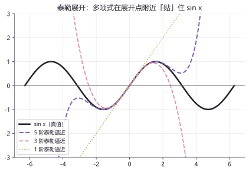
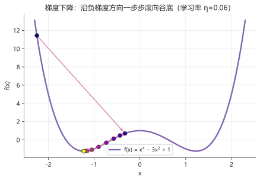

# 微积分 II · 积分、级数与多元入门

> 一句话概括本章：**上一章学会"由位置求速度"，这一章学会反过来"由速度还原位置"，以及机器人参数学习的第一课——梯度下降。**
> 积分、微分方程、泰勒展开、梯度，四个新工具，一个主题：把变化"攒"回去、把复杂"化"简单。

---

## 本章导航

| 项目 | 内容 |
|---|---|
| 上一章 | [10 微积分 I · 极限与一元微分](./10_微积分I_极限与一元微分.md) |
| 下一章 | [30 线性代数 I · 矩阵与线性方程组](./30_线性代数I_矩阵与线性方程组.md) |
| 教材锚点 | 同济《高等数学》上册第三、四章，下册 §7、§9.2、§9.7、§12.1 |

**本章四问**

- **这章讲什么？**——不定积分与定积分、微积分基本定理、换元与分部两大积分技法、泰勒展开与级数直觉、分离变量法解最简微分方程、偏导数与梯度初见。
- **为什么学它？**——IMU 测的是加速度，位置要靠**积分**还原；PID 控制器的 I 项就是**积分**；一切参数学习（标定、训练神经网络）的核心动作是**沿梯度下降**；计算机算 $\sin x$ 靠的是**泰勒展开**。四个工具全是机器人的日常。
- **学完能做什么？**——会算基本积分、会解 $\dot x=kx$ 这类微分方程、会做一步梯度下降、能逐项解释 PID 控制律 $u=K_p e+K_i\displaystyle\int e\,\mathrm{d}t+K_d\dot e$ 里每个符号的身份。

**本章在路线图中的位置**

```
00 学习地图
   └─ 10 微积分 I：极限 → 导数 → 微分（已学）
        └─ 20 微积分 II（本页）：积分 → 微分方程 → 泰勒 → 梯度
             └─ 30 线性代数 I（下一站）
```

**预计学习时长**

| 学习方式 | 时间 | 适合谁 |
|---|---|---|
| 首次学习（跟做练习） | 3-4 小时 | 刚学完微积分 I |
| 快速复习 | 40-60 分钟 | 学过但忘了，回来查漏补缺 |

---

## 1. 从生活到概念：知道每一瞬间的速度，怎么知道走了多远？

上一章的结局是：给出位置函数 $s(t)$，求导得速度。现在把问题**倒过来**——开车时速度表每秒都在跳，你能看到"每一瞬间有多快"，却看不到"一共走了多远"。里程表偷偷替你干了这件事，它怎么干的？

思路很土但有效：**把时间切成小段，每段内近似认为速度不变，段长 × 段内速度 = 这段的距离，全部加起来**。

来做个能全程手算的例子。设速度 $v(t)=t$（m/s，$t$ 单位 s，匀加速起步），求 10 秒内走的距离。真值先按下不表，用"切成小段"逼近：

| 分段数 $n$ | 每段长 $\Delta t$ (s) | 各段用左端点速度算距离 | 总距离 (m) |
|---|---|---|---|
| 2 | 5 | $0\times 5 + 5\times 5$ | 25 |
| 5 | 2 | $(0+2+4+6+8)\times 2$ | 40 |
| 10 | 1 | $(0+1+2+\cdots+9)\times 1$ | 45 |
| 50 | 0.2 | $(0+0.2+0.4+\cdots+9.8)\times 0.2$ | 49 |

分段越细，总距离越"稳"，稳稳地奔向 50 m。数学把"**分割 → 求和 → 取极限**"这整套动作打包成一个记号——**积分**。

> 📖 教材对照：同济《高等数学》上册 §5.1

!!! warning
    类比立刻泼冷水：任何有限分段的结果都只是**近似**（2 段时误差大得离谱），"精确值 50"来自**分段数趋于无穷的极限**。另外，若速度函数复杂到没有现成公式，"切矩形求和"反而能硬算出数值——这正是计算机数值积分的思路，第 4 节会让 IMU 亲自演示。

---

## 2. 概念是什么

### 2.1 不定积分与积分常数 C

积分有两种身份。第一种身份：**求导的逆运算**。

**原函数（Antiderivative）**：若 $F'(x)=f(x)$，称 $F$ 是 $f$ 的一个原函数。比如 $(x^2)'=2x$，所以 $x^2$ 是 $2x$ 的原函数。但注意 $(x^2+5)'$ 也等于 $2x$，$(x^2-100)'$ 还是 $2x$——**差一个常数，求导后全都看不出来**（常数的导数为 0）。

**不定积分（Indefinite Integral）** 就是全体原函数，记作：

$$
\int f(x)\,\mathrm{d}x = F(x) + C
$$

其中 $C$ 叫**积分常数（Constant of Integration）**，$\int$ 是拉长的字母 S（Sum 的首字母），$f(x)$ 叫**被积函数（Integrand）**。**那个 $+C$ 不是装饰，漏写是错的**——理由已如上：求导不可逆地抹掉了常数信息，逆运算必须把它补回来。

**基本积分表**（基本求导公式表的镜像，反向背）：

| 不定积分 | 结果 | 验证（求导应还原被积函数） |
|---|---|---|
| $\int x^n\,\mathrm{d}x$ | $\dfrac{x^{n+1}}{n+1}+C$（$n\neq -1$） | $\left(\dfrac{x^{n+1}}{n+1}\right)'=x^n$ |
| $\int \dfrac{1}{x}\,\mathrm{d}x$ | $\ln\vert x\vert + C$ | $(\ln\vert x\vert)'=\dfrac{1}{x}$ |
| $\int e^x\,\mathrm{d}x$ | $e^x+C$ | $(e^x)'=e^x$ |
| $\int \cos x\,\mathrm{d}x$ | $\sin x+C$ | $(\sin x)'=\cos x$ |
| $\int \sin x\,\mathrm{d}x$ | $-\cos x+C$ | $(-\cos x)'=\sin x$ |

**积分常数在机器人里有一层格外实在的含义**。已知某底盘速度 $v(t)=3t^2$（m/s），求位移 $s(t)$。因为 $\dot s=v$，所以：

$$
s(t)=\int 3t^2\,\mathrm{d}t = t^3 + C
$$

$C$ 是什么？是**初始位置**！若已知 $t=0$ 时底盘在 $s=2$ m 处，代入得 $2=0^3+C$，即 $C=2$，最终 $s(t)=t^3+2$。**光知道速度不够，必须再告诉机器人"从哪出发"**——这就是积分常数在物理世界的真身。

> 📖 教材对照：同济《高等数学》上册 §4.1

### 2.2 定积分：分割-求和-取极限

第二种身份：**累积量**。**定积分（Definite Integral）** 的定义动作，就是第 1 节的三个步骤：

1. **分割**：把区间 $[a,b]$ 切成 $n$ 小段，每段宽 $\Delta x$；
2. **求和**：每段上取一个函数值当"高"，乘段宽当矩形面积，全部相加 $S_n=\sum f(\xi_i)\,\Delta x_i$；
3. **取极限**：段数 $n\to\infty$（每段 $\Delta x\to 0$），$S_n$ 的极限就是定积分：

$$
\int_a^b f(x)\,\mathrm{d}x = \lim_{n\to\infty}\sum_{i=1}^{n} f(\xi_i)\,\Delta x_i
$$

几何含义（当 $f(x)\ge 0$）：**曲线下方、$x$ 轴上方、$a$ 与 $b$ 之间围出的面积**。速度-时间曲线下的面积，正是走过的距离——所以第 1 节那辆车：

$$
\int_0^{10} t\,\mathrm{d}t = 50\ \mathrm{m}
$$

这个 50 从哪来的？靠一个威力巨大的定理，马上讲。先记定积分两条常用性质：

| 性质 | 公式 | 直觉 |
|---|---|---|
| 常数可提出 | $\int_a^b c\,f(x)\,\mathrm{d}x = c\int_a^b f(x)\,\mathrm{d}x$ | 每个矩形都同倍放大 |
| 区间可拆 | $\int_a^b + \int_b^c = \int_a^c$ | 面积拼接 |

> 📖 教材对照：同济《高等数学》上册 §5.1

### 2.3 微积分基本定理：牛顿-莱布尼茨公式

**微积分基本定理（Fundamental Theorem of Calculus）**，又称**牛顿-莱布尼茨公式（Newton-Leibniz Formula）**：

$$
\int_a^b f(x)\,\mathrm{d}x = F(b) - F(a), \quad \text{其中 } F'=f
$$

**一句话**：想算累积量（面积），不用真去切无穷多块矩形，**找一个原函数，代上下限相减**即可。

**直觉版证明思路**（严格证明在教材，这里把逻辑走通）。定义"从 $a$ 累积到 $x$"的面积函数 $A(x)=\int_a^x f(t)\,\mathrm{d}t$，然后问：$A$ 的导数是多少？

1. 给 $x$ 一小步 $h$，面积增加了一根窄条：$A(x+h)-A(x)$；
2. $h$ 很小时，$f$ 在窄条内来不及变化，窄条近似矩形，高为 $f(x)$、宽为 $h$，所以 $A(x+h)-A(x)\approx f(x)\,h$；
3. 两边除以 $h$：$\dfrac{A(x+h)-A(x)}{h}\approx f(x)$；
4. 令 $h\to 0$：左边恰好是导数定义，近似变精确，得 $A'(x)=f(x)$；
5. 所以 $A$ 是 $f$ 的一个原函数，记 $F$ 为任一原函数，则 $A$ 与 $F$ 只差常数：$A(x)=F(x)-F(a)$；令 $x=b$，得 $\int_a^b f\,\mathrm{d}x=F(b)-F(a)$。

**验证第 1 节的例子**：$f(t)=t$ 的一个原函数是 $F(t)=\frac{t^2}{2}$：

$$
\begin{aligned}
\int_0^{10} t\,\mathrm{d}t &= \left[\frac{t^2}{2}\right]_0^{10} && \text{（牛顿-莱布尼茨公式，} F(t)=t^2/2 \text{）} \\
&= \frac{10^2}{2} - \frac{0^2}{2} && \text{（代上限，减下限）} \\
&= 50 - 0 = 50\ \mathrm{m} && \text{（计算）}
\end{aligned}
$$

与"切矩形"表格收敛到的 50 完全一致——分割求和是过程，牛顿-莱布尼茨是捷径。

> 📖 教材对照：同济《高等数学》上册 §5.2

### 2.4 泰勒展开与级数的直觉


*◈ 泰勒展开:多项式一阶阶缝出原函数(lab01)——想亲手跑出这张图:章末 🔬 配套实验。*


上一章的线性近似只用到一阶信息。**泰勒展开（Taylor Expansion）** 是它的加强版：在基准点 $x_0$ 附近，用多项式把曲线"贴"得更服帖。

$$
f(x) \approx f(x_0) + f'(x_0)(x-x_0) + \frac{1}{2}f''(x_0)(x-x_0)^2 + \cdots
$$

- 第一项：贴住**高度**；一阶项：贴住**斜率**；二阶项：贴住**弯曲程度**（弯的方向和快慢）。项数越多，贴得越远越准。

**以 $\sin x$ 为例，在 $x_0=0$ 处展开**。先逐阶求导并在 0 处取值：

| 阶数 | 导函数 | 在 $x=0$ 的值 |
|---|---|---|
| 0 | $\sin x$ | $0$ |
| 1 | $\cos x$ | $1$ |
| 2 | $-\sin x$ | $0$ |
| 3 | $-\cos x$ | $-1$ |
| 4 | $\sin x$（回到起点，循环） | $0$ |

代入公式（偶数阶值全是 0，只有奇数阶留下）：

$$
\sin x \approx x - \frac{x^3}{6} + \frac{x^5}{120} - \cdots
$$

**算例**：用一阶和三阶近似，对比真值：

| $x$ (rad) | 真值 $\sin x$ | 一阶：$x$ | 三阶：$x-\frac{x^3}{6}$ |
|---|---|---|---|
| 0.1 | 0.09983 | 0.1 | 0.09983 |
| 0.5 | 0.47943 | 0.5 | 0.47917 |
| 1.0 | 0.84147 | 1.0 | 0.84167 |

三阶在 $x=1$ 时已经准到小数点后三位——**两个减法一个除法，换一个三角函数值**，这就是计算器与机器人芯片算 $\sin$ 的土办法（配上更多项与缩小区间的技巧）。

**级数直觉**：把省略号老老实实写到底，就得到一个**级数（Series）**——无穷多项相加。取前 $N$ 项的部分和（**部分和（Partial Sum）**）逐次逼近：对 $\sin 1$，取 1 项得 1.0，取 2 项得 0.8417，取 3 项得 0.841471……一步步咬住真值。"无穷多项相加为什么能有确定值"是微妙的数学问题，第〇阶段只取直觉：**部分和有稳定的归宿，级数就有值**。

> 📖 教材对照：同济《高等数学》上册 §3.3（泰勒公式）、下册 §12.1（级数概念，仅取直觉）

### 2.5 常微分方程初见：分离变量法解 dx/dt = kx

**微分方程（Differential Equation）**：含有"未知函数的导数"的方程。未知函数只依赖一个自变量时，叫**常微分方程（Ordinary Differential Equation, ODE）**。

方程 $\dot x=kx$（即 $\frac{\mathrm{d}x}{\mathrm{d}t}=kx$，$k$ 为常数）读作："**变化率正比于自身**"。它是机器人学的常客：电容放电、电机断电后的转速衰减、参数指数收敛，全是这个形状。

**分离变量法（Separation of Variables）** 求通解，六步走（$x\neq 0$）：

$$
\begin{aligned}
\frac{\mathrm{d}x}{\mathrm{d}t} &= kx && \text{（原方程）}
\end{aligned}
$$

**第 1 步：分离变量**——把含 $x$ 的都挪到左边、含 $t$ 的都挪到右边：

$$
\frac{1}{x}\,\mathrm{d}x = k\,\mathrm{d}t
$$

**第 2 步：两边同时积分**（左边对 $x$ 积，右边对 $t$ 积）：

$$
\int \frac{1}{x}\,\mathrm{d}x = \int k\,\mathrm{d}t
$$

**第 3 步：查积分表积出来**：

$$
\ln\vert x\vert = kt + C_1
$$

**第 4 步：解出 $x$**——两边取指数：

$$
\begin{aligned}
\vert x\vert &= e^{kt+C_1} = e^{C_1}\,e^{kt} \\
x &= C\,e^{kt} \quad\left(C=\pm e^{C_1} \text{，且 } C=0 \text{ 即 } x\equiv 0 \text{ 也满足原方程}\right)
\end{aligned}
$$

**第 5 步：验证**（微分方程的解必须代回去检查）：

$$
\begin{aligned}
\frac{\mathrm{d}}{\mathrm{d}t}\left(Ce^{kt}\right) &= C\,k\,e^{kt} && \text{（链式法则：外层 } e^u \text{ 不变，乘内层导数 } k \text{）} \\
&= k\left(Ce^{kt}\right) = kx && \text{（重组）}
\end{aligned}
$$

成立。**第 6 步：用初值条件定常数**。**初值条件（Initial Condition）** 如 $x(0)=x_0$，代入 $t=0$：

$$
x_0 = C\,e^{0} = C \quad\Longrightarrow\quad x(t) = x_0\,e^{kt}
$$

**读解**：$k<0$ 时 $e^{kt}$ 衰减——转速滑落、电容放电；$k>0$ 时爆炸增长——现实中必有别的机制把它按住，见到 $k>0$ 先警惕。

> 📖 教材对照：同济《高等数学》下册 §7.1-§7.2

### 2.6 偏导数与梯度初见：多个输入怎么办

到目前为止的函数只有一个输入。**多元函数（Multivariate Function）** 有多个输入，例如高度场：

$$
f(x,y) = x^2 + y^2
$$

把 $(x,y)$ 想成地面上坐标（单位 m），$f$ 输出该点的海拔——图像是一个碗。站在碗上某点，"坡度"该怎么说？沿 $x$ 方向和沿 $y$ 方向的坡度可能完全不同。

**偏导数（Partial Derivative）**：**只朝一个坐标方向看坡度，把其他坐标当常数**。记号 $\dfrac{\partial f}{\partial x}$，读"偏 f 偏 x"。对 $f(x,y)=x^2+y^2$：

$$
\begin{aligned}
\frac{\partial f}{\partial x} &= 2x + 0 = 2x && \text{（对 } x \text{ 求导，} y^2 \text{ 视为常数，导数为 0）} \\
\frac{\partial f}{\partial y} &= 0 + 2y = 2y && \text{（对 } y \text{ 求导，} x^2 \text{ 视为常数）}
\end{aligned}
$$

**梯度（Gradient）** 把各方向坡度打包成一个**向量**（读"nabla f"）：

$$
\nabla f = \left(\frac{\partial f}{\partial x},\ \frac{\partial f}{\partial y}\right) = (2x,\ 2y)
$$

**核心直觉**：在某点，$\nabla f$ 指向**上坡最陡**的方向；$-\nabla f$ 指向**下坡最陡**的方向。想快速下山，就沿着 $-\nabla f$ 迈步；在碗底 $(0,0)$，$\nabla f=(0,0)$，四个方向都平——极值点。

> 类比失效提示：梯度说的是"当前这一点的局部坡向"，不保证一路下山到底。真实地形里沿着局部最陡方向走，可能卡在半山腰的小坑（局部极小值）出不来——这是第 9 周后优化课程要处理的老大难，先记住坑的存在。

> 📖 教材对照：同济《高等数学》下册 §9.2（偏导数）、§9.7（梯度）

---

## 3. 动手算一算

### 3.1 换元法：链式法则的逆用

**换元法（Integration by Substitution，又称"凑微分法"）**：看到"某函数和它的内层导数"同时出现在被积函数里，就把内层设为 $u$。它是链式法则的逆用，规则：

$$
\int f(g(x))\,g'(x)\,\mathrm{d}x = \int f(u)\,\mathrm{d}u, \quad u=g(x),\ \mathrm{d}u=g'(x)\,\mathrm{d}x
$$

**例 1：求 $\int 2x\,e^{x^2}\,\mathrm{d}x$**。观察到 $e$ 的指数是 $x^2$，而 $x^2$ 的导数 $2x$ 恰好在外面：

$$
\begin{aligned}
u &= x^2, \quad \mathrm{d}u = 2x\,\mathrm{d}x && \text{（设元并求微分）} \\
\int 2x\,e^{x^2}\,\mathrm{d}x &= \int e^{u}\,\mathrm{d}u && \text{（整体换元）} \\
&= e^{u} + C && \text{（查积分表）} \\
&= e^{x^2} + C && \text{（回代 } u=x^2 \text{）}
\end{aligned}
$$

**验证**：$\dfrac{\mathrm{d}}{\mathrm{d}x}\left(e^{x^2}\right) = e^{x^2}\cdot 2x$（链式法则）——正是被积函数，正确。

**例 2：求 $\int \dfrac{x}{x^2+1}\,\mathrm{d}x$**。分子 $x$ 恰好是分母导数的一半：

$$
\begin{aligned}
u &= x^2+1, \quad \mathrm{d}u = 2x\,\mathrm{d}x \ \Longrightarrow\ x\,\mathrm{d}x = \frac{1}{2}\,\mathrm{d}u && \text{（设元、求微分、移项）} \\
\int \frac{x}{x^2+1}\,\mathrm{d}x &= \int \frac{1}{u}\cdot\frac{1}{2}\,\mathrm{d}u && \text{（换元，分母换成 } u \text{）} \\
&= \frac{1}{2}\ln\vert u\vert + C && \text{（提出常数，查积分表）} \\
&= \frac{1}{2}\ln\left(x^2+1\right) + C && \text{（回代；} x^2+1>0 \text{，绝对值可去）}
\end{aligned}
$$

**验证**：$\dfrac{\mathrm{d}}{\mathrm{d}x}\left[\dfrac{1}{2}\ln(x^2+1)\right] = \dfrac{1}{2}\cdot\dfrac{2x}{x^2+1} = \dfrac{x}{x^2+1}$。正确。

> 📖 教材对照：同济《高等数学》上册 §4.2

### 3.2 分部积分：乘积法则的逆用

两函数**相乘**且换元救不了时，用**分部积分（Integration by Parts）**。公式两行推出来：

$$
\begin{aligned}
(uv)' &= u'v + uv' && \text{（乘积法则，微积分 I 学过）} \\
uv' &= (uv)' - u'v && \text{（移项）}
\end{aligned}
$$

两边对 $x$ 积分，注意 $(uv)'$ 积分还原为 $uv$：

$$
\int u\,v'\,\mathrm{d}x = uv - \int u'\,v\,\mathrm{d}x
$$

**用法**：把被积函数拆成 $u$（负责求导变简单）和 $v'$（负责积分）两部分。

**例 1：求 $\int x\,e^{x}\,\mathrm{d}x$**。$x$ 求导会变成 1（变简单），$e^x$ 积分还是 $e^x$（不添乱）：

$$
\begin{aligned}
u &= x, \quad \mathrm{d}v = e^x\,\mathrm{d}x && \text{（分工：} u \text{ 负责求导，} v' \text{ 负责积分）} \\
\mathrm{d}u &= \mathrm{d}x, \quad v = e^x && \text{（各自微分/积分）} \\
\int x\,e^x\,\mathrm{d}x &= x\,e^x - \int e^x\,\mathrm{d}x && \text{（分部积分公式）} \\
&= x\,e^x - e^x + C && \text{（查积分表）} \\
&= (x-1)\,e^x + C && \text{（整理）}
\end{aligned}
$$

**验证**：$\left[(x-1)e^x\right]' = 1\cdot e^x + (x-1)e^x = x\,e^x$。正确。

**例 2：求 $\int x\cos x\,\mathrm{d}x$**。同样让 $x$ 当 $u$：

$$
\begin{aligned}
u &= x, \quad \mathrm{d}v = \cos x\,\mathrm{d}x && \text{（分工）} \\
\mathrm{d}u &= \mathrm{d}x, \quad v = \sin x && \text{（微分/积分）} \\
\int x\cos x\,\mathrm{d}x &= x\sin x - \int \sin x\,\mathrm{d}x && \text{（分部积分公式）} \\
&= x\sin x + \cos x + C && \text{（} \int\sin x\,\mathrm{d}x=-\cos x \text{，注意负号）}
\end{aligned}
$$

!!! tip
    $u$ 和 $v'$ 怎么分工？口诀"**对、反、幂、指、三**"（对数、反三角、幂函数、指数、三角）：**排前面的当 $u$**。本题 $x$ 是幂函数，$e^x$、$\cos x$ 分别是指/三，幂在前——所以 $x$ 当 $u$。选反了会越积越复杂，见到"$-x^2$ 出现"这类倒退就停下来重选。

> 📖 教材对照：同济《高等数学》上册 §4.3

### 3.3 再解一个微分方程：电机断电后滑行多久

电机断电后，转速 $v$（rad/s）近似满足 $\dfrac{\mathrm{d}v}{\mathrm{d}t}=-kv$（$k>0$，摩擦系数类常数），初值 $v(0)=v_0$。用 2.5 节六步流程解它：

$$
\begin{aligned}
\frac{\mathrm{d}v}{v} &= -k\,\mathrm{d}t && \text{（第 1 步：分离变量）} \\
\int \frac{\mathrm{d}v}{v} &= \int -k\,\mathrm{d}t && \text{（第 2 步：两边积分）} \\
\ln\vert v\vert &= -kt + C_1 && \text{（第 3 步：积出）} \\
v &= C\,e^{-kt} && \text{（第 4 步：解出 } v \text{）} \\
\frac{\mathrm{d}}{\mathrm{d}t}\left(Ce^{-kt}\right) &= -kCe^{-kt} = -kv && \text{（第 5 步：验证，成立）} \\
v_0 = C\,e^{0} = C \ \Longrightarrow\ v(t) &= v_0\,e^{-kt} && \text{（第 6 步：代初值定 } C \text{）}
\end{aligned}
$$

**追问：转速衰减到一半要多久？** 令 $v(t)=v_0/2$：

$$
\begin{aligned}
v_0\,e^{-kt} &= \frac{v_0}{2} && \text{（设衰减到一半）} \\
e^{-kt} &= \frac{1}{2} && \text{（两边除以 } v_0 \text{）} \\
-kt &= \ln\frac{1}{2} = -\ln 2 && \text{（两边取自然对数）} \\
t &= \frac{\ln 2}{k} \approx \frac{0.693}{k} && \text{（解出时间）}
\end{aligned}
$$

有趣：**衰减到一半的时间与当前转速无关**——这叫半衰期结构，放射性衰变、信号衰减共用同一套数学。

### 3.4 梯度下降一步算例


*◈ 梯度下降:每步沿最陡方向下坡(lab01)——想亲手跑出这张图:章末 🔬 配套实验。*


碗形函数 $f(x,y)=x^2+y^2$（可当成"误差地形"：站得越高 = 错得越离谱）。当前站在 $(3,4)$，沿负梯度走一步，步长 $\eta=0.1$：

$$
\begin{aligned}
\nabla f &= (2x,\ 2y) = (6,\ 8) && \text{（代入当前点求梯度）} \\
f(3,4) &= 3^2 + 4^2 = 25 && \text{（当前"误差"）} \\
(x_{\text{新}},\ y_{\text{新}}) &= (3,4) - 0.1\,(6,8) && \text{（沿 } -\nabla f \text{ 迈一步，规则见 4.3）} \\
&= (3-0.6,\ 4-0.8) = (2.4,\ 3.2) \\
f(2.4,3.2) &= 5.76 + 10.24 = 16 && \text{（误差从 25 降到 16）}
\end{aligned}
$$

再走一步：$\nabla f=(4.8,6.4)$，新点 $(1.92,2.56)$，$f=10.24$。误差一路 $25\to16\to10.24\to\cdots$，步子越走越小，最终滑向碗底 $(0,0)$——**这就是"学习"的全部秘密**，4.3 节正式接线。

---

## 4. 和机器人有什么关系

### 4.1 由加速度积分出速度与位置：惯性导航的原理

上一章认识过 **IMU（Inertial Measurement Unit，惯性测量单元）**——机器人身上的"内耳"，它直接吐出**加速度** $a$。机器人想知道自己在哪，必须**反着积分回去**：

$$
v(t) = v_0 + \int_0^t a(\tau)\,\mathrm{d}\tau, \qquad s(t) = s_0 + \int_0^t v(\tau)\,\mathrm{d}\tau
$$

（$\tau$ 是积分内部的"哑变量"，避免与上限 $t$ 混淆，见其形会其意即可。）

匀加速验证：$a=2\ \mathrm{m/s^2}$，$v_0=s_0=0$：

$$
\begin{aligned}
v(t) &= \int_0^t 2\,\mathrm{d}\tau = 2t \ \mathrm{m/s} \\
s(t) &= \int_0^t 2\tau\,\mathrm{d}\tau = t^2 \ \mathrm{m}
\end{aligned}
$$

与微积分 I 的 4.1 节（$s=t^2 \to v=2t \to a=2$）严丝合缝对上——求导与积分互为逆运算的完整闭环。

**计算机的版本**是离散累加（矩形法）：每隔 $\Delta t$ 读一次 $a_k$，就

$$
v_{k+1} = v_k + a_k\,\Delta t, \qquad s_{k+1} = s_k + v_k\,\Delta t
$$

这正是"分割-求和"的代码形态。**但积分是记账，记错一笔永远赖在那**：若加速度计有恒定偏差 $\varepsilon_a=0.01\ \mathrm{m/s^2}$，60 秒后位置误差约

$$
\frac{1}{2}\,\varepsilon_a\,t^2 = \frac{1}{2}\times 0.01\times 60^2 = 18\ \mathrm{m}
$$

**一分钟的纯惯性导航就能漂出 18 米**——所以实战中 IMU 必须与 GPS、视觉等持续融合校正（怎么"融合"？概率线 50 章的贝叶斯思想 + 卡尔曼滤波，是后话）。

### 4.2 PID 控制器的 I 项，就是积分

无人机悬停的误差 $e$（目标高度减实际高度，m）要变成电机推力指令 $u$。工业界用得最多的公式：

$$
u = K_p\,e + K_i\int e\,\mathrm{d}t + K_d\,\dot e
$$

这叫 **PID 控制**。逐项拆解：

| 项 | 数学身份 | 它在"看"什么 | 直觉 |
|---|---|---|---|
| $K_p\,e$ | 误差本身乘系数 | **现在** | 偏多少补多少，最朴素的反射 |
| $K_i\displaystyle\int e\,\mathrm{d}t$ | 误差对时间的积分 | **过去**（累积账本） | 小误差攒久了也是大事，攒到账本上一起还 |
| $K_d\,\dot e$ | 误差的导数（微积分 I 学的） | **趋势**（正在变好还是变坏） | 刹车预判：误差快收敛了就提前松劲 |

**为什么 I 项不可或缺？** 设无人机悬停时因配重偏轻，恒差 $0.1$ m 才能维持（P 项出力刚好抵消重力缺口，误差不再变化但**不归零**）。看 I 项：

$$
K_i\int_0^T e\,\mathrm{d}t = K_i\times 0.1\times T \xrightarrow{\ T\text{ 增大}\ } \infty
$$

账本随时间**线性增厚**，推力指令被持续推高，误差被慢慢压到 0——**稳态误差靠 I 项消除**。（副作用：账太厚会过头冲出去，即"超调"，所以 $K_i$ 要调，这就是"调参"的物理含义。）

> 类比失效提示：说 I 项像"攒钱"没问题，但账本只对"误差随时间的累积"负责——误差变号（超调到另一侧）时，旧的存款会被新账冲抵，它并不是只增不减的存钱罐。

### 4.3 梯度下降：机器人参数学习的第一课

机器人有一堆可调**参数** $w$（相机标定偏移、控制器增益、神经网络权重……）。怎么调最好？先定义**损失函数（Loss Function）** $L(w)$："这组参数错得有多离谱"，错得越多 $L$ 越大。于是调参 = **找让 $L$ 最小的 $w$** = 在误差地形里下到谷底。

**梯度下降（Gradient Descent）** 的更新规则只有一行：

$$
w \leftarrow w - \eta\,\nabla L(w)
$$

| 符号 | 身份 | 说明 |
|---|---|---|
| $w$ | 参数向量 | 你要调的一组数 |
| $L(w)$ | 损失 | "错得有多离谱"的打分 |
| $\nabla L$ | 梯度 | 指向上坡最陡方向的向量（2.6 节） |
| $\eta$ | **学习率（Learning Rate）** | 每步迈多大，$0<\eta\ll 1$ |

每一步：算当前梯度 → 朝**下坡最陡**方向挪一小步 → 重复。3.4 节那个 $25\to16\to10.24$ 的数值演示，就是这个规则前两步的实况——走姿谈不上优雅，像在野外顺着最陡的下坡路下山，但方向感是数学给的，够用了。

- $\eta$ **太大**：一步跨过谷底落到对面山坡更高处，误差不降反升（发散）；
- $\eta$ **太小**：几十万步还在半山腰（训练太慢）。

神经网络训练、SLAM 里的非线性优化、控制器自整定，底层都是这行公式的千万次重复。**你现在已经在原理上"会训练 AI"了**——剩下的只是工程细节。

!!! tip
    深度学习框架一键算出的"梯度"，本质是链式法则（微积分 I 3.3 节）的程序化实现，学名叫**自动微分（Automatic Differentiation）**。当年那颗"剥洋葱不许漏层"的种子，在这里长成了整棵树。

---

## 5. 常见错误与自救

| 错误现象 | 原因 | 怎么改 |
|---|---|---|
| 不定积分不写 $+C$ | 没意识到"求导抹掉了常数信息" | 见到 $\int$ 就条件反射补 $C$；定常数靠初值条件（如初始位置） |
| 牛顿-莱布尼茨代成 $F(a)-F(b)$ | 上限下限顺序记反 | 口诀"上限减下限"；用 $\int_0^{10}t\,\mathrm{d}t=50>0$ 自检，面积不能算出负数（$f\ge 0$ 时） |
| $(e^{kt})'=e^{kt}$，漏乘 $k$ | 链式法则回潮，内层导数没乘 | 内层是 $kt$，导数是 $k$：$(e^{kt})'=k\,e^{kt}$——微积分 I 的"数层数"还在管用 |
| 分部积分选反 $u$ 和 $v'$，越积越复杂 | 没按"对、反、幂、指、三"排序 | 排前面的当 $u$；发现被积式反而升阶立即推倒重选 |
| 换元后忘换 $\mathrm{d}x$ 或最后忘回代 | 换元只换了一半 | 两步检查单：换元时 $\mathrm{d}u$ 写全；出结果先回代再写 $+C$ |
| 梯度下降学习率 $\eta$ 设得太大，误差不降反升 | 一步跨过谷底 | 减小 $\eta$ 重试；观察损失曲线是否单调下降是基本体检 |
| 把 $\dfrac{\partial f}{\partial x}$ 写成 $\dfrac{\mathrm{d}f}{\mathrm{d}x}$ | 偏导与一元导数混用 | 多元函数用 $\partial$：它声明"其余变量被冻结" |

---

## 6. 动手练习

先自己算，再展开折叠解答。建议每题至少 10 分钟。

**练习 1**　求 $\int (3x^2 + 2x)\,\mathrm{d}x$，并用求导验证你的答案。

??? details "练习 1 解答"

    逐项积分（和差法则的逆向使用）：

    $$
    \begin{aligned}
    \int (3x^2 + 2x)\,\mathrm{d}x &= \int 3x^2\,\mathrm{d}x + \int 2x\,\mathrm{d}x && \text{（拆成两项分别积分）} \\
    &= 3\cdot\frac{x^3}{3} + 2\cdot\frac{x^2}{2} + C && \text{（幂函数积分公式，常数提出）} \\
    &= x^3 + x^2 + C && \text{（约分化简）}
    \end{aligned}
    $$

    **验证**（求导必须还原被积函数）：

    $$
    \left(x^3 + x^2 + C\right)' = 3x^2 + 2x + 0 = 3x^2 + 2x
    $$

    正确。注意验证时 $C$ 的导数是 0——这正说明 $C$ 取什么都行，但**答案里不能不写**。

**练习 2**　已知底盘速度 $v(t)=3t^2$（m/s），$t=0$ 时位于原点。求它 $2$ 秒内走过的路程，并说明每一步用到的定理。

??? details "练习 2 解答"

    路程 = 速度曲线在 $[0,2]$ 下的面积 = 定积分：

    $$
    \begin{aligned}
    s &= \int_0^2 3t^2\,\mathrm{d}t && \text{（路程的积分表示）} \\
    &= \left[\,t^3\,\right]_0^2 && \text{（牛顿-莱布尼茨公式：} t^3 \text{ 的导数是 } 3t^2 \text{）} \\
    &= 2^3 - 0^3 && \text{（代上限减下限）} \\
    &= 8\ \mathrm{m}
    \end{aligned}
    $$

    交叉验证（不定积分路线）：$s(t)=\int 3t^2\,\mathrm{d}t = t^3 + C$；由 $s(0)=0$ 得 $C=0$，故 $s(2)=8$。两条路线一致。

**练习 3**　解初值问题 $\dot x = -2x$，$x(0)=5$，并求 $x$ 下降到 $1$ 需要多少时间（结果保留两位小数，$\ln 5\approx 1.609$）。

??? details "练习 3 解答"

    **第一步：分离变量并积分**（$x\neq 0$）：

    $$
    \begin{aligned}
    \frac{\mathrm{d}x}{\mathrm{d}t} &= -2x && \text{（原方程）} \\
    \frac{\mathrm{d}x}{x} &= -2\,\mathrm{d}t && \text{（分离变量）} \\
    \ln\vert x\vert &= -2t + C_1 && \text{（两边积分）} \\
    x &= C\,e^{-2t} && \text{（两边取指数，合并常数）}
    \end{aligned}
    $$

    **第二步：代初值**：

    $$
    x(0) = C\,e^{0} = C = 5 \quad\Longrightarrow\quad x(t) = 5\,e^{-2t}
    $$

    **第三步：验证**：$\dot x = 5\times(-2)\,e^{-2t} = -2\left(5e^{-2t}\right) = -2x$。成立。

    **第四步：求下降到 1 的时间**：

    $$
    \begin{aligned}
    5\,e^{-2t} &= 1 && \text{（令 } x=1 \text{）} \\
    e^{-2t} &= \frac{1}{5} && \text{（两边除以 5）} \\
    -2t &= \ln\frac{1}{5} = -\ln 5 && \text{（取自然对数）} \\
    t &= \frac{\ln 5}{2} \approx \frac{1.609}{2} \approx 0.80\ \mathrm{s}
    \end{aligned}
    $$

**练习 4**　设损失函数 $L(x,y)=x^2 y$。（1）求 $\nabla L$ 在点 $(1,2)$ 的值；（2）从 $(1,2)$ 出发，沿 $-\nabla L$ 走一步，学习率 $\eta=0.1$，写出新点并比较前后损失。

??? details "练习 4 解答"

    **第（1）问**：先求两个偏导（对谁求导，另一个就冻成常数）：

    $$
    \begin{aligned}
    \frac{\partial L}{\partial x} &= 2xy && \text{（} x^2 \text{ 求导得 } 2x \text{，} y \text{ 是常数系数）} \\
    \frac{\partial L}{\partial y} &= x^2 && \text{（对 } y \text{ 求导，} x^2 \text{ 是常数系数）}
    \end{aligned}
    $$

    代入点 $(1,2)$：

    $$
    \nabla L(1,2) = \left(2\times 1\times 2,\ \ 1^2\right) = (4,\ 1)
    $$

    **第（2）问**：起点损失 $L(1,2) = 1^2\times 2 = 2$。沿负梯度走一步：

    $$
    \begin{aligned}
    (x_{\text{新}},\ y_{\text{新}}) &= (1,2) - 0.1\,(4,1) && \text{（梯度下降更新规则）} \\
    &= (1-0.4,\ 2-0.1) = (0.6,\ 1.9) \\
    L(0.6,1.9) &= 0.6^2\times 1.9 = 0.36\times 1.9 = 0.684
    \end{aligned}
    $$

    损失从 $2$ 降到 $0.684$——一步有效。想继续下降就再算 $\nabla L(0.6,1.9)$ 再走，重复到满意为止；至于"会不会卡在半山腰的小坑"，2.6 节的类比失效提示已经预告过了。

---

## 综合习题：电机断电滑行的完整一生（全章知识串联）

电机断电瞬间转子以 $v_0 = 3$ m/s 滑行，摩擦使其满足 $v'(t) = -0.5\,v(t)$。本题串起本章从微分方程到数值积分的全部工具。

**(a) 解出速度**（§2.5 分离变量、§3.3 同款方程）：解此微分方程得 $v(t)$，并求 $v(4)$。

**(b) 总滑行距离**（§2.2 定积分、§2.3 牛顿-莱布尼茨、§2.1 不定积分）：距离 $= \int_0^4 v(t)\,dt$，用原函数精确计算。

**(c) 计算机怎么算**（§2.5 数值积分思想在 60 章展开，这里先用 8 段梯形近似）：说明梯形法则思路，并估计它与 (b) 的误差来源。

**(d) 泰勒的威力与边界**（§2.4 泰勒展开、§3.4 梯度下降的前置）：用一阶泰勒估计 $e^{-0.5\times4}$，结果如何？这说明泰勒近似在什么条件下才可靠？

**(e) 控制器视角**（§4.1 惯性导航、§4.2 PID 的 I 项）：若编码器每 0.01 s 采样一次速度，控制器累计位移用什么运算？它和 (b) 的定积分是什么关系？

??? details "综合习题完整解答"

    **(a)** 分离变量 $\dfrac{dv}{v} = -0.5\,dt$，两边积分 $\ln v = -0.5t + C$，代初值 $C = \ln 3$，得 $v(t) = 3e^{-0.5t}$。$v(4) = 3e^{-2} \approx 0.406$ m/s——指数衰减，越滑越慢但永不停（理想模型）。

    **(b)** 原函数：$\int 3e^{-0.5t}dt = -6e^{-0.5t} + C$。牛顿-莱布尼茨：$\int_0^4 v\,dt = [-6e^{-0.5t}]_0^4 = 6(1 - e^{-2}) \approx 5.188$ 米。

    **(c)** 梯形法则把 $[0,4]$ 切 8 段，每段用直线（梯形）替代曲线求面积。实测：

    ```python
    import numpy as np
    k, v0 = 0.5, 3.0
    v = lambda t: v0*np.exp(-k*t)
    ts = np.linspace(0, 4, 9)
    trap = np.trapezoid(v(ts), ts)
    exact = v0/k*(1 - np.exp(-k*4))
    print("8 段梯形 =", round(trap, 4), " 解析 =", round(exact, 4), " 误差 =", round(abs(trap-exact), 4))
    ```

    ```text
    8 段梯形 = 5.215  解析 = 5.188  误差 = 0.027
    ```

    误差来自"以直代曲"的截断误差——曲线是凸的，梯形一律高估。段数加倍，误差约缩小 4 倍（$O(h^2)$）。

    **(d)** 一阶泰勒 $e^{-x} \approx 1 - x$ 在 $x = 2$ 处给出 $1 - 2 = -1$，而真值 $\approx 0.135$——荒谬。泰勒近似只在展开点附近可靠（$|x|$ 明显小于 1）；离展开点越远，需要更高阶数。这不是泰勒错了，是用的人越界了。

    **(e)** 位移累计 $s \approx \sum v(t_i)\cdot\Delta t$——这就是矩形法数值积分，PID 控制器的 I 项（§4.2）做的正是同一件事：把误差"面积"累加起来。$\Delta t \to 0$ 时它趋于 (b) 的定积分——惯性导航（§4.1）积分加速度得速度、积分速度得位置，用的是同一根思想链条。

---

## 本章速查卡

| 条目 | 公式 / 内容 | 一句话理解 |
|---|---|---|
| 不定积分 | $\int f\,\mathrm{d}x = F(x)+C$，其中 $F'=f$ | 求导的逆运算，$+C$ 必须写 |
| 幂函数积分 | $\int x^n\,\mathrm{d}x = \dfrac{x^{n+1}}{n+1}+C$（$n\neq -1$） | 指数加一、整体除以新指数 |
| 定积分定义 | $\int_a^b f\,\mathrm{d}x = \lim \sum f(\xi_i)\Delta x_i$ | 分割-求和-取极限，曲线下面积 |
| 牛顿-莱布尼茨 | $\int_a^b f\,\mathrm{d}x = F(b)-F(a)$ | 面积不用切矩形，代原函数相减 |
| 换元法 | $\int f(g(x))g'(x)\,\mathrm{d}x = \int f(u)\,\mathrm{d}u$ | 内层设 $u$，$\mathrm{d}u$ 要换全 |
| 分部积分 | $\int u\,v'\,\mathrm{d}x = uv - \int u'v\,\mathrm{d}x$ | 乘积法则逆用；"对反幂指三"选 $u$ |
| 泰勒展开（二阶） | $f(x)\approx f(x_0)+f'(x_0)(x-x_0)+\frac12 f''(x_0)(x-x_0)^2$ | 高度、斜率、弯曲三层贴合 |
| $\sin x$ 近似 | $\sin x \approx x - \dfrac{x^3}{6}$ | 小角度近似 $\sin x\approx x$ 的加强版 |
| 最简 ODE | $\dot x = kx$ 的解：$x=x_0e^{kt}$ | 变化率正比自身 → 指数衰减/增长 |
| 半衰时间 | $v_0e^{-kt}=v_0/2 \Rightarrow t=\ln 2/k$ | 衰减一半的时间与初值无关 |
| 偏导数 | $\dfrac{\partial f}{\partial x}$：冻结其余变量求导 | 只看一个方向的坡度 |
| 梯度 | $\nabla f=\left(\dfrac{\partial f}{\partial x},\dfrac{\partial f}{\partial y}\right)$ | 指向上坡最陡的向量 |
| 梯度下降 | $w \leftarrow w-\eta\nabla L$ | 沿负梯度小步走 = 参数学习 |
| PID 控制律 | $u=K_p e+K_i\displaystyle\int e\,\mathrm{d}t+K_d\dot e$ | 看现在、记过去、盯趋势 |

---

## 下一章预告

微积分的两章，你拿到了"变化与累积"的完整工具箱。但机器人世界里还有一个无处不在的主角：**一堆数打包成向量、一组方程打包成矩阵**——坐标变换、方程组求解、状态更新，全靠它。下一站**线性代数 I · 矩阵与线性方程组**：从扫地机的 $(x,y)$ 位置出发，学机器人学的"通用方言"。

- 下一章：[30 线性代数 I · 矩阵与线性方程组](./30_线性代数I_矩阵与线性方程组.md)

---

> 🔬 **配套实验**：梯度下降的三连帧演示——打开 [lab01 · 微积分实验室](../../08_可视化实验室/lab01_微积分实验室.md)，抄一遍代码跑起来。

<div class="rt-complete" markdown>

{.rt-complete__sticker}

✓ 本章完成 · 积分、级数与多元入门
{: .rt-complete__title}

下一站：[30 · 线性代数 I](./30_线性代数I_矩阵与线性方程组.md) ｜ 动手验证：[lab01 · 微积分实验室](../../08_可视化实验室/lab01_微积分实验室.md)
{: .rt-complete__body}

</div>
