# 十四讲跟读 · 第 4 讲:相机模型——三维世界怎么变成一张照片

> 第 3 讲解决了"位姿怎么优化";本讲造出**观测方程的眼睛**:三维点 $\boldsymbol{p}$ 经过外参变换、针孔投影、内参缩放、畸变弯曲,最终落成照片上的一个像素。学完本讲,SLAM 两大方程里的观测函数 $h(\cdot)$ 就有了完整的第一块拼图。
>
> 📖 教材对照:视觉SLAM十四讲(第2版)第 5 讲"相机与图像"｜OpenCV calib3d 官方文档(针孔模型权威定义)

---

## 本章导航

**上一章**:[第 3 讲 李群与李代数](./30_十四讲第3讲_李群李代数.md)

### 本章四问

| 问题 | 一句话回答 |
|---|---|
| 这章讲什么? | 针孔相机模型:归一化平面、内参矩阵 K、外参 $(R,\boldsymbol{t})$、径向畸变;并从零实现投影与反投影 |
| 为什么要学它? | 视觉 SLAM 的每一次"观测"都是一次投影;标定、BA、重投影误差全都围绕本章公式转 |
| 学完能做什么? | 给定 K 与位姿,手算和编程算出任意三维点落在哪个像素;理解畸变为什么把直线拍弯 |

### 本章在路线图中的位置

```text
【SLAM 方向 · 十四讲跟读线】
 20_第 2 讲 刚体运动（旋转与位姿的表示）
        │
 30_第 3 讲 李群李代数（位姿可优化）
        │
 40_第 4 讲 相机模型（本章）★ 三维点 → 像素
        │        ├─▶ 前置已学：第 2 讲 T 矩阵（本讲的外参）、第 3 讲 SE(3)
        │        └─▶ 后续：第 5 讲 非线性优化（重投影误差的最小化）
        ▼
 【合流】观测方程 z = h(T, p)：本章就是 h 的眼睛部分
```

### 预计学习时长

| 学习方式 | 时间 | 适合谁 |
|---|---|---|
| 首次学习(跟手算+跑代码) | 2.5-3.5 h | 已学完第 2-3 讲 |
| 快速复习 | 40 min | 只记不清 K 各元素含义 |

---

## 1. 从生活到概念:为什么照片会"说谎"

用手机拍一条笔直的楼道,照片边缘的门框常常是**弯的**;拍篮球架,近处的球显得比远处的人还大。两张"说谎的照片",恰好对应相机的两件核心事:

- **近大远小**(透视):光沿直线穿过一个小孔,交到背后屏幕上——离得越远,视线越"斜",落点越靠中间。这不是失真,是投影的**本性**;
- **边缘变弯**(畸变):真实镜头不是理想小孔,玻璃曲率让边缘光线**再偏一点**——这是误差,可以建模、可以矫正。

◎ 类比:针孔投影像**皮影戏**——光源(相机中心)把三维玩偶沿直线投到幕布(成像平面)上;畸变像一块**微微不平的幕布**,皮影被局部拉伸。类比失效点:皮影戏的光可以向四面八方,相机只收集穿过小孔那一束;且幕布(传感器)是**数码格子布**,每一格是一个像素——量化是皮影戏没有的第三层。

---

## 2. 概念是什么

### 2.1 针孔模型:一条直线的事

设相机中心为原点、光轴为 $z$ 轴,成像平面放在 $z = 1$ 处(**归一化平面**,normalized plane)。三维点 $\boldsymbol{p}_c = (X, Y, Z)$(相机系)沿直线投向原点,与归一化平面交于:

$$
x = \frac{X}{Z},\qquad y = \frac{Y}{Z}
$$

——"除以 Z"就是**透视**的全部秘密:远处的点(Z 大)被压缩向中心。第 2 讲学过的位姿此刻上场——点在世界系时,先用**外参**搬进相机系:

$$
\boldsymbol{p}_c = R\boldsymbol{p}_w + \boldsymbol{t}
$$

### 2.2 内参矩阵 K:从米到像素

归一化平面是"米"的世界,传感器是"像素"的世界。两步换算:乘**焦距**(以像素为单位的放大率 $f_x, f_y$),再加**主点**(图像中心在像素网格里的位置 $c_x, c_y$)。合并成一个矩阵:

$$
\begin{bmatrix} u\\ v\\ 1 \end{bmatrix} = \frac{1}{Z}K\begin{bmatrix} X\\ Y\\ Z \end{bmatrix},\qquad
K = \begin{bmatrix} f_x & 0 & c_x\\ 0 & f_y & c_y\\ 0 & 0 & 1 \end{bmatrix}
$$

K 叫**内参矩阵(intrinsics)**——只跟这台相机有关(出厂后基本不变),与它对偶,**外参** $(R,\boldsymbol{t})$ 只跟相机装在哪有关。**标定(calibration)** 就是拿棋盘格照片把 K 与畸变系数测出来(OpenCV 的 `calibrateCamera`,权威导航里有官方教程)。

> ◇ 三层流水线一句话:**外参换系 → 除 Z 透视 → 内参上像素**。SLAM 里反复出现的投影公式 $\boldsymbol{z} = \tfrac{1}{Z}K(R\boldsymbol{p} + \boldsymbol{t})$ 就是这三步连写。

### 2.3 畸变:把弯的拉直

真实镜头的边缘像一块不平的幕布。最主要是**径向畸变**:离光心越远,偏移越大,方向沿半径——广角镜头边缘的"桶形/枕形"都是它。模型(归一化坐标上):

$$
x' = x\,(1 + k_1 r^2 + k_2 r^4),\qquad y' = y\,(1 + k_1 r^2 + k_2 r^4),\qquad r^2 = x^2 + y^2
$$

$k_1$ 为负 → 边缘向内收(桶形);为正 → 向外鼓(枕形)。矫正 = 用畸变模型把像素"搬回"该在的位置,标定一次,终身使用。





---

## 3. 动手算一算

### 3.1 手算:一个点的完整旅程

相机 $f_x = f_y = 500$、主点 $(320, 240)$;点 $\boldsymbol{p}_c = (1,\ 0.5,\ 4)$(相机系,米)。

① 除 Z:$x = 1/4 = 0.25$,$y = 0.5/4 = 0.125$。
② 上像素:$u = 320 + 500\times0.25 = 445$;$v = 240 + 500\times0.125 = 302.5$。

这个点落在像素 $(445,\ 302.5)$。手算即代码,代码即手算:

### 3.2 从零实现:投影、畸变、反投影

```python
import numpy as np
K = np.array([[500.0, 0, 320], [0, 500, 240], [0, 0, 1]])   # 内参

def project(P_c):                       # 相机系 3D 点 -> 像素(针孔,无畸变)
    Z = P_c[2]
    x, y = P_c[0]/Z, P_c[1]/Z           # ① 归一化平面
    uv1 = K @ np.array([x, y, 1.0])     # ② 内参上像素
    return uv1[:2]

def distort(uv, k1=-0.3, k2=0.1):       # 径向畸变(在归一化坐标上做)
    x = (uv[0]-K[0,2])/K[0,0]           # 先撤掉内参,回到归一化平面
    y = (uv[1]-K[1,2])/K[1,1]
    r2 = x*x + y*y
    s = 1 + k1*r2 + k2*r2*r2            # 径向缩放因子
    return np.array([K[0,2] + K[0,0]*x*s, K[1,2] + K[1,1]*y*s])

def backproject(uv, Z):                 # 像素 + 已知深度 -> 相机系 3D 点
    x = (uv[0]-K[0,2])/K[0,0]           # K 的逆:减主点、除焦距
    y = (uv[1]-K[1,2])/K[1,1]
    return np.array([x*Z, y*Z, Z])

P = np.array([1.0, 0.5, 4.0])
uv = project(P)
print("投影 =", np.round(uv, 1))
print("畸变后 =", np.round(distort(uv), 1))
print("往返最大差 =", np.abs(backproject(uv, 4.0) - P).max())
```

实测输出:

```text
投影 = [445.  302.5]
畸变后 = [442.1 301.1]
往返最大差 = 0.0
```

**三个读数**:① 投影与 §3.1 手算逐位一致;② 负 $k_1$ 把点从 $(445,302.5)$ 拉向光心到 $(442.1,301.1)$——桶形畸变"边缘内收";③ 反投影与投影严格互逆(差 0)——深度 Z 已知时,像素能唯一还原 3D 点;**Z 未知时只能还原方向**,这就是"单目没有尺度"的代数根源(第 1 讲的老结论在这里现形)。

### 3.3 把三讲合起来:完整观测函数

外参用上第 3 讲的 SE(3)(相机在 $T_{wc}$ 处,点在世界系):

$$
\boldsymbol{z} = \pi\bigl(T_{cw}\,\boldsymbol{p}_w\bigr) = \tfrac{1}{Z}K\bigl(R\boldsymbol{p}_w + \boldsymbol{t}\bigr)
$$

BA/重投影误差 = 实测像素 $-$ 这个 $\boldsymbol{z}$;第 5 讲的非线性优化,优化的就是让全体误差平方和最小的位姿(李代数增量)与路标点——**第 2、3、4 讲在这里完成合流**。

---

## 4. 和机器人有什么关系

| 场景 | 用到的本讲知识 |
|---|---|
| **视觉里程计 / vSLAM** | 每帧数百个特征点的投影与重投影误差,是前端位姿估计的全部输入 |
| **手眼标定**(导论 §4 同款) | 标定板角点的三维坐标 ↔ 照片像素,联立解 $T$ 与 K |
| **双目测距** | 两台相机各投影一次,视差反解 Z——单目缺的尺度由基线补上 |
| **RGB-D 相机** | 深度直接给了 Z,反投影一步得到相机系点云(扫描建图的标准入口) |
| **比赛/仿真里的相机** | 调 K 的 $f$ 与主点,就是调"视野与成像风格";畸变系数置零即理想针孔 |

◇ 一句话:**相机是机器人的"可微的眼睛"——本章给了它从米到像素的完整公式,后面所有视觉算法都是在这条流水线上做文章**。

---

## 5. 常见错误与自救

| 错误现象 | 原因 | 怎么改 |
|---|---|---|
| 投影结果差一个平移量 | 忘了加主点 $c_x, c_y$(直接用 $fx, fy$ 乘归一化坐标) | 内参乘法后**必须**加主点;K 第三列就是它 |
| 投影点全部挤在图像中心 | 先乘 K 再除 Z(顺序反了) | **先除 Z(归一化)再上 K**;或整体写 $\tfrac{1}{Z}K\boldsymbol{p}$ |
| 反投影得不到原 3D 点 | 深度 Z 用错(用了畸变前的 Z 或别的点) | 反投影必须用**该点自己的** Z;Z 未知只能得方向 |
| 矫正后图像边缘发虚 | 畸变模型阶数不够/系数没标好 | 增加高阶项或重新标定;边缘裁掉一圈是工程惯例 |
| 单目重建的地图"忽大忽小" | 尺度不确定性(单目投影天然丢 Z) | 用双目/RGB-D/IMU 补尺度;或固定首个路标距离 |
| 世界系点投影结果乱飞 | 外参方向用反($T_{cw}$ 当成 $T_{wc}$) | 写清记号:下标从"从 w 到 c"读,变换前先确认是哪边到哪边 |

---

## 6. 动手练习

**练习 1(手算投影)**:$f_x = f_y = 800$,主点 $(640, 512)$,点 $(2, -1, 2)$。求像素坐标。

??? details "练习 1 解答"

    归一化:$x = 2/2 = 1$,$y = -1/2 = -0.5$。像素:$u = 640 + 800\times1 = 1440$;$v = 512 + 800\times(-0.5) = 112$。点落在 $(1440, 112)$——注意 $u$ 已超出常见 1280 宽的图像:该点在视场外,真实系统应丢弃(常见错误表第一行的近亲:忘了判越界)。

**练习 2(畸变方向)**:$k_1 = +0.2$ 时,远离中心的点向哪偏?画一个 8×8 网格会被掰成什么形状?

??? details "练习 2 解答"

    $s = 1 + 0.2 r^2 > 1$ 且随 $r$ 增大而增大——边缘点**向外鼓**,网格呈枕形(distortion 课后可用 `distort` 函数对网格逐点验证);$k_1 < 0$ 则反之呈桶形(§3.2 实测的 445→442.1 即向内收)。

**练习 3(反投影)**:同练习 1 的 K,像素 $(720, 512)$ 对应的归一化坐标是多少?若深度 $Z = 5$,相机系坐标是多少?

??? details "练习 3 解答"

    $x = (720-640)/800 = 0.1$,$y = (512-512)/800 = 0$。$Z=5$:$\boldsymbol{p}_c = (0.5,\ 0,\ 5)$。验证:投影回去 $u = 640+800\times0.1 = 720$ ✓,$v = 512$ ✓。

**练习 4(尺度直觉)**:同一场景用单目拍两张,第二张相机的距离全是第一张的 2 倍(场景也等比放大 2 倍)。照片会有区别吗?这说明什么?

??? details "练习 4 解答"

    **没有区别**——归一化坐标 $X/Z, Y/Z$ 对等比缩放不变,投影只依赖方向。这说明单目视觉**天然丢尺度**:场景放大 k 倍与相机后退 k 倍,产生完全相同的照片。破局靠外部信息:双目基线、RGB-D、或 IMU 提供的绝对加速度(第 1 讲"单目致命伤"的代数证明)。

---

## 综合习题:给两个路标点做"全流程投影体检"(全章知识串联)

机器人相机内参 $f_x = f_y = 500$、主点 $(320, 240)$、畸变 $k_1 = -0.3$、$k_2 = 0.1$;相机外参 $R = R_z(90°)$、$\boldsymbol{t} = (5, 0, 0)$(世界系到相机系)。两个候选路标:$\boldsymbol{p}_{w1} = (3, 1, 0)$、$\boldsymbol{p}_{w2} = (1, 3, 2)$。

**(a) 第一关:换系与体检**(§2.1、§5 投影前体检):把两点分别搬进相机系。$\boldsymbol{p}_{w1}$ 出了什么问题?工程上应怎么处理?

**(b) 透视与上像素**(§2.2):对 $\boldsymbol{p}_{w2}$ 手算针孔投影的像素坐标。

**(c) 加畸变**(§2.3):算畸变后的像素与径向缩放因子 $s$,说明它向哪偏、为什么。

**(d) 反向体检**(§3.2):分别用 (b) 与 (c) 的像素反投影(深度取 (a) 的 $Z$),哪个能还原 $\boldsymbol{p}_{c}$?另一个偏多少?这说明"矫正"为什么必须存在。

**(e) 工程落点**(§3.3、§4):BA 的"重投影误差"在本题中对应哪两个量之差?它优化哪些变量(用第 3 讲的话说)?

??? details "综合习题完整解答(全部数字已代码实测)"

    **(a)** $R_z(90°)$ 把 $(x, y) \to (-y, x)$(第 2 讲 §2.2 三兄弟):

    $$\boldsymbol{p}_{c1} = R_z(90°)(3,1,0)^{\mathsf T} + \boldsymbol{t} = (-1,\,3,\,0) + (5,0,0) = (4,\ 3,\ \mathbf{0})$$

    $Z = 0$——点落在相机焦平面上,投影要除以 $Z$,**发散**。工程处理:投影前查 $Z > \epsilon$,不满足直接丢弃该点(§5 体检清单第 1 条)。

    $$\boldsymbol{p}_{c2} = (-3,\,1,\,0) + (5,0,0) = (2,\ 1,\ 2)$$

    $Z = 2 > 0$ ✓,进入流水线。

    **(b)** 归一化:$x = 2/2 = 1$,$y = 1/2 = 0.5$。上像素:

    $$u = 320 + 500\times1 = 820,\qquad v = 240 + 500\times0.5 = 490$$

    像素 $(820,\ 490)$,在常见 $1280\times720$ 图内 ✓。

    **(c)** 回归一化:$x = (820-320)/500 = 1$,$y = (490-240)/500 = 0.5$;$r^2 = 1.25$;缩放因子

    $$s = 1 + k_1 r^2 + k_2 r^4 = 1 - 0.375 + 0.15625 = 0.78125$$

    畸变坐标 $x' = 0.78125$、$y' = 0.390625$,再上内参:

    $$u' = 320 + 500\times0.78125 = 710.6,\qquad v' = 240 + 500\times0.390625 = 435.3$$

    $s < 1$ → 沿半径**向光心内收**(桶形,$k_1 < 0$)——实测 `(710.625, 435.3125)`。

    **(d)** 无畸变像素反投影:$x = (820-320)/500 = 1$,$y = 0.5$,乘 $Z=2$ 得 $(2, 1, 2)$——**分毫不差还原**(实测差 0)。把畸变像素 $(710.625,\ 435.3125)$ 当针孔像素反投影:$x = 0.78125$、$y = 0.390625$,得 $(1.5625,\ 0.7812,\ 2)$——横向偏差 $0.44$ m、纵向 $0.22$ m(实测 `[0.4375 0.2188]`)。**每个未矫正的像素都自带这么大系统偏差**,BA 若不先去畸变,误差会被摊进位姿与地图;这就是成像流水线里"矫正"一步必须存在的原因。

    **(e)** 重投影误差 = 实测像素 $-$ 当前估计算出的投影(本题 (b) 这一步);优化变量 = 相机位姿增量 $\delta\boldsymbol{\xi} \in se(3)$(第 3 讲 6 维李代数)与路标三维坐标——**第 3 讲的增量、第 4 讲的投影,拼成第 5 讲要解的最小二乘**。

---

## 本章速查卡

| 条目 | 内容 |
|---|---|
| 投影三步 | 外参换系 → 除 Z(归一化平面)→ 内参上像素 |
| 内参 K | $\begin{bmatrix}f_x&0&c_x\\0&f_y&c_y\\0&0&1\end{bmatrix}$:焦距(像素)+ 主点;出厂不变 |
| 外参 | $(R,\boldsymbol{t})$:世界→相机;$T_{cw} \in SE(3)$ |
| 完整公式 | $\boldsymbol{z} = \tfrac{1}{Z}K(R\boldsymbol{p}_w + \boldsymbol{t})$ |
| 反投影 | 像素→归一化方向:减主点、除焦距;配 Z 才得 3D 点 |
| 径向畸变 | $x' = x(1+k_1r^2+k_2r^4)$;$k_1<0$ 桶形、$>0$ 枕形 |
| 单目尺度 | 投影只依赖方向(X/Z 同比不变)→ 天然丢尺度,双目/RGB-D/IMU 补 |
| 投影前体检 | Z>0?像素在图内?畸变矫正做了吗? |

---

## 下一章预告

第 5 讲**非线性优化**:有了观测(本讲投影)与状态(第 3 讲李代数),终于可以正面回答"误差平方和最小"怎么求——最小二乘、高斯-牛顿、LM 这些后端的引擎,一一从零推起。

---

> 🔬 **配套实验**:本讲投影/畸变代码可直接运行;坐标部分的可视化见 [lab09 · 坐标变换实验室](../../08_可视化实验室/lab09_坐标变换实验室.md)。

## 权威资料导航(免费在线)

> 📖 以下链接于 2026-09 检索核实,针孔模型与标定的权威出处。

| 资源 | 是什么 | 怎么配合本讲用 |
|---|---|---|
| [OpenCV 相机标定官方教程](https://docs.opencv.org/4.13.0/dc/dbb/tutorial_py_calibration.html) | 官方手把手:畸变类型、棋盘标定、`calibrateCamera` 全流程 | 学完本讲公式后,跟着它实测标定自己的相机 |
| [OpenCV calib3d 模块文档](https://docs.opencv.org/4.13.0/d9/d0c/group__calib3d.html) | 针孔模型与 K 矩阵的权威定义、`projectPoints` 等 API | 查投影/去畸变函数的精确语义与参数 |
| [CMU 15-463 几何相机模型讲义](https://imaging.cs.cmu.edu/15-463/2018_fall/lectures/lecture13.pdf) | 大学课程讲义:相机矩阵、透视、畸变的图示推导 | 想看更多图解推导时的补充阅读 |
| [LearnOpenCV 镜头畸变专文](https://learnopencv.com/understanding-lens-distortion) | 径向/切向畸变的图文详解与矫正工作流 | 本讲 §2.3 的扩展版 |
