# 00 · 机器人学导论 · 学习地图

MODULE 07 · 机器人学导论
把数学与代码第一次真正用在机器人上

◆ 坐标变换◆ 正运动学◆ ROS2 初体验◆ 配套实验 ×2

> 📖 教材锚点：Craig《机器人学导论》（第 4 版，中文版，机械工业出版社）｜熊有伦 等《机器人学：建模、控制与视觉》（华中科技大学出版社）｜蔡自兴《机器人学》（第 4 版，清华大学出版社）

## 本章导航（先读我：这份地图怎么用）

**这份文档是什么？**

这是"机器人学导论"目录的入口地图。本目录一共五章，是全站第〇阶【零基础筑基】的**收尾篇**：数学（01 目录）教你会"算"，C++（02 目录）教你会"写"，本目录教你把这两样工具第一次**真的用在机器人上**，并且亲手跑起你的第一个机器人仿真。

就像初到一座新城，先把地标一座座认熟，地图才慢慢展开——本目录就是你机器人学地图上的前五座"传送点"。点亮它们之后，SLAM、规控、运动控制、具身智能四个方向的大门才会真正"解锁"。

**从哪里来？**

- 数学工具：[00 · 零基础数学学习地图](../01_数学/00_大学基础筑基/00_零基础数学学习地图.md)（本目录 20/30 章会用到其中的矩阵与三角函数，边用边补也来得及）
- 编程工具：本目录代码从 **Python** 起步（40 章需要），不依赖 C++ 目录，可以并行学习

**与 01/02 两个筑基目录的分工边界**（免得你学串了）：

| 目录 | 负责 | 不负责 | 与本目录的关系 |
|---|---|---|---|
| 01 数学筑基 | 矩阵、微积分、概率的"为什么" | 这些数学用在机器人哪里 | 本目录到处回链它，负责"用到即取" |
| 02 C++ 基础与进阶 | 语法、内存、工程习惯 | 机器人程序怎么组织 | 本目录用 Python 避开它，方向目录再会师 |
| 07 本目录 | 机器人的"是什么"与"怎么算" | 各方向的深水区（SLAM 算法细节等） | 是 01/02 的"第一次实战"，也是四方向的"共同前厅" |

**本章四问**

- 这章（份地图）讲什么？——本目录的定位、教材选择、五章顺序、学习方法和常见疑问。
- 为什么要先读它？——花 15 分钟看清全局，比闷头扎进第一章省 5 个小时。
- 学完能做什么？——拿到一张"学习路线图"，知道每章为什么存在、学完去哪。

| 学习方式 | 时间 | 适合谁 |
|---|---|---|
| 通读一遍（建议现在就读完） | 15–20 分钟 | 所有人 |
| 学完五章后回来对照 | 5 分钟 | 需要规划下一步的人 |

---

## 1. 本目录定位：从零基础到"看得懂机器人系统"

"机器人学导论"要解决的核心问题是：**一个只会加减乘除和一点矩阵的人，距离"看得懂一台机器人在干什么"还差几步？** 本目录的答案是：差五步，每步一章。

我们按层次把"看懂"分成三级，本目录负责把你送到第二级：

| 层次 | 具体表现 | 本目录能否达成 |
|---|---|---|
| 看懂新闻 | 知道波士顿动力和宇树是干嘛的，能分清四足和人形 | 第 10 章达成 |
| 看懂系统 | 拿到一段机器人代码或一张系统框图，能对上"感知-决策-执行"，能看懂 D-H 参数表，能手算坐标变换 | 10–40 章全部达成 |
| 做出系统 | 能独立开发一个 SLAM/规划/控制功能包 | 需要继续走 03–06 方向目录 |

!!! note "本目录不做的事"
    本目录**不教**你调参炼丹、不教你复现论文、也不追求数学严谨性的极限。它只做一件事：让你"零基础"三个字真正归零——之后任何一个方向的文档，你读第一页时都不会被术语劝退。

### 1.1 入学摸底三题（全不会就对了）

零基础不是一句口号，是可验证的起点状态。来，试试这三道题——**答不上来完全正常**，这正是本目录存在的理由；学完五章后回来看，你会讶异自己的进步：

1. 机械臂说它有 6 个"自由度"，这 6 个是什么意思？
2. 相机看到杯子在"自己前方 0.5 米"，机械臂控制器为什么听不懂这句话？需要补什么信息？
3. 扫地机器人"自己回家充电"，中间至少发生了哪三步？

??? details "摸底题答案预告（学完对应章节再核对）"

    - 第 1 题的答案在 **10 章**：空间刚体要 6 个参数（位置 3 + 姿态 3）才能完全确定，6 自由度是"把物体放到任意位姿"的标配（§2.3 与 §3）。
    - 第 2 题的答案在 **20 章**：相机和机械臂用的是两个原点、朝向都不同的坐标系，需要一本"翻译词典"——齐次变换矩阵 $T$（§1 与 §4 的手眼标定小例）。
    - 第 3 题的答案在 **10 章**：感知（发现电量低）→ 决策（规划回充路径）→ 执行（对接充电座），三步缺一不可（§2.2 与 §7 练习 1）。

**为什么本目录放在第〇阶收尾，而不是开头？**

因为机器人学是"用"数学与编程最多的学科：直接从机器人学入门，等于在没有地基的地皮上盖楼，第一章就会被旋转矩阵劝退。我们的路线是：01 数学给"算"的地基 → 02 C++ 给"写"的地基 → 本目录把它们**第一次组装成机器人能力**。所以本目录的每一章都自带"数学卡壳回 01"的路标——你不需要等 01 全学完，够用就行。

**五章各用一个比喻记住它**：

| 章 | 比喻 | 它教你的那件事 |
|---|---|---|
| 10 什么是机器人 | 认识新朋友的"名片" | 机器人由什么组成、有哪些种类 |
| 20 坐标变换 | 机器人世界的"普通话" | 怎么说清"在哪、朝哪" |
| 30 正运动学 | 第一次"造句" | 从关节参数推出末端位置 |
| 40 ROS2 | 第一次"通话" | 让部件之间的数据流真的跑起来 |

---

## 2. 教材书单：三本主教材怎么选、怎么用

本目录全程标注教材对照，方便你回到纸质书查证。三本书分工不同：

| 教材 | 作者与出版社 | 风格定位 | 优点 | 注意点 | 在本目录的角色 |
|---|---|---|---|---|---|
| 《机器人学导论》（Introduction to Robotics: Mechanics and Control）第 4 版 | John J. Craig 著，中文版机械工业出版社 | 经典主线教材 | 推导清晰、循序渐进（作者称之为"螺旋式上升"），D-H 建模的世界通用讲法 | 以机械臂为主线，移动机器人内容很少 | **20/30 章的主线教材**，跟着章节走 |
| 《机器人学：建模、控制与视觉》 | 熊有伦、丁汉 等，华中科技大学出版社 | 国产"大部头"全家桶 | 建模、控制、视觉一把抓，术语体系与中文工程界一致 | 篇幅大、起点稍高，初学从头啃容易迷路 | **当字典用**：遇到任何术语想深挖，先查它 |
| 《机器人学》第 4 版 | 蔡自兴，清华大学出版社 | 通识入门读物 | 中文母语写作，历史、分类、应用讲得生动，读起来最轻松 | 数学推导少，深度有限 | **10 章总览的对照读物**，睡前翻着看 |

**购买建议（学长碎碎念）**

1. 预算只够一本：买 **Craig 第 4 版**。本目录 20/30 章的教材对照全部指向它。
2. 学校图书馆有蔡自兴：先借它通读一遍，建立"机器人学大概有什么"的直觉。
3. 熊有伦的书适合读到第三阶、需要系统性查阅时再入，零基础阶段不必强求。

!!! tip "英文原版与电子资源"
    Craig 英文原版书名 *Introduction to Robotics: Mechanics and Control, 4th Edition (Pearson)*。中文版翻译质量不错，二者选一即可。教材配套的 PPT 与习题在网上可查到公开资源，但请以动手推导为主——机器人学是"算"出来的，不是"看"会的。

### 2.1 每章的教材对照地图

本目录每章正文后都有 `> 📖 教材对照` 行，汇总如下，方便你规划翻书：

| 本目录章节 | Craig 第 4 版 | 熊有伦《机器人学》 | 蔡自兴《机器人学》第 4 版 | 其他资源 |
|---|---|---|---|---|
| 10 什么是机器人 | §1.1–1.3（概论） | 第 1 章（概论） | §1.1–1.3 与分类、发展史部分 | 行业新闻/发布会（补充"现状"） |
| 20 坐标变换 | 第 2 章 §2.1–2.8 | 位姿描述与变换相关章节（当字典查） | 空间描述与坐标变换一章 | 3Blue1Brown 线性代数可视化视频（选看） |
| 30 正运动学 | 第 3 章（D-H 与建模）＋第 4 章开头（逆运动学初见） | 运动学建模相关章节（当字典查） | 机器人运动学一章 | 本章 Python 代码即验证器 |
| 40 ROS2 | （不属于 Craig 体系） | 机器人软件系统相关章节（选读） | 机器人软件平台相关章节（选读） | ROS2 官方 Beginners Guide（docs.ros.org） |

**用法**：正文是"讲课"，教材是"教材组的官方讲义"。初学以本目录为主线，卡壳或想深挖时再按对照行翻书——顺序不要反过来，否则容易在教材的密度里溺水。

> 📖 教材对照：蔡自兴《机器人学》第 4 版 §1.1–1.2（机器人学概况）

---

## 3. 五章学习顺序与学时

**学习顺序图（强烈建议按编号顺序学）**

**依赖关系说明**

- 10 章**相对独立**，你可以先读它找感觉；
- 20 → 30 **强依赖**：30 章的 D-H 推导全部踩在 20 章的旋转矩阵与 T 矩阵上，不可跳；
- 40 章**半独立**：理论上可以先跑（很多人第一次接触 ROS2 就是小海龟），但按顺序学，你会带着"我要把坐标变换发给海龟"的觉悟去学通信，收获完全不同。

**学时表**

| 章 | 主题 | 首次学习（跟做练习） | 快速复习 |
|---|---|---|---|
| 10 | 什么是机器人：组成、分类与发展 | 2–3 小时 | 30 分钟 |
| 20 | 空间描述与坐标变换 | 3–4 小时 | 60 分钟 |
| 30 | 机械臂正运动学入门 | 3–4 小时 | 60 分钟 |
| 40 | ROS2 初体验：小海龟仿真 | 3–4 小时（含装环境） | 60 分钟 |
| 合计 | | 约 11–15 小时 | 约 3 小时 |

!!! note "学时怎么算"
    学时按"跟着文档亲手推导、亲手敲命令"计算。只读不做会快很多，但遗忘也快得多——机器人学动手与不动手的差距，一周后就肉眼可见。

**每章的"打卡动作"**（学完该章，做完这件事才算过关）：

| 章 | 打卡动作 | 完成标志 |
|---|---|---|
| 10 | 给家里的扫地机器人/任一电器做三层分解 | 能填出每层至少 3 个部件 + 3 条行为 |
| 20 | 手算"点绕 $z$ 轴转 90°"并做直觉校验 | 与文档 §3.1 结果一致 |
| 30 | 默推 2R 正运动学（从 D-H 表到 $x,y$） | 三条路线（D-H/向量/余弦）结果一致 |
| 40 | 亲手发布第一个 ROS2 节点 | 海龟走出正弦轨迹，`rqt_graph` 能看到你的节点 |

---

## 4. 学完本目录你能做什么

以下是**可验收**的具体能力清单，学完请逐条自测：

**数学与建模能力**

1. 给你一个点和一个角度，手算它绕 $z$ 轴旋转 90° 后的新坐标（20 章）；
2. 说清齐次变换矩阵 $T$ 的每一块是什么，手算两个 $T$ 的连乘（20 章）；
3. 读懂一张 D-H 参数表，把平面 2R 机械臂的末端位置公式 $x = l_1\cos\theta_1 + l_2\cos(\theta_1+\theta_2)$ 完整推导一遍（30 章）；
4. 用 Python + NumPy 验证自己的手算结果，知道工作空间、奇异性是什么（30 章）。

**系统能力**

5. 拿到家里的扫地机器人，能做出"感知-决策-执行"三层分解（10 章）；
6. 独立安装 ROS2，跑通小海龟仿真，用 `rqt_graph` 看懂节点关系图（40 章）；
7. 写出一个自己的 Python 发布者节点，让海龟走出正弦轨迹（40 章）。

**认知能力**

8. 分得清工业机械臂、AGV/AMR、四足、人形各自的技术路线与代表产品（10 章）；
9. 看到"自由度 6 还是 7""冗余机械臂"这类新闻词，知道它们在说什么（10 章）。

做到以上 9 条，你就跨过了"看得懂机器人系统"这道门——这正是全站四个专业方向共同的人口。

**输出倒逼输入（强烈推荐的三件事）**：

1. **写学习笔记**：不用长，每章 200 字——"这章解决了什么问题 + 我卡在哪 + 怎么解开的"。未来翻起来全是黄金；
2. **画图复述**：把 10 章工作流图、20 章三坐标系、30 章 2R 机械臂各凭记忆画一遍。画不出来的地方就是没懂的地方；
3. **讲给别人听**（费曼式自测）：找同学、室友甚至对着空气，10 分钟讲完"机器人怎么知道杯子在哪"。讲得顺 = 真懂了，讲得磕巴 = 回去重读对应小节。

---

## 5. 本目录与其他方向的关系

第〇阶到本目录为止全部收尾。之后是四个专业方向，它们对本目录的依赖如下：

**方向与本目录章节对照表**

| 方向目录 | 必须带走本目录哪几章 | 为什么 |
|---|---|---|
| [03 SLAM](../03_SLAM/SLAM方向_学习路径与教材映射.md) | 20 章（坐标变换） | SLAM 的本质就是"边走边估计各坐标系之间的变换 $T$"，旋转矩阵不会，一步都迈不出去 |
| [04 移动机器人规控](../04_移动机器人规控/移动规控方向_学习路径与教材映射.md) | 20 章 + 30 章 | 规划问题的输入输出全是"位姿"，底盘与机械臂的建模靠运动学 |
| [05 运动控制](../05_运动控制/运动控制方向_学习路径与教材映射.md) | 20 章 + 30 章 | 运动控制的控制目标就是"末端位姿跟踪轨迹"，先得会说"位姿"这门话 |
| [06 具身智能](../06_具身智能/具身智能方向_学习路径与教材映射.md) | 40 章（ROS2） | 大模型驱动的具身系统，其感知-决策-执行的数据流跑在 ROS2 通信之上 |

!!! tip "读方向文档的正确姿势"
    进入任一方向后，第一篇文档永远叫《学习路径与教材映射》——那是该方向的"传送点"。四个入口链接都列在上面的表格里，点得动就点，点不动说明该方向文档还在撰写中，先安心学完本目录。

**四个方向在现实世界里的样子**（选方向前给个"人间参照"）：

| 方向 | 真实世界的岗位/产品影子 | 一天到晚在解决什么 |
|---|---|---|
| 03 SLAM | 自动驾驶定位工程师、扫地机建图算法、测绘无人机 | 让机器人在没有 GPS 的地方也知道自己在哪 |
| 04 移动机器人规控 | 无人配送车规划模块、AMR 调度系统 | 让机器人又快又安全地从 A 到 B |
| 05 运动控制 | 四足机器人运控团队、协作臂控制器厂商 | 让关节和腿稳、快、抗干扰 |
| 06 具身智能 | 人形机器人公司策略组、机器人 foundation model 团队 | 让机器人"听得懂人话、看得见世界、动得了手" |

---

## 6. 学习方法建议（学长碎碎念）

**开动前的三件小事**（5 分钟，但决定后面几十小时的体验）：

1. **建一个专用草稿本**：纸质最佳。20/30 章的推导必须手算，屏幕上敲不出发散性思维；
2. **建一个笔记文档**：电子即可，按章建标题。每章学完写三行：解决了什么问题 / 我卡在哪 / 怎么解开的；
3. **确认 Python 可用**：终端输入 `python --version`（或 `python3 --version`）能看到 3.x 即可，20/30 章的验证代码用得上；40 章装 ROS2 时再装其他东西，现在不用。

**第一条：跟着算，不要跟着看。** 20/30 章每个推导都一行一行列了中间步骤，请拿草稿纸同步算一遍。机器人学的一切"看懂了"都可能是错觉，只有手算出和文档一致的结果才算数。

**第二条：代码逐行敲，不要复制粘贴。** 40 章的命令和 Python 节点都只有几十行，亲手敲一遍的肌肉记忆，比复制粘贴十遍都管用。

**第三条：卡壳是常态，及时回数学。** 在 20 章被矩阵乘法绊倒？回 [30 · 线性代数 I](../01_数学/00_大学基础筑基/30_线性代数I_矩阵与线性方程组.md)。被三角函数绊倒？回数学筑基的第 10 章。这不叫"退步"，叫"按图索骥"。

**第四条：每章末尾的练习务必做。** 练习解答折叠在 `???` 块里，先自己算，再展开对答案。扫地机器人分解（10 章）和 2R 机械臂推导（30 章）是本目录的两道"关卡"，拿下它们地图就亮了。

### 6.1 三种节奏的进度表

按每周可投入时间选一种节奏，贴在书桌前：

| 节奏 | 总时长 | 周计划 | 适合谁 |
|---|---|---|---|
| 速通（1 周） | 约 15 小时 | 第 1–3 天：10 章 + 20 章；第 4–5 天：30 章；第 6 天：40 章；第 7 天：全目录回顾 + 练习补漏 | 有整块假期 |
| 标准（3 周） | 每周 4–6 小时 | 第 1 周：10 章 + 20 章；第 2 周：30 章；第 3 周：40 章 + 毕业选向 | 在校生常规节奏 |
| 慢工（6 周） | 每两周 1 章 | 两周一章，每章练习全做、教材对照部分全翻 | 在职或课业繁重 |

**哪一种都行，唯一错误的是"一直停在第一章"。** 机器人学的复利来自"推导 → 仿真 → 再推导"的循环，跑起来比跑得快重要。

**三个常见劝退点与急救包**：

| 劝退点 | 症状 | 急救 |
|---|---|---|
| 推导卡住 | "每一步都对，合起来不知道在干嘛" | 回到该推导的第一行，把"已知什么、求什么"抄在草稿纸最上方；再不行去 01 数学回链补对应工具 |
| 环境报错 | 40 章命令一连串红字 | 先查 §7 常见错误表，再贴到搜索/问答工具，报错第一行通常已说明病因 |
| 学完就忘 | 一周后公式模糊 | 只复习各章"本章速查卡"（10 分钟），然后靠练习 5（编程题）激活记忆——遗忘是正常循环，不是失败 |

### 6.2 章末自测清单（学完逐条打钩）

| 自测项 | 达标标准 | 对应章节 |
|---|---|---|
| 能向室友讲清"感知-决策-执行" | 脱稿，各举 2 个实例 | 10 章 |
| 手臂 7 自由度会拆 | 肩 3 + 肘 1 + 腕 3，能解释冗余 | 10 章 |
| 手算绕 $z$ 转 90° 的点坐标 | 3 分钟内完成并直觉校验 | 20 章 |
| 背出 $T^{-1}$ 技巧 | 旋转转置 + 平移变 $-R^{\top}p$ | 20 章 |
| 默推 2R 正运动学 | 从 D-H 表到 $x, y$ 全程无提示 | 30 章 |
| 三条路线互验 | D-H / 向量加法 / 余弦定理结果一致 | 30 章 |
| 独立装好 ROS2 | `ros2 --help` 有输出 | 40 章 |
| 跑通并讲清 8 条小海龟命令 | 每条能说"它做了什么" | 40 章 |
| 第一个节点活着 | sine_talker 让海龟画正弦 | 40 章 |

---

## 7. FAQ：入学前最常被问的十个问题

**Q1：我数学只有高中水平，真的能学吗？**

能。本目录只用到矩阵乘法、矩阵转置和三角函数，全部在用到时现场回顾，不假设你熟练。推导遇到跳步感（实际上没有跳步），九成是三角恒等式忘了，回数学筑基即可。微积分在本目录几乎不出现——它属于后续方向。

**Q2：需要买一台实体机器人吗？**

不需要。本目录全程零硬件：10 章纸上谈兵，20/30 章草稿纸 + Python，40 章软件仿真。想上真机，建议学完 40 章再说，届时你对"该买什么"会更有判断（几百元的舵机机械臂套件、千元级小车都是常见选择）。

**Q3：三本教材都要买吗？**

不必。只买 Craig 第 4 版即可支撑 20/30 章；蔡自兴可借图书馆；熊有伦留给以后。本目录正文是自足的——教材对照行是"查证入口"，不是"必读前置"。

**Q4：网上 ROS1 的老教程还能看吗？**

概念层（节点、话题、发布-订阅）可以迁移着看；命令层 ROS1 与 ROS2 差异很大（`rostopic` vs `ros2 topic` 等），不要照抄。本目录 40 章只教 ROS2，并给出了一张 ROS1/ROS2 区别对照表。

**Q5：我用 Windows / macOS，能学 40 章吗？**

可以。主线环境是 Ubuntu 22.04 + ROS2 Humble；Windows 用户走 WSL2（Windows 11 自带 WSLg 图形支持，小海龟窗口能直接弹出），40 章有专门提示。macOS 建议虚拟机。原生 Windows 装 ROS2 可行但教程少，不建议第一套环境就用它。

**Q6：学完本目录，能直接做项目/找工作吗？**

本目录给你的是"看得懂系统"的地基。做项目请在四个方向目录里至少走完一条：SLAM、规控、运动控制、具身智能。好消息是：方向目录的所有前置，本目录已经全部铺好。

**Q7：和 02_C++ 目录什么关系？先学哪个？**

本目录刻意用 Python 起步，降低门槛。C++ 在后续方向（尤其 SLAM/运动控制的工程代码）中大量使用，两者可以并行，也可以先本目录再 C++。数学永远是最优先的——如果只有时间学一样，学数学。

**Q8：我的 Ubuntu 版本 / ROS2 发行版和你写的不一样怎么办？**

主线是 Ubuntu 22.04 + Humble。Ubuntu 24.04 用户装 Jazzy，把文档里所有 `humble` 字样替换成 `jazzy` 即可，命令与概念完全一致。不建议在更老的系统上硬装——发行版与 Ubuntu 一一绑定（见 40 章的发行版表）。

**Q9：教材版本买错了/只有第 3 版，影响大吗？**

影响很小。Craig 第 3 版与第 4 版的第 2、3、4 章内容基本同构（第 4 版主要是更新了实例与习题编号），教材对照行里的章节号基本能对上；实在对不上时，用目录里的章标题（"空间描述""正运动学"）定位即可。

**Q10：学完本目录后，四个方向怎么选？会不会选错？**

先看兴趣自画像：喜欢"机器人怎么知道自己在哪"选 SLAM；喜欢"怎么从 A 点聪明地到 B 点"选规控；喜欢"让腿和关节稳稳地动"选运动控制；喜欢"把大模型接到机器人上"选具身智能。四个方向共享本目录与数学、C++ 地基，**先随便选一个跑起来，比纠结更省时间**（详见 §5 与 40 章"毕业去哪"）。

**Q11：论文/别的书里的变换记号和我学的不一样，是写错了吗？**

大概率没错，是流派不同。同一个变换有人写 $T_{A\leftarrow B}$、有人写 $T^{A}_{B}$、有人写 $T_{BA}$，甚至箭头方向约定相反。对策：**看定义，不看记号**——每本教材/每篇论文开头都会约定记号含义，花两分钟找到那句定义，换算成你熟悉的形式即可。本站统一用 $T_{A\leftarrow B}$（"坐标顺着箭头走"），至少全站内部不会打架。

---

## 8. 十大新词预热（混个脸熟即可，后面都会正式教）

第一次进机器人领域的你，会撞上一堆新词。提前把它们列在这里，混个脸熟——**现在不用懂**，每章会各就各位地正式登场：

| 新词 | 中文+英文 | 一句话预览 | 正式登场 |
|---|---|---|---|
| 位姿 | Pose | "位置 + 朝向"的合称 | 20 章 |
| 自由度 | Degree of Freedom, DOF | 确定位形所需的独立参数个数 | 10 章 |
| 感知-决策-执行 | Perceive–Decide–Act | 一切机器人共用的三层骨架 | 10 章 |
| 旋转矩阵 | Rotation Matrix | 用 9 个数描述"朝哪"的矩阵 | 20 章 |
| 齐次变换矩阵 | Homogeneous Transformation, $T$ | 把"在哪 + 朝哪"打包成的 4×4 矩阵 | 20 章 |
| D-H 参数 | Denavit–Hartenberg Parameters | 给每根连杆发的一张"四参数身份证" | 30 章 |
| 正/逆运动学 | Forward / Inverse Kinematics | 关节角→末端位姿，及其反问题 | 30 章 |
| 奇异性 | Singularity | 某些方向"突然失能"的位形 | 30 章 |
| 节点/话题 | Node / Topic | ROS2 里的功能单元与消息频道 | 40 章 |
| 里程计 | Odometry | 机器人"自报走了多远"的数据 | 40 章 |

## 9. 本目录速查卡（文件清单与入口）

| 编号 | 文件 | 一句话简介 | 学完你获得 |
|---|---|---|---|
| 00 | 本文件 | 学习地图 | 路线与预期 |
| 10 | [什么是机器人：组成、分类与发展](./10_什么是机器人_组成分类与发展.md) | 机器人定义、感知-决策-执行、自由度、分类、历史、开源生态 | 全景认知 + 扫地机器人分解 |
| 20 | [空间描述与坐标变换](./20_空间描述与坐标变换.md) | 位置矢量、旋转矩阵、欧拉角、齐次变换 $T$、复合与逆变换、手眼标定 | 机器人学的"普通话" |
| 30 | [机械臂正运动学入门](./30_机械臂正运动学入门.md) | 连杆关节、D-H 参数、平面 2R 完整推导、工作空间、奇异性初见 | 第一次亲手建出机械臂模型 |
| 40 | [ROS2 初体验：小海龟仿真](./40_ROS2初体验_小海龟仿真.md) | ROS2 概念、安装、小海龟实战、第一个 Python 节点、毕业去哪 | 亲手跑起的第一个机器人系统 |

**本目录两条"必打卡"关卡**（别错过）：

1. 30 章：平面 2R 机械臂正运动学**无跳步完整推导**——机器人学第一次"从公理推出公式"的体验；
2. 40 章：亲手发布的第一个 ROS2 节点——从"学机器人"到"用机器人"的分水岭。

---

## 下一章预告

最后说两句。

这份目录的每一章，我们都刻意保持"短"——不是内容少，而是**只留主干**。市面上的机器人学入门材料，常见两种失败：一种默认你会大学数学，第一页就上偏导数；另一种只讲故事不推公式，读完热血沸腾却算不出一个坐标。本目录赌的是第三条路：**每个概念从生活切入、每个公式一行行推、每个命令都真的能跑**。

十五个小时换一门"看得懂机器人系统"的新语言，这笔买卖无论如何不亏。准备好草稿纸，去点亮第一座锚点吧。

按顺序，我们进入 [10 · 什么是机器人：组成、分类与发展](./10_什么是机器人_组成分类与发展.md)。它回答最朴素的问题：**机器人到底是个什么东西？** 由哪些部分组成、为什么六自由度是工业臂的标配、从 1961 年的 Unimate 到 2026 年的宇树发生了什么。这一章不烧脑，但请留意"感知-决策-执行"三个词——后面四章会反复用到它。
