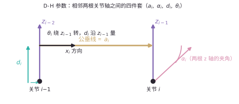
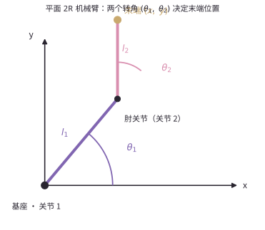
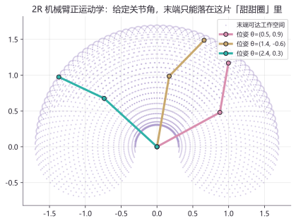

# 30 · 机械臂正运动学入门

> 📖 教材对照：Craig《机器人学导论》第 4 版 第 3 章 §3.1–3.6、第 4 章 §4.1–4.2（入门部分）
> 前置：[20 · 空间描述与坐标变换](./20_空间描述与坐标变换.md)（本章全部踩在它的旋转矩阵与 $T$ 连乘上）

## 本章导航

**上一章**：[20 · 空间描述与坐标变换](./20_空间描述与坐标变换.md)

**这章讲什么？**

给机械臂装上"骨骼"（连杆与关节），学会给每根连杆发一张"身份证"（D-H 参数），然后用这张身份证**一步一步**推出：给定关节角 $\theta_1, \theta_2$，平面 2R 机械臂的末端到底落在 $(x, y)$ 哪里。最后完整推导一遍——从 D-H 表到矩阵连乘到展开到几何验证，一个跳步都没有。

**为什么在机器人学里重要？**

正运动学是"机器人学的第一座桥"：一端是驱动器关心的关节角，另一端是任务关心的末端位置。焊枪走轨迹、抓取算位姿、仿真里摆姿态，全都要过这座桥。它也是你第一次"从参数推出公式"的完整体验——比任何习题都珍贵。

**学完能做什么？**

1. 看懂连杆、关节、关节变量与关节空间；
2. 说清 D-H 四参数 $\theta/d/a/\alpha$ 各是什么，按四步流程给 2R 臂建出 D-H 表；
3. **亲手完整推导** 2R 正运动学 $x = l_1\cos\theta_1 + l_2\cos(\theta_1+\theta_2)$，并用余弦定理交叉验证；
4. 跑通 Python 数值验证代码，理解工作空间与"奇异"的初步含义；
5. 读懂 UR5 官方参数表，说清逆运动学为什么难（多解）。

**本章在路线图中的位置**

```text
00 学习地图 → 10 什么是机器人 → 20 坐标变换 → 【30 机械臂正运动学入门】→ 40 ROS2 初体验
                                                   ▲ 你在这里
```

| 学习方式 | 时间 | 适合谁 |
|---|---|---|
| 首次学习（跟着推导，强烈建议备草稿纸） | 3–4 小时 | 第一次接触运动学 |
| 快速复习 | 60 分钟 | 推导过但细节遗忘 |

---

## 1. 从生活到概念：机器人的"骨骼"

看你的胳膊肘：大臂是一根"杆"，肘是一个"转轴"，小臂是另一根"杆"。机械臂的结构一模一样，只是用钢铁替换了骨头与关节：

- **连杆（Link）**：刚性"骨头"，负责保持两端的相对关系，本身不形变；
- **关节（Joint）**：允许相邻两根连杆产生**一个**相对运动的"轴承"，负责动。

再想想折纸/人偶：人偶能摆姿势，是因为每个关节处都能转；折纸鹤能"飞"，是因为折痕两侧的纸面相对转动。**"刚性杆 + 单自由度关节"交替串联**，就是绝大多数机械臂的骨架。

本章要回答的核心问题由此而来：每个关节转多少度是电机说了算（好测），但焊枪尖、吸盘、夹爪在**空间**的哪里（这才是任务要的）。从"各关节转角"到"末端位姿"的映射，就叫**正运动学（Forward Kinematics）**。

!!! note "类比在哪里失效"
    "骨骼"类比在前向计算上很好用，但有一处失效：人的关节有弹性、骨头会微小形变，机械臂的连杆被视为**绝对刚性**。真实的柔性误差属于后续的动力学与振动课程，入门阶段一律当作刚性处理。

---

## 2. 概念是什么

### 2.1 连杆与关节：两种基本关节

| 关节类型 | 运动方式 | 变量 | 生活实例 | 机械臂实例 |
|---|---|---|---|---|
| **转动关节（Revolute Joint）** | 绕一根轴旋转 | 角度 $\theta$（弧度） | 门合页、肘关节 | 绝大多数机械臂关节 |
| **移动关节（Prismatic Joint）** | 沿一根轴平移 | 长度 $d$（米） | 抽屉、伸缩天线 | 3D 打印机横梁、部分插装机械臂 |

文字图解（俯视一个转动关节）：

```text
      连杆 1                连杆 2
   ════════════○──────────────▶
              ╱ ╲
        关节 i 绕 ●（垂直纸面的轴）转动
        转过 θ 后连杆 2 抬起一个角度
```

本目录只展开**全转动关节**的平面机械臂；移动关节的公式框架完全相同（只是变量换成 $d$），等遇到 SCARA、3D 打印机时你只需"换个变量名"。

### 2.2 关节变量与关节空间

**关节变量（Joint Variables）**：每个关节的那个可动参数（转动关节为 $\theta$，移动关节为 $d$）凑成的一组数。$n$ 关节机械臂的关节变量是一个 $n$ 维向量：

$$
q = \begin{bmatrix} q_1 \\ q_2 \\ \vdots \\ q_n \end{bmatrix}
$$

**关节空间（Joint Space）**：把所有可能的 $q$ 想成一个"抽象空间"，机械臂的每一种姿态都是其中的一个点。2R 臂的关节空间就是一个平面（横轴 $\theta_1$、纵轴 $\theta_2$），每个点对应一种摆臂姿势。

- 控制器说"关节空间里往 $(30°, 45°)$ 走"——电机听得懂；
- 任务说"末端去 $(1.12,\ 1.47)$ 米处"——直角坐标（笛卡尔空间）的说法。

**正运动学就是从关节空间到笛卡尔空间的翻译官**：$q \mapsto T(q)$，输出正是上一章的齐次变换矩阵 $T$。

### 2.3 D-H 参数：给每根连杆发一张"身份证"

多个关节串起来后，难点在于：相邻连杆的坐标系怎么摆、怎么记。1955 年 Denavit 和 Hartenberg 提出一套固定套路，让每根连杆只用**四个参数**就完全确定——**D-H 参数（Denavit–Hartenberg Parameters）**。

**四个参数各是什么**

| 参数 | 名称 | 绕/沿哪根轴 | 含义（白话） | 类型 |
|---|---|---|---|---|
| $\theta_i$ | 关节角（Joint Angle） | 绕 $z_{i-1}$ 轴 | 关节 $i$ 转过的角度 | 转动关节的**变量** |
| $d_i$ | 连杆偏距（Link Offset） | 沿 $z_{i-1}$ 轴 | 两条公垂线之间沿 $z$ 的距离 | 移动关节的**变量**，其余为常数 |
| $a_i$ | 连杆长度（Link Length） | 沿 $x_i$ 轴 | 相邻两关节轴之间的公垂线长度 | **常数**（结构决定） |
| $\alpha_i$ | 连杆扭角（Link Twist） | 绕 $x_i$ 轴 | 相邻两根 $z$ 轴之间的夹角 | **常数**（结构决定） |

文字图（读法：两条不相交的关节轴线 $z_{i-2}$、$z_{i-1}$ 之间的"错位"由 $a$ 与 $\alpha$ 共同刻画）：



**标准 D-H 建模四步流程**

1. **画轴线**：把每个关节的转轴画出来，记为 $z_0, z_1, \dots, z_{n-1}$（$z$ 轴永远沿关节轴向）；
2. **定 $x$ 轴**：相邻两根 $z$ 轴的公垂线方向就是 $x$（两轴平行时 $x$ 可任选，选与上一杆对齐的方向）；
3. **读参数**：按上表逐杆读出 $\theta_i, d_i, a_i, \alpha_i$，列成 D-H 参数表；
4. **连乘**：每杆参数生成一个矩阵 $A_i$，正运动学就是连乘 $T = A_1 A_2 \cdots A_n$。

每杆的 $A_i$ 由四个参数"拧"出（转动关节取 $d, a, \alpha$ 为常数、$\theta$ 为变量）：

$$
A_i =
\begin{bmatrix}
\cos\theta_i & -\sin\theta_i\cos\alpha_i & \sin\theta_i\sin\alpha_i & a_i\cos\theta_i \\
\sin\theta_i & \cos\theta_i\cos\alpha_i & -\cos\theta_i\sin\alpha_i & a_i\sin\theta_i \\
0 & \sin\alpha_i & \cos\alpha_i & d_i \\
0 & 0 & 0 & 1
\end{bmatrix}
$$

这张通用表不用背：它就是"绕 $z$ 转 $\theta$ → 沿 $z$ 平移 $d$ → 沿 $x$ 平移 $a$ → 绕 $x$ 转 $\alpha$"四个基本变换依次连乘后的合并结果（用 20 章的齐次矩阵手乘一遍即可复现）。本章只用它最简的特例——平面上 $\alpha = 0$、$d = 0$ 的情形，届时你可以亲眼看到它"缩"成一小块。

> 📖 教材对照：Craig 第 4 版 §3.2（D-H 参数）、§3.4（连杆变换的推导）

---

## 3. 动手算一算：平面 2R 机械臂完整推导（本章核心）

对象：平面上两根连杆，长度 $l_1, l_2$，两个转动关节（基座一个、肘部一个），末端装一个小工具点。**目标**：推出末端坐标 $(x, y)$ 关于 $(\theta_1, \theta_2)$ 的表达式。全程四步，一步不跳。



### 第一步：建 D-H 表

按四步流程：关节轴线 $z_0, z_1$ 都垂直纸面（平行），故 $\alpha = 0$；平面内没有沿轴平移，$d = 0$；两根连杆的公垂线长就是杆长 $l_1, l_2$；变量是两个关节角。

| $i$ | $\theta_i$ | $d_i$ | $a_i$ | $\alpha_i$ |
|---|---|---|---|---|
| 1 | $\theta_1$（**变量**） | 0 | $l_1$ | 0 |
| 2 | $\theta_2$（**变量**） | 0 | $l_2$ | 0 |

四行参数里变量两个、常数两个——一张表装下整台机械臂。

### 第二步：写出 A₁ 与 A₂

把 $\alpha = 0$、$d = 0$ 代入 §2.3 的通用式：含 $\alpha$ 的项全部消失，第三行只剩 $(0, 0, 1, 0)$。为书写简洁，记 $c_1 = \cos\theta_1$，$s_1 = \sin\theta_1$，$c_2, s_2$ 同理：

$$
A_1 = \begin{bmatrix} c_1 & -s_1 & 0 & l_1 c_1 \\ s_1 & c_1 & 0 & l_1 s_1 \\ 0 & 0 & 1 & 0 \\ 0 & 0 & 0 & 1 \end{bmatrix},
\qquad
A_2 = \begin{bmatrix} c_2 & -s_2 & 0 & l_2 c_2 \\ s_2 & c_2 & 0 & l_2 s_2 \\ 0 & 0 & 1 & 0 \\ 0 & 0 & 0 & 1 \end{bmatrix}
$$

抽查 $A_1$ 结构：左上 $2\times 2$ 是 20 章的 2D 旋转矩阵 $R_z(\theta_1)$（平面内转），右上 $(l_1 c_1, l_1 s_1)^{\top}$ 是"沿杆 1 方向平移 $l_1$"——旋转 + 平移打包，与直觉一致 ✔。

### 第三步：连乘 T = A₁A₂（逐元素，不跳步）

记 $\theta_{12} = \theta_1 + \theta_2$。逐行计算（每个元素 = $A_1$ 的该行与 $A_2$ 的对应列点积）：

**第 1 行：**

$$
T_{11} = c_1 c_2 + (-s_1) s_2 + 0 \cdot 0 + l_1 c_1 \cdot 0 = c_1 c_2 - s_1 s_2 = \cos(\theta_1 + \theta_2)
$$

（末步用了和角公式 $\cos\alpha\cos\beta - \sin\alpha\sin\beta = \cos(\alpha+\beta)$，20 章已回顾）

$$
T_{12} = c_1(-s_2) + (-s_1) c_2 + 0 + 0 = -(c_1 s_2 + s_1 c_2) = -\sin(\theta_1 + \theta_2)
$$

（和角公式 $\sin\alpha\cos\beta + \cos\alpha\sin\beta = \sin(\alpha+\beta)$）

$$
T_{13} = c_1 \cdot 0 + (-s_1) \cdot 0 + 0 \cdot 1 + l_1 c_1 \cdot 0 = 0
$$

$$
T_{14} = c_1 (l_2 c_2) + (-s_1)(l_2 s_2) + 0 \cdot 0 + l_1 c_1 \cdot 1 = l_2(c_1 c_2 - s_1 s_2) + l_1 c_1 = l_2\cos\theta_{12} + l_1 c_1
$$

**第 2 行：**

$$
T_{21} = s_1 c_2 + c_1 s_2 = \sin(\theta_1 + \theta_2)
$$

$$
T_{22} = s_1(-s_2) + c_1 c_2 = c_1 c_2 - s_1 s_2 = \cos(\theta_1 + \theta_2)
$$

$$
T_{23} = 0
$$

$$
T_{24} = s_1 (l_2 c_2) + c_1 (l_2 s_2) + l_1 s_1 = l_2(s_1 c_2 + c_1 s_2) + l_1 s_1 = l_2\sin\theta_{12} + l_1 s_1
$$

**第 3、4 行：** $A_1$ 的第 3、4 行与 $A_2$ 相乘只搬运 $A_2$ 对应行，得 $[0\ 0\ 1\ 0]$ 与 $[0\ 0\ 0\ 1]$（平面臂不产生 $z$ 向变化 ✔）。

**汇总：**

$$
T = A_1 A_2 = \begin{bmatrix} \cos\theta_{12} & -\sin\theta_{12} & 0 & l_1 c_1 + l_2\cos\theta_{12} \\ \sin\theta_{12} & \cos\theta_{12} & 0 & l_1 s_1 + l_2\sin\theta_{12} \\ 0 & 0 & 1 & 0 \\ 0 & 0 & 0 & 1 \end{bmatrix}
$$

按 20 章的读法，右上角 $3\times 1$ 块就是末端在基座系的位置矢量：

$$
\boxed{\;x = l_1\cos\theta_1 + l_2\cos(\theta_1 + \theta_2), \qquad y = l_1\sin\theta_1 + l_2\sin(\theta_1 + \theta_2)\;}
$$

**姿态也顺便有了**：左上块说明末端朝向 = $\theta_1 + \theta_2$（两段旋转叠加）——这就是 10 章"数关节不数电机"的又一次现身：平面 2R 末端有 3 个位形参数（$x, y$ 与朝向角）。

### 第四步：与几何法互相验证（余弦定理）

矩阵推出一条公式，怎么信它？**换一条完全不同的路再走一遍。**

**路线一：向量加法（几何直读）。** 看 §3 开头的图：杆 1 末端（肘）坐标显然是 $(l_1 c_1,\ l_1 s_1)$；杆 2 从肘部出发，与水平线的夹角是 $\theta_1 + \theta_2$（先随杆 1 抬起 $\theta_1$，再自己抬 $\theta_2$），贡献 $(l_2\cos\theta_{12},\ l_2\sin\theta_{12})$。两段首尾相接：

$$
(x, y) = (l_1 c_1 + l_2\cos\theta_{12},\ \ l_1 s_1 + l_2\sin\theta_{12})
$$

与 D-H 结果逐字相同 ✔。

**路线二：余弦定理（距离侧证）。** 只验证"末端到基座的距离 $r$"这一条：基座-肘-末端构成三角形，两边长 $l_1, l_2$，**肘部内角**是 $180° - \theta_2$（因为 $\theta_2$ 是两杆延长方向的夹角，$\theta_2 = 0$ 时两杆共线伸直、内角翻平为 $180°$）。余弦定理：

$$
r^2 = l_1^2 + l_2^2 - 2 l_1 l_2\cos(180° - \theta_2) = l_1^2 + l_2^2 + 2 l_1 l_2\cos\theta_2
$$

（用了诱导公式 $\cos(180° - \theta_2) = -\cos\theta_2$）

**再用 D-H 的结果独立算 $r^2$：**

$$
r^2 = x^2 + y^2 = (l_1 c_1 + l_2 c_{12})^2 + (l_1 s_1 + l_2 s_{12})^2
$$

逐项展开：

$$
= l_1^2 c_1^2 + 2 l_1 l_2\, c_1 c_{12} + l_2^2 c_{12}^2 + l_1^2 s_1^2 + 2 l_1 l_2\, s_1 s_{12} + l_2^2 s_{12}^2
$$

把平方项按 $\sin^2 + \cos^2 = 1$ 归组：

$$
= l_1^2 (c_1^2 + s_1^2) + l_2^2 (c_{12}^2 + s_{12}^2) + 2 l_1 l_2 (c_1 c_{12} + s_1 s_{12})
$$

前两项化为 $l_1^2 + l_2^2$；交叉项用积化和公式 $\cos A\cos B + \sin A \sin B = \cos(A - B)$，取 $A = \theta_1$、$B = \theta_{12}$：

$$
c_1 c_{12} + s_1 s_{12} = \cos(\theta_1 - \theta_{12}) = \cos(-\theta_2) = \cos\theta_2
$$

（$\cos$ 是偶函数，$\cos(-\theta_2) = \cos\theta_2$）

$$
\Longrightarrow \quad r^2 = l_1^2 + l_2^2 + 2 l_1 l_2 \cos\theta_2
$$

**两条路给出同一个 $r^2$** ✔✔。特别抽查两个极端姿态：$\theta_2 = 0$（伸直）时 $r^2 = (l_1 + l_2)^2$，$r = l_1 + l_2$，正好全长 ✔；$\theta_2 = 180°$（对折）时 $r^2 = (l_1 - l_2)^2$，正好折回 ✔。

> 📖 教材对照：Craig 第 4 版 第 3 章（平面二连杆臂的正向运动学示例）与第 4 章开头（同款机械臂演示逆运动学的多解，结论互为印证）

### 3.5 Python 数值验证：θ₁ = 30°, θ₂ = 45°

先手算一遍（留作"预期输出"的对照基准）。$l_1 = l_2 = 1$ 米：

$$
c_1 = \cos 30° = \frac{\sqrt{3}}{2} \approx 0.8660, \qquad s_1 = \sin 30° = 0.5
$$

$\theta_{12} = 75°$，用和角公式（20 章同款）：

$$
\cos 75° = \cos 45°\cos 30° - \sin 45°\sin 30° = \frac{\sqrt{2}}{2}\cdot\frac{\sqrt{3}}{2} - \frac{\sqrt{2}}{2}\cdot\frac{1}{2} = \frac{\sqrt{6} - \sqrt{2}}{4} \approx 0.2588
$$

$$
\sin 75° = \frac{\sqrt{6} + \sqrt{2}}{4} \approx 0.9659
$$

代入公式：

$$
x = 1 \times 0.8660 + 1 \times 0.2588 = 1.1248 \text{ m}
$$

$$
y = 1 \times 0.5 + 1 \times 0.9659 = 1.4659 \text{ m}
$$

$$
r^2 = x^2 + y^2 = 1.2653 + 2.1489 = 3.4142 \approx 2 + 2\cos 45° = 3.4142 \text{（余弦定理对上了）}
$$

**运行环境**：Python 3，依赖 NumPy（安装：`pip install numpy`）。完整可运行代码：

```python
import numpy as np                    # 数值计算库

def dh_matrix(theta, d, a, alpha):    # 标准 D-H 的通用 A 矩阵（§2.3 公式的代码化）
    c, s = np.cos(theta), np.sin(theta)
    ca, sa = np.cos(alpha), np.sin(alpha)
    return np.array([
        [c, -s * ca,  s * sa, a * c],
        [s,  c * ca, -c * sa, a * s],
        [0.0,    sa,     ca,     d],
        [0.0,   0.0,    0.0,   1.0],
    ])

l1, l2 = 1.0, 1.0                     # 两根连杆长（米）
theta1 = np.deg2rad(30.0)             # 关节角 1：30° 转弧度
theta2 = np.deg2rad(45.0)             # 关节角 2：45° 转弧度

A1 = dh_matrix(theta1, 0.0, l1, 0.0)  # 按第一步的 D-H 表填参
A2 = dh_matrix(theta2, 0.0, l2, 0.0)
T = A1 @ A2                           # 第三步的连乘

print("T =\n", np.round(T, 4))        # 预期左上为 [cos75 -sin75; sin75 cos75] 的取值
print("末端 x =", round(T[0, 3], 4))  # 预期 1.1248
print("末端 y =", round(T[1, 3], 4))  # 预期 1.4659

x_geo = l1*np.cos(theta1) + l2*np.cos(theta1 + theta2)   # 几何路线一：向量加法
y_geo = l1*np.sin(theta1) + l2*np.sin(theta1 + theta2)
print("几何法 x =", round(x_geo, 4), " y =", round(y_geo, 4))  # 应与 T 完全一致

r = np.hypot(x_geo, y_geo)                              # 末端到基座距离
r_cos = np.sqrt(l1**2 + l2**2 + 2*l1*l2*np.cos(theta2)) # 路线二：余弦定理
print("r =", round(r, 4), " r(余弦定理) =", round(r_cos, 4))   # 两个都约 1.8478
```

**预期输出**（末位可能差 1 个尾数，属浮点正常）：

```text
T =
 [[ 0.2588 -0.9659  0.      1.1248]
 [ 0.9659  0.2588  0.      1.4659]
 [ 0.      0.      1.      0.    ]
 [ 0.      0.      0.      1.    ]]
末端 x = 1.1248
末端 y = 1.4659
几何法 x = 1.1248  y = 1.4659
r = 1.8478  r(余弦定理) = 1.8478
```

D-H 矩阵法、向量加法、余弦定理三条路全部收敛到同一组数——**推导闭环完成**。把你手算的 $(1.1248,\ 1.4659)$ 与机器输出对齐，本章的"关卡"就算通关。

---

## 4. 和机器人有什么关系

### 4.1 工作空间：2R 臂的"势力范围"

**工作空间（Workspace）**：所有关节角组合下，末端能到达的点的集合。对 2R 臂，由 $r^2 = l_1^2 + l_2^2 + 2l_1 l_2\cos\theta_2$ 立刻读出（$\cos\theta_2 \in [-1, 1]$）：

$$
|l_1 - l_2| \;\le\; r \;\le\; l_1 + l_2
$$

- $\theta_2 = 0$ 时 $r$ 最大 $= l_1 + l_2$（伸直摸最远）；
- $\theta_2 = 180°$ 时 $r$ 最小 $= |l_1 - l_2|$（对折收回来）。

所以 2R 臂的工作空间是一个**圆环域**（外半径 $l_1 + l_2$、内半径 $|l_1 - l_2|$）；当 $l_1 = l_2$ 时内半径为零，环退化成"整块圆盘"。



外半径 $R = l_1 + l_2$（伸直可达），内半径 $r = |l_1 - l_2|$（对折够不着）：圆环里每一处末端都能到，中间的"洞"与圆环之外到不了。想亲手扫描这个甜甜圈：[lab06 · 运动学实验室](../08_可视化实验室/lab06_运动学实验室.md)。

工程意义：选型机械臂时，**任务点必须全部落进工作空间**，且最好离边界远一点——原因见下节。这就像游戏里点亮传送点后开图：工作空间就是你这张图上"走得到"的范围，边界外仍是迷雾。

### 4.2 奇异性初见：手臂伸直时发生了什么

试一个思想实验：2R 臂**完全伸直**（$\theta_2 = 0$），此时指令"让末端沿杆方向再往外 1 厘米"——**办不到**。关节无论怎么转，瞬时都只能让末端沿着垂直于杆的方向滑动（微转 $\delta\theta_1$ 或 $\delta\theta_2$ 都让末端"画圆弧"），沿杆向外的一丝都动不了。这种"某些方向突然失能"的位形叫**奇异位形（Singularity）**，它是工作空间的边界（以及若干内部特殊位形）。

刻画它的标准工具是**雅可比矩阵（Jacobian）**——把关节速度"吹"成末端速度的"风场"：

$$
\dot{p} = J(q)\,\dot{q}
$$

对 2R 臂（把 §3 的 $x, y$ 对 $\theta_1, \theta_2$ 求偏导，微积分规则即可）：

$$
J = \begin{bmatrix} -l_1 s_1 - l_2 s_{12} & -l_2 s_{12} \\ l_1 c_1 + l_2 c_{12} & l_2 c_{12} \end{bmatrix},
\qquad
\det J = l_1 l_2 \sin\theta_2
$$

$\det J = 0$ 恰好发生在 $\theta_2 = 0°$ 或 $180°$（伸直/对折）——**手伸直的那一刻，风场熄火，末端速度场塌缩**，这正是"奇异"的数学身份。（$\det J$ 的展开过程折叠在下面，学有余力再展开。）

??? details "det J = l₁l₂sinθ₂ 的展开（选读）"

    记 $s_{12} = \sin(\theta_1+\theta_2)$，$c_{12} = \cos(\theta_1+\theta_2)$。二阶行列式定义（主对角积减副对角积）：

    $$
    \det J = (-l_1 s_1 - l_2 s_{12})(l_2 c_{12}) - (-l_2 s_{12})(l_1 c_1 + l_2 c_{12})
    $$

    第一项展开：

    $$
    = -l_1 l_2 s_1 c_{12} - l_2^2 s_{12} c_{12}
    $$

    第二项减去（负负得正）：

    $$
    + l_2 s_{12}(l_1 c_1 + l_2 c_{12}) = + l_1 l_2 s_{12} c_1 + l_2^2 s_{12} c_{12}
    $$

    合并，$l_2^2$ 项恰好抵消：

    $$
    \det J = l_1 l_2 (s_{12} c_1 - s_1 c_{12})
    $$

    用公式 $\sin A\cos B - \cos A\sin B = \sin(A - B)$，取 $A = \theta_{12}$、$B = \theta_1$：

    $$
    s_{12} c_1 - s_1 c_{12} = \sin(\theta_{12} - \theta_1) = \sin\theta_2
    $$

    所以 $\det J = l_1 l_2 \sin\theta_2$。$\theta_2 \in \{0°, 180°\}$ 时为零，与"伸直/对折失能"的物理直觉一致。

> 📖 教材对照：Craig 第 4 版 §5.8 起（雅可比与奇异性，本章只做预告）

### 4.3 机器人挂钩专节：读懂真实机械臂的参数表 + 逆运动学是什么

**（一）UR5 的 D-H 表怎么读。** 优傲 UR5 是协作机械臂的"教科书机型"，官方公布的 D-H 参数表长这样（单位：长度米、角度弧度；$a_2, a_3$ 为负是官方坐标系取向约定，不是错误）：

| $i$ | $\theta_i$ | $d_i$ (m) | $a_i$ (m) | $\alpha_i$ |
|---|---|---|---|---|
| 1 | $\theta_1$ 变量 | 0.089159 | 0 | $\pi/2$ |
| 2 | $\theta_2$ 变量 | 0 | $-0.42500$ | 0 |
| 3 | $\theta_3$ 变量 | 0 | $-0.39225$ | 0 |
| 4 | $\theta_4$ 变量 | 0.10915 | 0 | $\pi/2$ |
| 5 | $\theta_5$ 变量 | 0.09465 | 0 | $-\pi/2$ |
| 6 | $\theta_6$ 变量 | 0.08230 | 0 | 0 |

对照你刚学会的四参数读法：

- $\theta$ 列全是"变量"——六个转动关节，报数来自伺服编码器；
- $d_1 = 0.089$ 是基座高度（底座把第一关节抬起来一截），$d_4, d_5, d_6$ 是腕部三关节轴之间的错距；
- $a_2 = -0.425$、$a_3 = -0.392$：两根大臂/小臂的长（约 42.5 cm 与 39.2 cm，与 UR5 的 850 mm 工作半径吻合）；
- $\alpha$ 列的 $\pm\pi/2$：相邻关节轴互相垂直（比如腕部的"俯仰-偏航-滚转"正交布置）。

把 2R 的四步流程对这张表再走一遍（$A_1 \cdots A_6$ 连乘），就是 UR5 完整正运动学——流程一模一样，只是矩阵变多。宇树等厂商的机械臂（如六自由度的 Z1 系列）同样在官网/SDK 文档提供参数表，读法完全相同。

**（二）逆运动学是什么。** 一句话：**正运动学是"关节角 → 末端位姿"，逆运动学（Inverse Kinematics, IK）反过来："末端位姿 → 关节角"。** 为什么它难？

- **多解**：末端到了同一个点，肘可以"朝上翘"也可以"朝下塌"（肘上/肘下两解）——由 §3 的余弦定理结果反解可得 $\cos\theta_2 = \dfrac{x^2 + y^2 - l_1^2 - l_2^2}{2 l_1 l_2}$，一个 $\cos$ 对应 $\pm\theta_2$ 两个角，从此分岔出两族解；六轴工业臂最多 8 组解，7 自由度冗余臂有无穷多解（10 章的"冗余"在这里兑现）。
- **无解**：目标点在工作空间外（圆环之外/洞里）时无解。
- **奇异处病态**：目标点落在奇异位形附近时，解出的关节速度会飙到飞起（$\det J \to 0$，"除以接近零的数"）。

正运动学是"唯一答案 + 纯代入"，逆运动学是"选解 + 解方程"——难度与它差一个数量级，所以全行业先用正运动学把地基打牢。

---

## 5. 常见错误与自救

| 错误现象 | 原因 | 怎么改 |
|---|---|---|
| 推出 $x = l_1\cos\theta_1 + l_2\cos\theta_2$（漏加 $\theta_2$） | 忘记杆 2 的方向角是 $\theta_1+\theta_2$ | 画 §3 的平面图：$\theta_2$ 是**相对**杆 1 的角，对地要累加 |
| D-H 表 $a_i$ 填成"基座到肘的距离" | 混淆"公垂线长"与"点距" | $a_i$ 沿 $x_i$ 量在**两条关节轴**之间，不是两点之间 |
| $\alpha_i$ 符号错 | $z$ 轴指向没固定就读扭角 | 先把每根 $z$ 轴方向画死（沿关节轴），再看夹角带不带负号 |
| 连乘顺序写成 $A_2 A_1$ | 忘记"先做的在右边"（20 章约定） | 从基座到末端依次 $A_1 A_2 \cdots$，与坐标"顺着箭头走"一致 |
| 手算与代码对不上就怀疑推导 | 大概率是角度制/弧度制混用 | NumPy 全程弧度（`np.deg2rad`）；手算时也先换弧度再进公式 |
| 用伸直位形做抓取轨迹 | 撞上奇异，速度指令爆炸 | 规划时保持 $\theta_2$ 远离 $0°/180°$（离工作空间边界远一点） |
| 认为 $\det J = 0$ 时机械臂"卡死" | 混淆"瞬时失能方向"与"全局卡死" | 奇异是瞬时速度退化；换个姿态绕开即可，位置本身仍可达 |

---

## 6. 动手练习

**练习 1（手算）**：$l_1 = 0.5$ m，$l_2 = 0.3$ m，$\theta_1 = 90°$，$\theta_2 = 0°$。求末端 $(x, y)$ 与 $r$，并说明该位形的特殊之处。

??? details "练习 1 解答"

    $\theta_{12} = 90° + 0° = 90°$。$\cos 90° = 0$，$\sin 90° = 1$：

    $$
    x = 0.5\cos 90° + 0.3\cos 90° = 0.5 \times 0 + 0.3 \times 0 = 0
    $$

    $$
    y = 0.5\sin 90° + 0.3\sin 90° = 0.5 \times 1 + 0.3 \times 1 = 0.8
    $$

    $r = \sqrt{0^2 + 0.8^2} = 0.8 = l_1 + l_2$（余弦定理验证：$r^2 = 0.25 + 0.09 + 2\times 0.15\times\cos 0° = 0.34 + 0.30 = 0.64$ ✔）。

    特殊之处：$\theta_2 = 0$，两杆共线**伸直**，$r$ 达到最大值 $l_1 + l_2$——这是工作空间的外边界，也是**奇异位形**（$\det J = l_1 l_2\sin 0° = 0$）：此刻末端瞬时只能沿切向（水平方向）动，沿 $y$ 方向动不了。

**练习 2（手算）**：同一台臂（$l_1 = 0.5$，$l_2 = 0.3$），$\theta_1 = 0°$，$\theta_2 = 180°$。求末端坐标与 $r$。

??? details "练习 2 解答"

    $\theta_{12} = 180°$。$\cos 180° = -1$，$\sin 180° = 0$：

    $$
    x = 0.5\cos 0° + 0.3\cos 180° = 0.5 - 0.3 = 0.2
    $$

    $$
    y = 0.5\sin 0° + 0.3\sin 180° = 0 + 0 = 0
    $$

    $r = 0.2 = |l_1 - l_2|$（最小值，余弦定理：$r^2 = 0.25 + 0.09 + 0.3\cos 180° = 0.34 - 0.3 = 0.04$ ✔）。杆 2 完全折回压在杆 1 上，末端停在基座右侧 0.2 m 处——圆环域的**内边界**，同样是奇异位形。

**练习 3（D-H 建模）**：给"平面上 1 根连杆 + 1 个转动关节"的 1R 臂建 D-H 表，写出 $A_1$ 与末端公式。（它比 2R 简单，用于确认你真的会走四步。）

??? details "练习 3 解答"

    D-H 表：

    | $i$ | $\theta_i$ | $d_i$ | $a_i$ | $\alpha_i$ |
    |---|---|---|---|---|
    | 1 | $\theta_1$（变量） | 0 | $l_1$ | 0 |

    代入通用式（$\alpha = 0, d = 0$）：

    $$
    A_1 = \begin{bmatrix} c_1 & -s_1 & 0 & l_1 c_1 \\ s_1 & c_1 & 0 & l_1 s_1 \\ 0 & 0 & 1 & 0 \\ 0 & 0 & 0 & 1 \end{bmatrix}
    $$

    末端即杆 1 端点：$x = l_1\cos\theta_1$，$y = l_1\sin\theta_1$。工作空间是半径 $l_1$ 的圆周（注意：1R 臂的工作空间是**圆周**而非圆盘——末端到基座距离恒为 $l_1$，没有第二个关节去改 $r$）。

**练习 4（工作空间）**：$l_1 = 0.4$ m，$l_2 = 0.4$ m。目标点距基座 (a) 0.9 m、(b) 0.1 m、(c) 0.5 m，逐个判断可达性；可达的给出 $\theta_2$ 的余弦值。

??? details "练习 4 解答"

    工作空间：$|l_1 - l_2| = 0 \le r \le l_1 + l_2 = 0.8$，即**半径 0.8 m 的整块圆盘**（两杆等长，内半径为零）。

    (a) $r = 0.9 > 0.8$：不可达（圆盘外）。
    (b) $r = 0.1$：可达（在盘内）。由 $\cos\theta_2 = \dfrac{r^2 - l_1^2 - l_2^2}{2 l_1 l_2} = \dfrac{0.01 - 0.16 - 0.16}{0.32} = \dfrac{-0.31}{0.32} \approx -0.9688$，对应 $\theta_2 \approx \pm 165.6°$（深度对折）。
    (c) $r = 0.5$：可达。$\cos\theta_2 = \dfrac{0.25 - 0.32}{0.32} = \dfrac{-0.07}{0.32} \approx -0.2188$，$\theta_2 \approx \pm 102.6°$。注意每组可达点都有 $\pm$ 两解——逆运动学的"多解"现场目击。

**练习 5（编程）**：改写 §3.5 的代码：把 $(\theta_1, \theta_2)$ 换成练习 1 的 $(90°, 0°)$，验证输出 $x = 0, y = 0.8$；再扫描 $\theta_2$ 从 $-150°$ 到 $150°$（$\theta_1$ 固定 $30°$），打印 $|\det J|$ 的最小值，确认它在 $\theta_2 = 0$ 附近趋近于 0。

??? details "练习 5 解答（参考代码）"

    ```python
    import numpy as np

    l1, l2 = 0.5, 0.3                       # 练习 1 的臂长
    t1 = np.deg2rad(90.0)
    t2 = np.deg2rad(0.0)

    x = l1*np.cos(t1) + l2*np.cos(t1 + t2)  # 正运动学公式（§3 第四步结果）
    y = l1*np.sin(t1) + l2*np.sin(t1 + t2)
    print("练习1:", round(x, 4), round(y, 4))   # 预期 0.0 0.8

    # 扫描 |det J|：det J = l1*l2*sin(theta2)（§4.2 结论）
    dets = [abs(l1*l2*np.sin(np.deg2rad(t2))) for t2 in range(-150, 151)]
    print("min |det J| =", min(dets))           # 预期 0.0（theta2 扫到 0 度附近）
    ```

    输出 `0.0 0.8` 与 `min |det J| = 0.0`：数值实验与两个推导结论完全一致。

---

## 本章速查卡

| 概念/公式 | 内容 | 备注 |
|---|---|---|
| 连杆/关节 | 刚性杆 + 单自由度关节交替串联 | 转动 $\theta$ / 移动 $d$ |
| 关节空间 | 关节变量向量 $q$ 张成的抽象空间 | 正运动学：$q \mapsto T(q)$ |
| D-H 四参数 | $\theta$（绕 $z$，关节变量）、$d$（沿 $z$）、$a$（沿 $x$，杆长）、$\alpha$（绕 $x$，扭角） | 一杆一张身份证 |
| 建模四步 | 画轴线 → 定 $x$（公垂线）→ 读参数表 → 连乘 $A_i$ | 全部机械臂通用 |
| 2R 结果 | $x = l_1\cos\theta_1 + l_2\cos(\theta_1{+}\theta_2)$，$y = l_1\sin\theta_1 + l_2\sin(\theta_1{+}\theta_2)$ | 三条路线互相验证过 |
| 距离公式 | $r^2 = l_1^2 + l_2^2 + 2l_1 l_2\cos\theta_2$ | 余弦定理同款 |
| 工作空间 | 圆环域：$\|l_1 - l_2\| \le r \le l_1 + l_2$ | 等长时成整盘 |
| 奇异性 | $\det J = l_1 l_2\sin\theta_2 = 0$，即 $\theta_2 = 0°/180°$ | 伸直/对折瞬时失能 |
| 逆运动学 | 末端位姿 → 关节角；难在多解/无解/奇异病态 | 2R 臂肘上肘下两解 |
| UR5 表读法 | $\theta$ 变量、$d/a/\alpha$ 结构常数、单位米与弧度 | 厂商文档直接查 |

---

## 下一章预告

会"算"位姿了，接下来是会"动"：[40 · ROS2 初体验：小海龟仿真](./40_ROS2初体验_小海龟仿真.md)。你将安装 ROS2、跑起经典的小海龟仿真器，用键盘和自写的 Python 节点让它画圈画正弦——亲手把 10 章的"感知-决策-执行"工作流图跑在屏幕上。所有推导是为了此刻的动手，别忘了当初的草稿纸，下一章要换键盘了。

---

> 🔬 **配套实验**：2R 机械臂工作空间甜甜圈与三种臂姿——打开 [lab06 · 运动学实验室](../08_可视化实验室/lab06_运动学实验室.md)，抄一遍代码跑起来。

<div class="rt-complete" markdown>


<p class="rt-complete__title"><span class="rt-complete__badge">✓</span>本章完成 · 机械臂正运动学入门</p>

<p class="rt-complete__body">下一站：[40 · ROS2 初体验](./40_ROS2初体验_小海龟仿真.md) ｜ 动手验证：[lab06 · 运动学实验室](../08_可视化实验室/lab06_运动学实验室.md)</p>

</div>
