# 可视化实验室 · 总览

<div class="rt-chapter-header">
<div class="rt-chapter-header__top">
<span class="rt-chapter-header__code">VIS LAB · 可视化实验室</span>
<span class="rt-chapter-header__tagline">每条公式都能亲手运行、亲手修改</span>
</div>
<div class="rt-chapter-header__meta">
<span>◆ 11 个实验</span><span>◆ 纯 numpy 可复现</span><span>◆ 固定种子出图</span>
</div>
</div>

> **紫樱的可视化实验室**——理论书上每一条公式，在这里都变成一段你能亲手运行、亲手修改的代码和一张你能看懂的图。
> 本实验室与第〇阶筑基章节一一对应：**读书觉得抽象时，来跑代码；跑完代码，回去读书会突然通透。**

<div class="rt-mascot-tip" markdown>


**紫樱的实验守则**只有三条——抄一遍再跑、每次只改一个参数、看到意外的形状别慌，意外就是理解的开端。

</div>

---

## 环境准备（一次即可）

```bash
# 需要 Python 3.9+，只需两个依赖
pip install numpy matplotlib
```

所有实验代码只依赖这两个库，**无需 GPU、无需机器人硬件**；随机数全部固定种子，你跑出的图与本站插图完全一致。

## 实验室地图

| 实验室 | 主题 | 配套理论章节 | 你将看到 |
|---|---|---|---|
| [lab01 微积分实验室](lab01_微积分实验室.md) | 导数/泰勒/梯度下降 | [微积分 I/II](../01_数学/00_大学基础筑基/10_微积分I_极限与一元微分.md) | 割线变切线、多项式贴住 sin、小球滚向谷底 |
| [lab02 线性代数实验室](lab02_线性代数实验室.md) | 矩阵变换/特征向量 | [线性代数 I/II](../01_数学/00_大学基础筑基/30_线性代数I_矩阵与线性方程组.md) | 方格被旋转/剪切、椭圆主轴=特征向量 |
| [lab03 概率与滤波实验室](lab03_概率与滤波实验室.md) | 噪声/贝叶斯/粒子滤波 | [概率与统计基础](../01_数学/00_大学基础筑基/50_概率与统计基础.md)、[SLAM是什么](../03_SLAM/00_零基础入门/10_SLAM是什么_从零理解定位与建图.md) | 传感器噪声直方图、粒子云收拢定位 |
| [lab04 数值方法实验室](lab04_数值方法实验室.md) | 牛顿法/数值积分 | [数值方法与复变速成](../01_数学/00_大学基础筑基/60_数值方法与复变速成.md) | 切线阶梯三步逼近 √2、误差平方级下降 |
| [lab05 控制实验室](lab05_控制实验室.md) | PID/LQR | 第一阶自控原理 | P/PI/PID 阶跃响应、LQR 调 R 的性格差异 |
| [lab06 运动学实验室](lab06_运动学实验室.md) | 2R 机械臂正运动学 | [机械臂正运动学入门](../07_机器人学导论/30_机械臂正运动学入门.md) | 末端可达"甜甜圈"与三种臂姿 |
| [lab07 规划实验室](lab07_规划实验室.md) | A*/RRT | 第一阶规划入门 | A* 探索区域与最短路径、RRT 探索树 |
| [lab08 强化学习实验室](lab08_强化学习实验室.md) | Q-learning | 第一阶 RL 入门 | 价值热力图、从乱走到直奔目标的学习曲线 |
| [lab09 坐标变换实验室](lab09_坐标变换实验室.md) | 旋转矩阵/齐次变换链 | [空间描述与坐标变换](../07_机器人学导论/20_空间描述与坐标变换.md) | 点旋转弧线、三系变换链、机体系速度画圆 |
| [lab11 凸优化实验室](lab11_凸优化实验室.md) | 等高线/可行域/KKT 几何 | [凸分析基础](../01_数学/30_优化理论/10_凸分析基础.md)、[凸优化与对偶](../01_数学/30_优化理论/30_凸优化问题与对偶理论.md) | 最优点被推上边界、∇f 与 ∇g 反向共线 |
| [lab10 卡尔曼滤波实验室](lab10_卡尔曼滤波实验室.md) | 预测-更新循环/协方差椭圆 | [概率与统计基础](../01_数学/00_大学基础筑基/50_概率与统计基础.md)、[概率与估计深层](../01_数学/60_概率与估计/10_贝叶斯滤波与线性高斯滤波.md) | 不确定度带收窄、协方差椭圆一呼一吸 |

## 实验室通用流程





## 使用守则（紫樱的三条叮嘱）

1. **抄一遍再跑**，不要复制粘贴——肌肉记忆也是记忆
2. **每次只改一个参数**，跑完对比图的差异，猜为什么，再回去看书
3. 看到图里"意外的形状"不要慌——**意外就是理解的开端**
