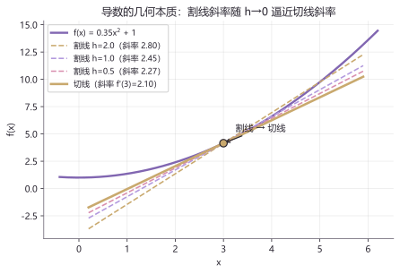

# lab01 · 微积分实验室

> 配套理论：[微积分 I：极限与一元微分](../01_数学/00_大学基础筑基/10_微积分I_极限与一元微分.md)、[微积分 II：积分与多元入门](../01_数学/00_大学基础筑基/20_微积分II_积分_级数与多元入门.md)
> 本页三组实验对应三个最抽象的概念：**导数、泰勒展开、梯度下降**——跑完代码，抽象就会落地。

## 实验流程





## 实验 1：割线如何变成切线

下面代码画出 $f(x)=0.35x^2+1$ 在 $x_0=3$ 处、$h=2/1/0.5$ 的三条割线与真正的切线。**以下代码即本页插图的生成代码**（固定种子，结果可复现）：

```python
import numpy as np
import matplotlib.pyplot as plt

f  = lambda x: 0.35 * x**2 + 1
fp = lambda x: 0.7 * x          # 导数：f'(x) = 0.7x

x = np.linspace(-0.4, 6.2, 200)
plt.plot(x, f(x), color="#8166B1", lw=2.4, label="f(x)")
x0 = 3.0
xs = np.linspace(0.2, 5.9, 50)
for h, c in [(2.0, "#DE9FBA"), (1.0, "#B39ADE"), (0.5, "#D98FAF")]:
    slope = (f(x0 + h) - f(x0)) / h          # 割线斜率 = 差商
    plt.plot(xs, f(x0) + slope * (xs - x0), "--", color=c, lw=1.6,
             label=f"割线 h={h}（斜率 {slope:.2f}）")
plt.plot(xs, f(x0) + fp(x0) * (xs - x0), color="#C9A96E", lw=2.6,
         label=f"切线（斜率 f'(3)={fp(3):.2f}）")
plt.scatter([x0], [f(x0)], color="#C9A96E", zorder=5, s=70)
plt.legend(); plt.title("导数的几何本质")
plt.show()
```



**图怎么读**：虚线割线的斜率（差商）随 $h$ 缩小一行行逼近金色切线的斜率——这就是导数定义 $f'(x_0)=\lim_{h\to0}\frac{f(x_0+h)-f(x_0)}{h}$ 的可视化。

**动手改**：
- 把 `x0` 改成 1.0，观察割线族整体变缓（切线斜率变小）
- 把 `h` 加一行 `0.05`，看割线与切线还有区别吗
- 把 f 换成 `np.sin`，在波峰处割线族会发生什么？（提示：导数为 0）

## 实验 2：泰勒展开——多项式"贴"住 sin

```python
import numpy as np
import matplotlib.pyplot as plt

x = np.linspace(-2 * np.pi, 2 * np.pi, 400)
plt.plot(x, np.sin(x), color="#292530", lw=2.6, label="sin x（真值）")
plt.plot(x, x,                              ":",  color="#C9A96E", label="1 阶")
plt.plot(x, x - x**3 / 6,                   "--", color="#D98FAF", label="3 阶")
plt.plot(x, x - x**3 / 6 + x**5 / 120,      "--", color="#8166B1", label="5 阶")
plt.ylim(-3, 3); plt.legend(loc="lower left")
plt.title("泰勒展开：阶数越高，贴得越远"); plt.show()
```


**图怎么读**：1 阶只在 0 附近有效；3 阶贴过半个周期；5 阶贴得更远。机器人学里"小角度近似 $\sin\theta\approx\theta$"就是 1 阶泰勒——它只在展开点附近可靠。

**动手改**：
- 加一行 `x - x**3/6 + x**5/120 - x**7/5040`（7 阶），看逼近范围扩大多少
- 把展开点搬到 $x=\pi$ 附近重写多项式（需要带 $(x-\pi)$ 的幂）

## 实验 3：梯度下降——小球滚向谷底

```python
import numpy as np
import matplotlib.pyplot as plt

f  = lambda x: x**4 - 3*x**2 + 1
fp = lambda x: 4*x**3 - 6*x            # 导数

x = np.linspace(-2.3, 2.3, 300)
plt.plot(x, f(x), color="#8166B1", lw=2.4)
xs, lr = -2.25, 0.06                    # 初值与学习率
path = [xs]
for _ in range(14):
    xs = xs - lr * fp(xs)               # 核心更新：x ← x − η·f'(x)
    path.append(xs)
path = np.array(path)
plt.plot(path, f(path), "--", color="#D98FAF", lw=1.4)
plt.scatter(path, f(path), c=range(len(path)), cmap="plasma", s=46, zorder=5)
plt.title("梯度下降：沿负梯度滚向谷底"); plt.show()
```


**图怎么读**：彩点按时间顺序从左侧陡坡滚落，颜色越亮越靠后；最终停在左边的谷底（局部极小）。机器人"学习"的第一课就是这条更新规则。

**动手改**：
- `lr=0.5`——小球会来回跳跃甚至发散（学习率过大的经典爆炸）
- 初值改 `1.8`——小球滚进右边另一个谷底：**初值决定收敛到哪个极小**

## 延伸开源项目

| 项目 | 干什么用 |
|---|---|
| [3b1b/manim](https://github.com/3b1b/manim) | 3Blue1Brown 的数学动画引擎，本节这些图都能做成动画 |
| [rougier/numpy-100](https://github.com/rougier/numpy-100) | NumPy 100 练习，把本页代码的向量化功底打扎实 |

## 回到理论

跑完三组实验，回到 [微积分 I](../01_数学/00_大学基础筑基/10_微积分I_极限与一元微分.md) 重读"导数定义"一节、[微积分 II](../01_数学/00_大学基础筑基/20_微积分II_积分_级数与多元入门.md) 重读"泰勒展开"与"梯度初见"——你会发现每句话背后都有这张图。
