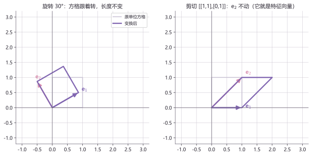
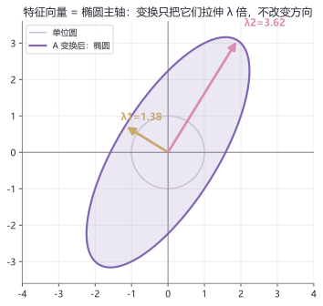

# lab02 · 线性代数实验室

> 配套理论：[线性代数 I：矩阵与线性方程组](../01_数学/00_大学基础筑基/30_线性代数I_矩阵与线性方程组.md)、[线性代数 II：特征值与二次型](../01_数学/00_大学基础筑基/40_线性代数II_特征值_二次型与正定性.md)
> 本页回答两个"矩阵到底在干嘛"的直觉问题：**矩阵=空间变换；特征向量=变换的不动方向。**

## 实验流程





## 实验 1：矩阵作为变换——旋转与剪切

```python
import numpy as np
import matplotlib.pyplot as plt

sq = np.array([[0, 0], [1, 0], [1, 1], [0, 1], [0, 0]])

def draw(ax, M, title):
    ax.set_aspect("equal")
    ax.plot(sq[:, 0], sq[:, 1], color="#b9b0cf", lw=1.6, label="原单位方格")
    t = sq @ M.T                              # 每个点左乘 M
    ax.plot(t[:, 0], t[:, 1], color="#8166B1", lw=2.4, label="变换后")
    for vec, c in [((1, 0), "#8166B1"), ((0, 1), "#D98FAF")]:
        v = np.array(vec) @ M.T
        ax.arrow(0, 0, v[0], v[1], head_width=0.09, color=c, length_includes_head=True)
    ax.set_xlim(-1.2, 3.2); ax.set_ylim(-1.2, 3.2)
    ax.axhline(0, color="gray", lw=0.8); ax.axvline(0, color="gray", lw=0.8)
    ax.set_title(title); ax.legend()

fig, axes = plt.subplots(1, 2, figsize=(9, 4.2))
th = np.deg2rad(30)
draw(axes[0], np.array([[np.cos(th), -np.sin(th)], [np.sin(th), np.cos(th)]]), "旋转 30°")
draw(axes[1], np.array([[1, 1], [0, 1]]), "剪切 [[1,1],[0,1]]")
plt.tight_layout(); plt.show()
```



**图怎么读**：左图旋转把方格整体转动；右图剪切把方格"推歪"——但注意粉色箭头 $e_2=(0,1)$ 在剪切下**纹丝不动**，它就是这个矩阵的特征向量（$\lambda=1$）。

**动手改**：
- 换 $M=\begin{bmatrix}2&0\\0&1\end{bmatrix}$（拉伸），观察行列式=面积缩放 2 倍
- 把旋转矩阵的角度改成 90°、180°，验证 $\det=-1$/$1$ 与面积的关系

## 实验 2：特征向量 = 椭圆主轴

```python
import numpy as np
import matplotlib.pyplot as plt

A = np.array([[2.0, 1.0], [1.0, 3.0]])   # 对称矩阵
t = np.linspace(0, 2*np.pi, 100)
circle = np.stack([np.cos(t), np.sin(t)], axis=1)
ell = circle @ A.T                        # 单位圆被 A 拉成椭圆

w, v = np.linalg.eigh(A)                  # 特征分解（eigh 用于对称阵）
plt.plot(circle[:, 0], circle[:, 1], color="#b9b0cf", label="单位圆")
plt.fill(ell[:, 0], ell[:, 1], color="#8166B1", alpha=0.16)
plt.plot(ell[:, 0], ell[:, 1], color="#8166B1", lw=2.2, label="A 变换后")
for i in range(2):
    vec = v[:, i] * w[i]
    plt.arrow(0, 0, vec[0], vec[1], head_width=0.12,
              color="#C9A96E" if i == 0 else "#D98FAF", length_includes_head=True)
    plt.text(vec[0]*1.1, vec[1]*1.1, f"λ{i+1}={w[i]:.2f}")
plt.axis("equal"); plt.legend(); plt.title("特征向量=主轴"); plt.show()
```



**图怎么读**：单位圆经 $A$ 变成椭圆；两支金色/粉色箭头（特征向量）恰好落在椭圆**主轴**上——变换只把它们拉长 $\lambda$ 倍，方向不变。这就是"特征"（ eigen，"自己的"）的含义。

**动手改**：
- 把 A 换成非对称矩阵 `[[2,1],[0,3]]`，主轴关系还成立吗？（提示：改用 `np.linalg.eig`）
- 把 A 换成 $\begin{bmatrix}2&1\\1&2\end{bmatrix}$，两个特征值相等时椭圆退化成什么？

## 延伸开源项目

| 项目 | 干什么用 |
|---|---|
| [3b1b/manim](https://github.com/3b1b/manim) | 3Blue1Brown 数学动画引擎；《线性代数的本质》同款视觉 |
| [MIT 18.06 Linear Algebra](https://math.mit.edu/~gs/linearalgebra/) | Strang 教授课程主页：讲义、习题与视频（免费） |

> 小樱丸备注：线性代数直觉的第一推荐是 3Blue1Brown《Essence of Linear Algebra》系列视频（官方免费），本实验是其第 3/4/14 集的代码版。
