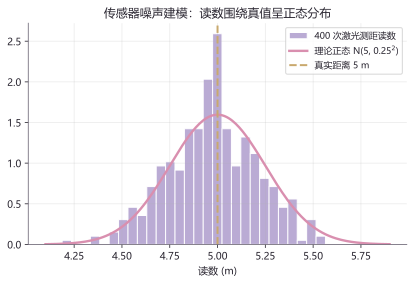
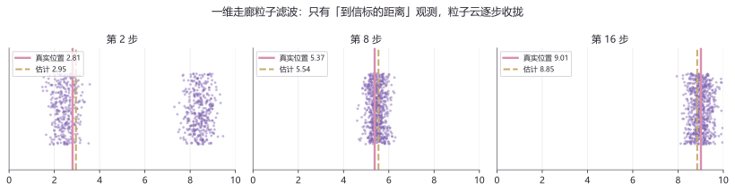

# lab03 · 概率与滤波实验室

> 配套理论：[概率与统计基础](../01_数学/00_大学基础筑基/50_概率与统计基础.md)、[SLAM是什么：从零理解定位与建图](../03_SLAM/00_零基础入门/10_SLAM是什么_从零理解定位与建图.md)
> 本页是全实验室的**镇馆之宝**：用一个 60 行的粒子滤波器，把"贝叶斯公式怎么让机器人找到自己"演给你看。

## 实验流程





## 实验 1：传感器噪声长什么样

```python
import numpy as np
import matplotlib.pyplot as plt

rng = np.random.default_rng(7)
d = 5.0 + rng.normal(0, 0.25, 400)        # 真值 5m + 高斯噪声

plt.hist(d, bins=28, color="#8166B1", alpha=0.55, edgecolor="white",
         density=True, label="400 次激光测距读数")
xs = np.linspace(4.1, 5.9, 200)
plt.plot(xs, 1/(0.25*np.sqrt(2*np.pi)) * np.exp(-0.5*((xs-5)/0.25)**2),
         color="#D98FAF", lw=2.4, label="理论正态 N(5, 0.25²)")
plt.axvline(5, color="#C9A96E", ls="--", lw=2, label="真实距离 5 m")
plt.legend(); plt.xlabel("读数 (m)"); plt.title("传感器噪声建模"); plt.show()
```



**图怎么读**：400 次读数堆成的"钟形山"与理论正态曲线吻合——这就是 $\mathcal N(0,\sigma^2)$ 噪声模型在真实数据上的样子。

## 实验 2：60 行粒子滤波定位（SLAM 定位的最小可运行原型）

```python
import numpy as np
import matplotlib.pyplot as plt

rng = np.random.default_rng(42)
N, T = 700, 16
true_x = 2.0                       # 机器人的真实位置（只有"上帝"知道）
particles = rng.uniform(0, 10, N)  # 初始：一无所知的均匀粒子云
weights = np.ones(N) / N
beacon = 5.0                       # 走廊正中挂一个信标
snapshots = []

for t in range(T):
    # --- 运动模型：真实机器人与粒子都往前走，都有噪声 ---
    true_x = np.clip(true_x + 0.45 + rng.normal(0, 0.12), 0, 10)
    z = abs(true_x - beacon) + rng.normal(0, 0.3)      # 观测：到信标的距离
    particles += 0.45 + rng.normal(0, 0.25, N)
    particles = np.clip(particles, 0, 10)

    # --- 观测更新：观测越吻合的粒子权重越高（贝叶斯！思想实验版） ---
    weights *= np.exp(-0.5 * ((np.abs(particles - beacon) - z) / 0.3) ** 2)
    weights /= weights.sum()
    if t in (1, 7, 15):
        est = np.sum(particles * weights)
        snapshots.append((t, particles.copy(), weights.copy(), true_x, est))

    # --- 重采样：按权重抽签，权重大者子孙多 ---
    idx = rng.choice(N, N, p=weights)
    particles, weights = particles[idx], np.ones(N) / N

fig, axes = plt.subplots(1, 3, figsize=(11.5, 3.0), sharey=True)
for ax, (t, ps, ws, xt, est) in zip(axes, snapshots):
    ax.scatter(ps, 1 + rng.uniform(-0.35, 0.35, N), s=4, c="#8166B1", alpha=0.35)
    ax.axvline(xt, color="#D98FAF", lw=2.4, label=f"真实位置 {xt:.2f}")
    ax.axvline(est, color="#C9A96E", lw=2, ls="--", label=f"估计 {est:.2f}")
    ax.set_title(f"第 {t+1} 步"); ax.set_yticks([])
    ax.legend(fontsize=8, loc="upper left")
plt.suptitle("粒子滤波：只有「到信标的距离」，粒子云逐步收拢")
plt.show()
```



**图怎么读**：
- 第 2 步：粒子云还很散（初始无知），但已开始向真值偏移
- 第 8 步：粉色竖线（真值）与金色虚线（加权估计）已经贴近
- 第 16 步：粒子云收成一条窄带——**机器人知道自己在哪了**

注意全程只有"到信标的距离"这一种观测，没有 GPS、没有地图——这就是贝叶斯滤波的威力，也是 SLAM 定位前端的最小雏形。

**动手改**：
- 把观测噪声 `0.3` 改成 `1.5`——收拢显著变慢（传感器变差，定位变难）
- 把运动噪声 `0.25` 改成 `0.05`——粒子云更窄，但真值跳出云外的概率变大（过度自信的风险）
- 把信标挪到 `beacon=10`（角落）——观察对称性丢失后粒子云的收拢形状变化

> 🎯 **进阶一步**：粒子滤波换成『高斯近似』，就是下一站的[卡尔曼滤波实验室](lab10_卡尔曼滤波实验室.md)——精确、快速、只需两个矩。

## 延伸开源项目

| 项目 | 干什么用 |
|---|---|
| [rlabbe/Kalman-and-Bayesian-Filters-in-Python](https://github.com/rlabbe/Kalman-and-Bayesian-Filters-in-Python) | 免费交互式 Jupyter 书，把卡尔曼/粒子滤波讲到无可再清楚 |
| [AtsushiSakai/PythonRobotics](https://github.com/AtsushiSakai/PythonRobotics) | 机器人算法可视化大全集（含定位/SLAM/规划），本实验室的"师兄" |
| [gaoxiang12/slambook2](https://github.com/gaoxiang12/slambook2) | 《视觉SLAM十四讲》官方代码仓，进阶之后的下一站 |

## 回到理论

回到 [概率与统计基础](../01_数学/00_大学基础筑基/50_概率与统计基础.md) 重读"贝叶斯公式"一节，再回 [SLAM是什么](../03_SLAM/00_零基础入门/10_SLAM是什么_从零理解定位与建图.md) 看运动方程与观测方程——你会认出实验里每一行对应哪个方程。
