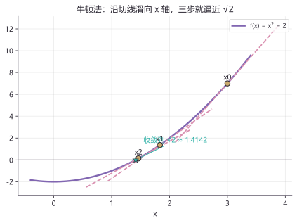
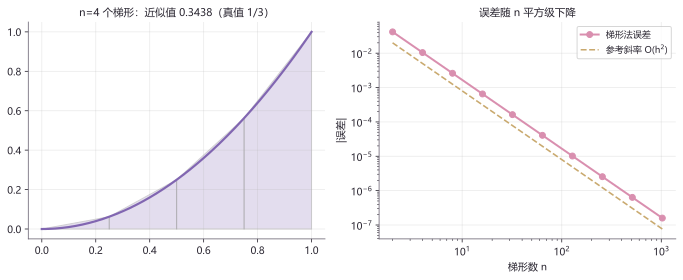

# lab04 · 数值方法实验室

> 配套理论：[数值方法与复变速成](../01_数学/00_大学基础筑基/60_数值方法与复变速成.md)
> 计算机只会加减乘除——本页演给你看：它怎么用"笨办法 + 聪明迭代"开平方、算积分。

## 实验流程





## 实验 1：牛顿法三步逼近 √2

```python
import numpy as np
import matplotlib.pyplot as plt

f  = lambda x: x**2 - 2
fp = lambda x: 2*x                      # 导数

x = np.linspace(-0.4, 3.4, 200)
plt.plot(x, f(x), color="#8166B1", lw=2.4, label="f(x) = x² − 2")
plt.axhline(0, color="gray", lw=1)
xn = 3.0
for i in range(3):
    plt.scatter([xn], [f(xn)], color="#C9A96E", zorder=5)
    plt.text(xn, f(xn)+0.35, f"x{i}", ha="center")
    tang = fp(xn)
    xs = np.linspace(xn-0.9, xn+0.9, 30)
    plt.plot(xs, f(xn) + tang*(xs-xn), "--", color="#D98FAF", lw=1.7)
    xn = xn - f(xn)/tang                # 牛顿迭代：沿切线滑到 x 轴
plt.scatter([np.sqrt(2)], [0], color="#2fb2a8", marker="*", s=180, zorder=6)
plt.title("牛顿法：切线阶梯滑向 √2"); plt.legend(); plt.show()
```



**图怎么读**：每条粉色虚线是当前点的切线；切线与 x 轴的交点就是下一个迭代点 $x_{n+1}=x_n-\frac{f(x_n)}{f'(x_n)}$。从 $x_0=3$ 出发，三步就贴近 $\sqrt2$。机器人学里逆运动学求解器的内核就是它。

**动手改**：
- 初值改成 `-0.3`——牛顿法会滑向另一个根 $-\sqrt2$（还是先绕个弯？跑跑看）
- 对 $f(x)=x^{1/3}$ 试试牛顿法——著名的"驻点陷阱"案例，迭代会来回打转

## 实验 2：梯形积分与误差的平方级下降

```python
import numpy as np
import matplotlib.pyplot as plt

f = lambda x: x**2
true = 1/3

def trapezoid(n):
    xs = np.linspace(0, 1, n+1)
    h = 1/n
    return h * sum((f(xs[i]) + f(xs[i+1]))/2 for i in range(n))

ns = 2 ** np.arange(1, 11)
err = [abs(trapezoid(n) - true) for n in ns]

fig, axes = plt.subplots(1, 2, figsize=(9.6, 3.8))
xs4 = np.linspace(0, 1, 5)
for i in range(4):
    axes[0].fill([xs4[i], xs4[i], xs4[i+1], xs4[i+1]],
                 [0, f(xs4[i]), f(xs4[i+1]), 0], alpha=0.22,
                 color="#8166B1", edgecolor="k", lw=0.8)
axes[0].plot(np.linspace(0, 1, 100), f(np.linspace(0, 1, 100)),
             color="#8166B1", lw=2.2)
axes[0].set_title(f"n=4：近似值 {trapezoid(4):.4f}（真值 0.3333）")
axes[1].loglog(ns, err, "o-", color="#D98FAF", lw=2, label="梯形法误差")
axes[1].loglog(ns, 0.08/ns**2, "--", color="#C9A96E", label="参考斜率 O(h²)")
axes[1].set_xlabel("梯形数 n"); axes[1].legend()
plt.tight_layout(); plt.show()
```



**图怎么读**：左图 4 个梯形拼出的"折线山顶"比真曲线略胖；右图双对数坐标下误差点与 $O(h^2)$ 参考线平行——n 翻 10 倍，误差小 100 倍。机器人仿真每一步积分都在用这个思想。

**动手改**：
- 把被积函数换成 $\sin x$ 在 $[0,\pi]$ 上（真值 2），误差斜率变了吗？
- 把梯形换成中点矩形（取每段中点函数值），精度是 $O(h^2)$ 吗？谁更准？

## 延伸开源项目

| 项目 | 干什么用 |
|---|---|
| [scipy/scipy](https://github.com/scipy/scipy) | `scipy.optimize.newton` 与 `integrate.quad` 就是本页算法的工业级版本 |
| [AtsushiSakai/PythonRobotics](https://github.com/AtsushiSakai/PythonRobotics) | Path Planning / Localization 各章节里到处是牛顿法与数值积分 |
