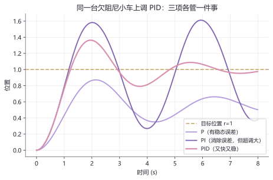
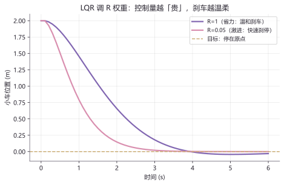

# lab05 · 控制实验室

> 配套理论：[从零开始学习路线总图 · 第一阶](../00_项目导航/从零开始学习路线总图.md)、[数学方向_学习路径与教材映射](../01_数学/数学方向_学习路径与教材映射.md)（胡寿松《自动控制原理》线）
> 本页把控制中最著名的两位主角请上实验台：**PID**（工业 95% 回路的当家）与 **LQR**（现代控制的最优基准）。

## 实验 1 流程：闭环控制的标准画法





> 权威画法要点：比较点用小圆圈标注「Σ」与正负号；反馈回路箭头必须回到比较点——这就是"闭环"二字的图形来源。

## 实验 1：一台欠阻尼小车上调 PID

被控对象是欠阻尼二阶系统（$w=1,\ \zeta=0.25$，想想一辆弹簧减震很差的小车）：

```python
import numpy as np
import matplotlib.pyplot as plt

dt, T = 0.01, 8.0
n = int(T/dt)
w, zeta = 1.0, 0.25

def sim(kp, ki, kd):
    x = v = integ = prev_e = 0.0
    ys = []
    for _ in range(n):
        e = 1.0 - x                          # 目标 1，当前 x → 误差
        integ += e * dt
        u = kp*e + ki*integ + kd*(e - prev_e)/dt   # PID 三项
        prev_e = e
        u = np.clip(u, 0, 2)                 # 电机推力有限幅
        v += (w**2*u - 2*zeta*w*v - w**2*x) * dt
        x += v * dt
        ys.append(x)
    return np.array(ys)

t = np.arange(n) * dt
plt.axhline(1, color="#C9A96E", ls="--", label="目标位置 r=1")
plt.plot(t, sim(1.2, 0, 0),   color="#B39ADE", label="P")
plt.plot(t, sim(2.0, 1.4, 0), color="#8166B1", label="PI")
plt.plot(t, sim(2.6, 1.8, 0.9), color="#D98FAF", lw=2.2, label="PID")
plt.xlabel("时间 (s)"); plt.legend(loc="lower right")
plt.title("PID 三项各管一件事"); plt.show()
```



**图怎么读**：
- **P**（比例）：反应快但永远差一点——稳态误差
- **PI**（+积分）：积分项把历史误差攒起来补掉了稳态误差，但代价是冲过头（超调）
- **PID**（+微分）：微分项预判误差变化趋势提前刹车——又快又稳

**动手改**：
- `kd=3.0`——微分过强会引起高频抖振（数值噪声被放大）
- 把 `np.clip` 限幅去掉——观察控制量爆炸时的响应（执行器饱和为何必须建模）

## 实验 2：LQR——调 R 就是调"性格"

双积分小车（位置+速度状态），离散 Riccati 迭代求最优增益 $K$：

```python
import numpy as np
import matplotlib.pyplot as plt

dt = 0.1
A = np.array([[1.0, dt], [0, 1.0]])
B = np.array([[0], [dt]])
x0 = np.array([[2.0], [0.0]])

def dare(A, B, Q, R, iters=400):          # 离散 Riccati 迭代
    P = Q.copy()
    for _ in range(iters):
        K = np.linalg.solve(R + B.T@P@B, B.T@P@A)
        P = Q + A.T@P@(A - B@K)
    return np.linalg.solve(R + B.T@P@B, B.T@P@A)

plt.axhline(0, color="#C9A96E", ls="--", label="目标：停在原点")
for Rv, c, name in [(1.0, "#8166B1", "R=1（省力：温和刹车）"),
                    (0.05, "#D98FAF", "R=0.05（激进：快速刹停）")]:
    K = dare(A, B, np.diag([1.0, 0.4]), np.array([[Rv]]))
    x = x0.copy(); xs = [x[0, 0]]
    for _ in range(60):
        x = (A - B@K) @ x                  # 闭环动力学
        xs.append(x[0, 0])
    plt.plot(np.arange(61)*dt, xs, color=c, lw=2.2, label=name)
plt.xlabel("时间 (s)"); plt.legend()
plt.title("LQR 调 R 权重"); plt.show()
```



**图怎么读**：R 是"控制量"的代价权重。R 大 → 控制量贵 → 小车温柔地滑回原点；R 小 → 随便用力 → 凶狠地一步刹停。LQR 的全部调参艺术就在 Q/R 这两个对角矩阵的权衡里（Q 管"状态误差多贵"，R 管"力气多贵"）。

**动手改**：
- 把 Q 的速度项权重 `0.4` 改成 `5.0`——观察刹车变"点头"（惩罚速度 → 提前减速）
- 把仿真步数拉到 200，验证两条曲线最终都稳定在 0（闭环稳定性的图形证据）

## 延伸开源项目

| 项目 | 干什么用 |
|---|---|
| [python-control/control](https://github.com/python-control/control) | MATLAB 级别的控制系统工具箱（本页 LQR 的工业版 `control.lqr`） |
| [AtsushiSakai/PythonRobotics](https://github.com/AtsushiSakai/PythonRobotics) | `Control` 目录下的 LQR/滑模/MPC 可视化示例 |
| [leggedrobotics/legged_gym](https://github.com/leggedrobotics/legged_gym) | 足式机器人 RL 训练框架（第三阶内容的前瞻预览） |
