# lab06 · 运动学实验室

> 配套理论：[机器人学导论 · 空间描述与坐标变换](../07_机器人学导论/20_空间描述与坐标变换.md)、[机械臂正运动学入门](../07_机器人学导论/30_机械臂正运动学入门.md)
> 一支两连杆机械臂，把"正运动学"与"工作空间"两个词变成一张图。

## 实验流程





## 实验：2R 机械臂的工作空间与三种臂姿

```python
import numpy as np
import matplotlib.pyplot as plt

l1, l2 = 1.0, 0.7                        # 两节连杆长度

# —— 工作空间：把 θ₁ θ₂ 扫个遍，收集成千上万个末端点 ——
t1 = np.linspace(0, np.pi, 60)
t2 = np.linspace(-np.pi, np.pi, 60)
T1, T2 = np.meshgrid(t1, t2)
px = l1*np.cos(T1) + l2*np.cos(T1 + T2)
py = l1*np.sin(T1) + l2*np.sin(T1 + T2)
plt.scatter(px, py, s=1.6, c="#8166B1", alpha=0.22)

# —— 三种具体臂姿：连杆画出来 ——
def arm(a1, a2):
    ex = l1*np.cos(a1) + l2*np.cos(a1 + a2)
    ey = l1*np.sin(a1) + l2*np.sin(a1 + a2)
    plt.plot([0, l1*np.cos(a1), ex],
             [0, l1*np.sin(a1), ey], "-o", lw=3)
    return ex, ey

arm(0.5, 0.9); arm(1.4, -0.6); arm(2.4, 0.3)
plt.axis("equal"); plt.title("2R 机械臂：工作空间与臂姿"); plt.show()
```


**图怎么读**：
- 紫色点云是**工作空间**：$\theta_1,\theta_2$ 任意取值时末端可能到达的所有位置——一个内半径 $|l_1-l_2|$、外半径 $l_1+l_2$ 的"甜甜圈"
- 三条彩色折线是三组关节角对应的臂姿：给定关节角，末端位置唯一（正运动学）；反过来给位置求角度就是**逆运动学**（多解，见理论章）
- 甜甜圈中心那个"洞"就是机械臂够不着的死区——手臂越短洞越大

**动手改**：
- 把 `t1 = np.linspace(0, np.pi, 60)` 改成 `(-np.pi/2, np.pi/2, 40)`——工作空间立刻缺一块（关节限位的图形意义）
- 两杆等长 `l1=l2=0.85`——甜甜圈的洞消失（内半径为 0）
- 加一行：对同一末端点画两组 $(\theta_1,\theta_2)$ 的臂姿——亲眼看到逆运动学的"多解"

## 延伸开源项目

| 项目 | 干什么用 |
|---|---|
| [AtsushiSakai/PythonRobotics](https://github.com/AtsushiSakai/PythonRobotics) | `ArmNavigation` 目录：两连杆 IK/工作空间动画一应俱全 |
| [stack-of-tasks/pinocchio](https://github.com/stack-of-tasks/pinocchio) | 工业级刚体动力学库（本站第三阶足式/机械臂章节的忠实伙伴） |
| [moveit/moveit2](https://github.com/moveit/moveit2) | ROS2 机械臂规划框架，第一阶 ROS2 工程化的主舞台 |
