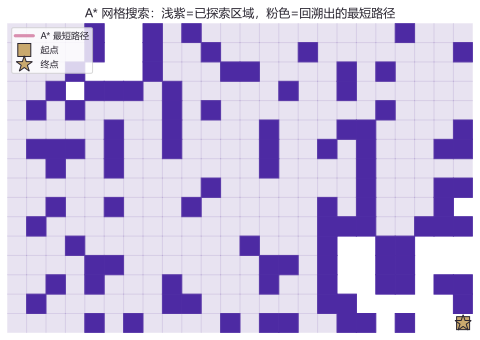
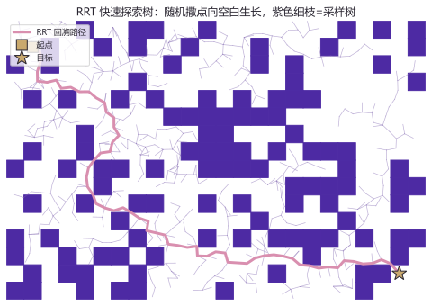

# lab07 · 规划实验室

> 配套理论：[移动规控方向_学习路径与教材映射](../04_移动机器人规控/移动规控方向_学习路径与教材映射.md)（LaValle《Planning Algorithms》线）
> 两种经典的路径规划器同台：**A\***（系统搜索的黄金标准）与 **RRT**（随机采样的探索大师）。

## 实验流程（A* 的权威流程图画法：判断用菱形）





## 实验 1：A* 网格搜索

```python
import numpy as np
import matplotlib.pyplot as plt
import heapq

rng = np.random.default_rng(3)
W, H = 24, 16
grid = (rng.random((H, W)) < 0.28).astype(int)
grid[0, 0] = grid[H-1, W-1] = 0            # 起点/终点保证可行
start, goal = (0, 0), (H-1, W-1)

def h(p):                                   # 曼哈顿启发式
    return abs(p[0]-goal[0]) + abs(p[1]-goal[1])

openq = [(h(start), 0, start)]
came, cost = {start: None}, {start: 0}
explored = set()
while openq:
    _, g, cur = heapq.heappop(openq)
    if cur in explored:
        continue
    explored.add(cur)
    if cur == goal:
        break
    for dy, dx in ((1,0), (-1,0), (0,1), (0,-1)):
        np_ = (cur[0]+dy, cur[1]+dx)
        if 0 <= np_[0] < H and 0 <= np_[1] < W and grid[np_] == 0:
            ng = g + 1
            if ng < cost.get(np_, 1e9):
                cost[np_] = ng; came[np_] = cur
                heapq.heappush(openq, (ng + h(np_), ng, np_))

path, cur = [], goal                        # 从终点回溯
while cur is not None:
    path.append(cur); cur = came.get(cur)
path = path[::-1]

# —— 可视化 ——
for y, x in zip(*np.where(grid == 1)):
    plt.Rectangle((x, y), 1, 1, color="#4d2aa3"); plt.gca().add_patch(plt.Rectangle((x, y), 1, 1, color="#4d2aa3"))
for y, x in explored - set(path):
    plt.gca().add_patch(plt.Rectangle((x, y), 1, 1, color="#8166B1", alpha=0.18))
plt.plot([x+.5 for _, x in path], [y+.5 for y, _ in path], color="#D98FAF", lw=3)
plt.plot(start[1]+.5, start[0]+.5, "s", color="#C9A96E", ms=12)
plt.plot(goal[1]+.5, goal[0]+.5, "*", color="#C9A96E", ms=16)
plt.axis("equal"); plt.axis("off"); plt.title("A* 网格搜索"); plt.show()
```



**图怎么读**：深紫方块=障碍；浅紫=被 A* "考虑过"的格子（探索区域）；粉色粗线=从终点回溯出的最短路径。注意浅紫区域如何被启发函数 $h$ "拽"着朝终点方向生长——把 `h` 改成恒返回 0（退化为 Dijkstra），探索区域立刻膨胀成圆形。

**动手改**：
- 障碍密度 `0.28` 提到 `0.38`——看路径如何绕行、甚至无解（记得处理 `came.get(goal)` 为 None 的情况）
- 换 8 邻域（对角线移动）+ 欧氏启发式——路径更斜更自然

## 实验 2：RRT 快速探索树

```python
import numpy as np
import matplotlib.pyplot as plt

rng = np.random.default_rng(11)
start, goal = np.array([1.5, 1.5]), np.array([22.5, 14.5])
tree = {tuple(start): None}
pts = [start]
for _ in range(2600):
    q = rng.uniform([0, 0], [24, 16]) if rng.random() > 0.08 else goal   # 8% 概率直奔目标
    near = min(pts, key=lambda p: np.hypot(*(q - p)))                    # 最近的树节点
    d = q - near
    step = near + d/(np.hypot(*d)+1e-9) * 0.55                           # 朝 q 走一小步
    if _collide(grid, step) or _collide(grid, near + (step-near)*0.5):   # 碰撞检测
        continue
    pts.append(step); tree[tuple(step)] = tuple(near)
    if np.hypot(*(goal - step)) < 0.7:
        tree[tuple(goal)] = tuple(step)
        break

path, cur = [], tuple(goal)
while cur is not None:
    path.append(cur); cur = tree.get(cur)
# —— 可视化同上：紫细线画树，粉粗线画回溯路径 ——
```



**图怎么读**：紫色细枝是 RRT 的采样树——它像藤蔓一样向空白区域疯长（"快速探索"得名于此）；找到目标后回溯出的粉色路径通常歪歪扭扭——所以工程上还要接一步"路径平滑/轨迹优化"（本站规控深水区的日常）。

**动手改**：
- 步长 `0.55` 改成 `2.5`——树变得稀疏、穿缝失败率上升
- 目标偏置 `0.08` 改成 `0.5`——树过早扎向目标，反而容易被障碍卡死（探索与贪婪的平衡）

## 延伸开源项目

| 项目 | 干什么用 |
|---|---|
| [AtsushiSakai/PythonRobotics](https://github.com/AtsushiSakai/PythonRobotics) | `PathPlanning` 目录有 A*/RRT/RRT* 全家桶动画 |
| [ompl/ompl](https://github.com/ompl/ompl) | ROS/MoveIt2 背后的采样规划官方库（第三阶） |

> 小樱丸备注：把两个实验的"探索区域"对比着看，你就懂了为什么工程上"结构化环境用 A*，高维连续空间用 RRT 系"。
