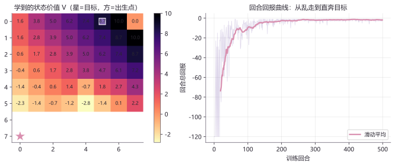

# lab08 · 强化学习实验室

> 配套理论：[具身智能方向_学习路径与教材映射](../06_具身智能/具身智能方向_学习路径与教材映射.md)（Sutton & Barto《强化学习》线）
> 最小可运行的 Q-learning：一个 6×8 网格世界，看智能体从"乱走"进化成"直奔目标"。

## 实验流程（Q-learning 循环的标准画法）





## 实验：6×8 网格世界的 Q-learning

```python
import numpy as np
import matplotlib.pyplot as plt

rng = np.random.default_rng(2)
H, W = 6, 8
goal = (0, W-1)
acts = [(-1,0), (1,0), (0,-1), (0,1)]       # 上下左右
Q = np.zeros((H, W, 4))
returns = []
alpha, gamma = 0.5, 0.97

for ep in range(500):
    s = (H-1, 0)                             # 出生点：左下角
    eps = max(0.05, 1.0 * 0.99**ep)          # ε 衰减：越学越少乱试
    total = 0.0
    for _ in range(120):
        a = rng.integers(4) if rng.random() < eps else int(np.argmax(Q[s]))
        ny, nx = s[0]+acts[a][0], s[1]+acts[a][1]
        ns = (ny, nx) if 0 <= ny < H and 0 <= nx < W else s
        r = 10.0 if ns == goal else -1.0     # 每步 -1，催它走快点
        Q[s][a] += alpha * (r + gamma*np.max(Q[ns]) - Q[s][a])
        total += r
        s = ns
        if ns == goal:
            break
    returns.append(total)

V = Q.max(axis=2)                            # 每格的最优价值
fig, axes = plt.subplots(1, 2, figsize=(10.5, 3.9),
                         gridspec_kw={"width_ratios": [1.15, 1]})
im = axes[0].imshow(V, cmap="magma_r")
for i in range(H):
    for j in range(W):
        axes[0].text(j, i, f"{V[i,j]:.1f}", ha="center", va="center", fontsize=8)
axes[0].plot(W-1, 0, "*", color="#D98FAF", ms=20, markeredgecolor="white")
axes[0].plot(0, H-1, "s", color="#8166B1", ms=11, markeredgecolor="white")
axes[0].set_title("学到的状态价值 V（星=目标，方=出生点）")
smooth = np.convolve(returns, np.ones(20)/20, mode="valid")
axes[1].plot(returns, color="#8166B1", alpha=0.25, lw=0.8)
axes[1].plot(range(19, 500), smooth, color="#D98FAF", lw=2.2, label="滑动平均")
axes[1].set_xlabel("训练回合"); axes[1].legend()
plt.tight_layout(); plt.show()
```



**图怎么读**：
- **左图（价值热力图）**：颜色越亮价值越高；离目标（粉色星）越近的格子价值越高，梯度自然形成一条"看不见的导航坡"——智能体就是顺着它学会走路的。这就是"奖励塑形"的空间直观
- **右图（学习曲线）**：紫色浅线是每回合原始回报（前期大起大落=乱走/运气），粉色粗线是滑动平均——从约 -30 抬升到接近最优值，稳定后几乎不再波动

**动手改**：
- `gamma=0.9` → 更短视；`gamma=0.99` → 更有远见（观察热力图梯度的"坡长"变化）
- 中间放一排障碍格 `Q[2:4, 2:6] = -np.inf` 的处理（把障碍格的 V 屏蔽掉再画图）——看价值梯度如何绕行
- `alpha=0.05`——学习变得非常慢（学习率的意义一目了然）

## 延伸开源项目

| 项目 | 干什么用 |
|---|---|
| [openai/gymnasium](https://github.com/Farama-Foundation/Gymnasium) | 标准强化学习环境库（CartPole 一行代码跑起来） |
| [dennybritz/reinforcement-learning](https://github.com/dennybritz/reinforcement-learning) | Sutton 教材的配套实现合集 |
| [leggedrobotics/legged_gym](https://github.com/leggedrobotics/legged_gym) | 四足机器人 RL 训练（本站 RL 运控 28 章的同源技术栈） |
