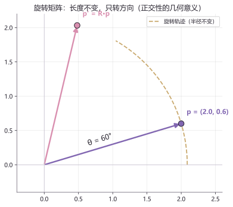
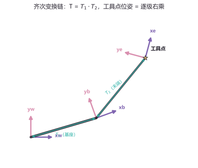
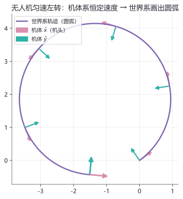

# lab09 · 坐标变换实验室

> 配套理论：[空间描述与坐标变换](../07_机器人学导论/20_空间描述与坐标变换.md)（Craig《机器人学导论》第2章线）
> 本页把全站最重要的三件事变成看得见的图：**旋转矩阵只转不伸、齐次变换链逐级右乘、机体系速度经旋转画 出世界系轨迹。**

## 实验流程





## 实验 1：旋转矩阵——长度不变，只转方向

```python
import numpy as np
import matplotlib.pyplot as plt

th = np.deg2rad(60)
R = np.array([[np.cos(th), -np.sin(th)],
              [np.sin(th),  np.cos(th)]])
p  = np.array([2.0, 0.6])
p2 = R @ p                                  # 旋转后的点

plt.scatter(*p,  color="#8166B1", s=90, label=f"p  = {tuple(p)}")
plt.scatter(*p2, color="#D98FAF", s=90, label=f"p' = {tuple(np.round(p2, 3))}")
plt.plot([0, *p],  [0, p[1]],  color="#8166B1")
plt.plot([0, p2[0]], [0, p2[1]], color="#D98FAF")
r = np.hypot(*p)
arc = np.linspace(0, th, 60)
plt.plot(r*np.cos(arc), r*np.sin(arc), "--", color="#C9A96E", label="旋转轨迹")
plt.axis("equal"); plt.legend()
plt.title("R 旋转 60°：|p'| == |p|"); plt.show()

print("旋转前长度:", np.linalg.norm(p))
print("旋转后长度:", np.linalg.norm(p2))
print("R·Rᵀ =")
print(np.round(R @ R.T, 6))                  # 单位阵 → 正交
```



**图怎么读**：紫点转到粉点，走的虚线圆弧半径不变——这就是"正交矩阵不改变长度"的图形证据。终端打印的 `R·Rᵀ = I` 是同一件事的代数表达：**旋转矩阵的逆就是它的转置**（机器人学里到处在用这个性质求逆变换）。

**动手改**：
- 把 `th` 改成 `np.deg2rad(90)`——p' 落在 y 轴上，坐标正好是 `(-p_y, p_x)`（旋转矩阵第二列的结构）
- 试 `R = np.array([[2, 0], [0, 1]]) @ R`（先拉伸再旋转）——长度不再不变，因为这不是正交矩阵

## 实验 2：齐次变换链——世界系到工具点

三个坐标系：世界系（原点）、基座系（平移 + 转 20°）、末端系（再平移 + 转 75°）。工具点在末端系下的坐标是固定的，问：它在世界系下在哪？

```python
import numpy as np
import matplotlib.pyplot as plt

def T(x, y, theta_deg):                      # 齐次变换矩阵
    th = np.deg2rad(theta_deg)
    return np.array([[np.cos(th), -np.sin(th), x],
                     [np.sin(th),  np.cos(th), y],
                     [0,           0,          1]])

T1 = T(1.2, 0.35, 20)                        # 世界 → 基座
T2 = T(0.8, 1.0,  55)                        # 基座 → 末端
p_tool = np.array([0.35, 0.1, 1.0])          # 工具点（末端系下）

p_world = T1 @ T2 @ p_tool                   # 变换链：逐级左乘
print("工具点在世界系下:", np.round(p_world[:2], 3))
```



**图怎么读**：蓝灰粗杆是机械臂两连杆；每个关节处画了一对坐标轴（紫 = x、粉 = y）。从世界系到工具点要经过两级变换——**矩阵连乘的顺序就是坐标系接力的顺序**：`p_world = T1 @ T2 @ p_tool`。把 `T1 @ T2` 顺序换成 `T2 @ T1`，结果完全不同（矩阵乘法不可交换）——这是初学者最高频的错误。

**动手改**：
- 打印 `T1 @ T2` 和 `T2 @ T1`，逐元素对比差异
- 把 `p_tool` 改成 `(0, 0, 1)`（末端系原点），结果就是末端系原点在世界系的位置——即 `T1 @ T2` 的平移列，验证这一点

## 实验 3：机体系速度 → 世界系轨迹（无人机画圆）

无人机的速度指令在**机体系**下是恒定的（"向前 1.6 m/s，同时左转 40°/s"），它在**世界系**里走出什么轨迹？

```python
import numpy as np
import matplotlib.pyplot as plt

speed, theta_rate = 1.6, np.deg2rad(40)      # 机体前向速度 + 转头角速度
dt, steps = 0.05, 160
x = y = 0.0
theta = np.deg2rad(35)
xs, ys, ths = [x], [y], [theta]
for _ in range(steps):
    theta += theta_rate * dt
    x += speed * np.cos(theta) * dt          # 每一步：旋转矩阵把
    y += speed * np.sin(theta) * dt          # 机体系速度变换到世界系
    xs.append(x); ys.append(y); ths.append(theta)

plt.plot(xs, ys, color="#8166B1", lw=2.2, label="世界系轨迹")
plt.axis("equal"); plt.legend()
plt.title("机体系匀速 → 世界系圆弧"); plt.show()
```



**图怎么读**：机头方向（粉色箭头）匀速转动，机体"以为自己在走直线"，但每一步的速度向量都被旋转矩阵 `x += v·cosθ·dt, y += v·sinθ·dt` 搬到了世界系——直线在世界系里弯成了圆弧。**这就是差速小车位姿积分的全部数学**，也是第〇阶 C++ 章"两轮差速小车"类 update 方法的原理。

**动手改**：
- `theta_rate = 0`——圆弧变直线（不转头就走直线，符合直觉）
- 把速度改成机体系侧向：`x += speed*(-np.sin(theta))*dt`——轨迹变 причине向内偏的圆（差速平移的图形）

## 延伸开源项目

| 项目 | 干什么用 |
|---|---|
| [AtsushiSakai/PythonRobotics](https://github.com/AtsushiSakai/PythonRobotics) | `ArmNavigation` 与 `Localization` 里大量坐标变换可视化 |
| [bfloat? → Modern Robotics](https://hades.mech.northwestern.edu/index.php/Modern_Robotics) | Lynch & Park 官方免费 PDF + 视频，旋量法是本页齐次变换的进阶形态 |
| [stack-of-tasks/pinocchio](https://github.com/stack-of-tasks/pinocchio) | 工业级刚体运动学/动力学库，TF 树的数学内核 |

## 回到理论

回到 [空间描述与坐标变换](../07_机器人学导论/20_空间描述与坐标变换.md) 重读"旋转矩阵性质"与"齐次变换链"两节——现在每一行矩阵乘法背后都有这张图。想继续动手？[lab06 · 运动学实验室](lab06_运动学实验室.md) 把这套变换用到了 2R 机械臂上。
