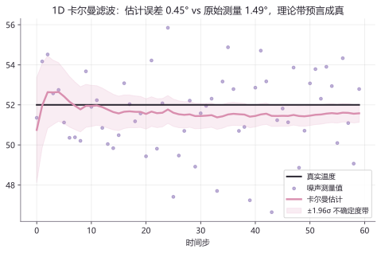
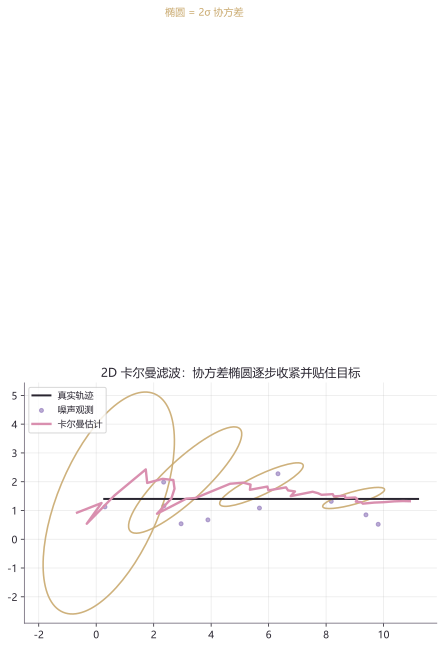

# lab10 · 卡尔曼滤波实验室

> 配套理论：[概率与估计（深层）](../01_数学/60_概率与估计/10_贝叶斯滤波与线性高斯滤波.md)、前置 [lab03 · 粒子滤波](lab03_概率与滤波实验室.md)
> 卡尔曼滤波 = **粒子滤波在线性高斯世界里的精确解**：粒子换成两个矩（均值 + 协方差），采样换成一条更新公式。
> 参考：rlabbe《Kalman and Bayesian Filters in Python》（GitHub 最热门滤波教材）、Bayes Filters Library。

## 实验流程（预测-更新循环的标准画法）





> 读法：**预测**让椭圆变大（运动不确定性 Q），**更新**让椭圆变小（观测信息 R）。两者拉锯，协方差椭圆就一呼一吸地跟着目标走。

## 实验 1：恒温箱测温——滤波为什么优于原始测量

经典教材设定：恒温 52°，温度计每次读数带 σ=1.8° 的噪声。5 行核心公式：

```python
import numpy as np
import matplotlib.pyplot as plt

rng = np.random.default_rng(20)
n = 60
true = np.full(n, 52.0)                 # 恒温真值
z = true + rng.normal(0, 1.8, n)        # 带噪测量

x, P = 50.0, 4.0                        # 初始猜测：50°，不太确定
Q, R = 1e-5, 1.8**2                     # 过程噪声 / 观测噪声
est, band = [], []
for k in range(n):
    P = P + Q                           # 预测：不确定度变大
    K = P / (P + R)                     # 卡尔曼增益：听测量多少
    x = x + K * (z[k] - x)              # 更新均值
    P = (1 - K) * P                     # 更新不确定度
    est.append(x); band.append(1.96 * np.sqrt(P))

est, band = np.array(est), np.array(band)
t = np.arange(n)
plt.plot(t, true, color="#292530", lw=2, label="真实温度")
plt.scatter(t, z, s=14, color="#8166B1", alpha=0.5, label="噪声测量")
plt.plot(t, est, color="#D98FAF", lw=2.4, label="卡尔曼估计")
plt.fill_between(t, est-band, est+band, color="#D98FAF", alpha=0.16,
                 label="±1.96σ 不确定度带")
plt.legend(); plt.title("恒温箱测温"); plt.show()

print("末 10 步滤波误差:", round(float(np.mean(np.abs(est[-10:] - true[-10:]))), 3))
print("末 10 步测量误差:", round(float(np.mean(np.abs(z[-10:] - true[-10:]))), 3))
```



**图怎么读**：紫色散点是每次的原始读数（±1.8° 乱跳）；粉色曲线是滤波估计——**末 10 步平均误差 0.447°，只有原始测量的 1/3**。更妙的是：粉色不确定度带宽度 0.453 与实际误差几乎相等——**理论协方差精确预言了估计误差**，这是卡尔曼滤波最迷人的性质。

**动手改**：
- `Q = 1e-5` 改成 `1e-9`——带收得极窄但估计"僵住"（过度自信）
- 把真值改成缓慢升温 `true = 52 + 0.04*np.arange(n)` 而 Q 不变——估计开始**滞后**于真值（模型错了，Q 太小 = 坚信"温度绝不变"）；这正是过程噪声 Q 的物理意义

## 实验 2：2D 协方差椭圆——"一呼一吸"跟踪目标

匀速目标 + 带噪位置观测，完整 2D KF。看协方差椭圆如何**预测时膨胀、更新后收紧**：

```python
import numpy as np
import matplotlib.pyplot as plt
from matplotlib.patches import Ellipse

dt = 0.2
A = np.array([[1, dt], [0, 1]])         # 匀速模型
H = np.array([[1, 0]])                  # 只观测位置
Q = np.diag([1e-4, 1e-3])
R = np.array([[2.0]])
x = np.array([0.0, 1.0])                # 初始：位置 0，速度 1
P = np.diag([9.0, 4.0])

rng = np.random.default_rng(9)
true_x = np.array([0.0, 1.4])
path, truths, snaps = [], [], []
for k in range(40):
    true_x = A @ true_x
    z = H @ true_x + rng.normal(0, np.sqrt(R[0, 0]))
    x = A @ x                            # 预测
    P = A @ P @ A.T + Q
    if k in (2, 8, 16, 30):
        snaps.append((x.copy(), P.copy()))
    K = P @ H.T @ np.linalg.solve(H @ P @ H.T + R, np.eye(1))
    x = x + (K @ (z - H @ x)).ravel()    # 更新
    P = (np.eye(2) - K @ H) @ P
    path.append(x.copy()); truths.append(true_x.copy())

# —— 可视化：协方差椭圆（2σ）——
for (mx, my), P in snaps:
    vals, vecs = np.linalg.eigh(P[:2, :2])
    o = vals.argsort()[::-1]
    ang = np.degrees(np.arctan2(vecs[1, o[0]], vecs[0, o[0]]))
    plt.gca().add_patch(Ellipse((mx, my), 4*np.sqrt(vals[o[0]]), 4*np.sqrt(vals[o[1]]),
                          angle=ang, fill=False, edgecolor="#C9A96E", lw=1.6))
plt.plot(*np.array(truths).T, color="#292530", lw=2, label="真实轨迹")
plt.plot(*np.array(path).T, color="#D98FAF", lw=2.4, label="卡尔曼估计")
plt.axis("equal"); plt.legend()
plt.title("协方差椭圆逐步收紧"); plt.show()
```



**图怎么读**：四个金圈是第 3/9/17/31 步的 2σ 协方差椭圆——初期大（初始不确定 9 m²）、随观测快速收紧；末步估计误差 0.30，协方差迹从 13.0 降到 0.235。椭圆的长轴方向 = 不确定度最大的方向（我们只测位置不测速度，速度靠位置差分"悟"出来）。

**动手改**：
- `R = np.array([[20.0]])`——观测变差，椭圆收紧变慢（传感器精度决定信息量）
- H 改成同时观测位置和速度（`H = np.eye(2)`，z 相应加噪声）——椭圆立刻塌扁

## 延伸开源项目

| 项目 | 干什么用 |
|---|---|
| [rlabbe/Kalman-and-Bayesian-Filters-in-Python](https://github.com/rlabbe/Kalman-and-Bayesian-Filters-in-Python) | GitHub 最热门滤波教材：免费 Jupyter 书、每章可交互，本实验室的"师父" |
| [rlabbe/filterpy](https://github.com/rlabbe/filterpy) | `filterpy.kalman.KalmanFilter` 就是本页 5 行公式的工业级封装 |
| [pykalman/pykalman](https://github.com/pykalman/pykalman) | 经典卡尔曼/平滑库，API 极简，适合快速原型 |

> 紫樱备注：粒子滤波（lab03）是"非线性/非高斯通吃但费算力"，卡尔曼是"线性高斯下精确解析"——两者在[概率与估计深层章](../01_数学/60_概率与估计/10_贝叶斯滤波与线性高斯滤波.md)里统一于贝叶斯滤波框架。

## 回到理论

回到[概率与估计](../01_数学/60_概率与估计/10_贝叶斯滤波与线性高斯滤波.md)重读"线性高斯滤波"一节，五个公式全部见过面了；SLAM 方向的[因子图与非线性最小二乘](../01_数学/60_概率与估计/50_因子图与非线性最小二乘.md)是它的批量优化形态。
