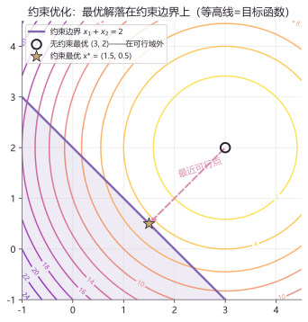
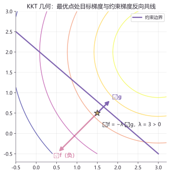

# lab11 · 凸优化实验室

> 配套理论：[凸分析基础（深层）](../01_数学/30_优化理论/10_凸分析基础.md)、[凸优化问题与对偶理论（深层）](../01_数学/30_优化理论/30_凸优化问题与对偶理论.md)
> 教材锚点：Boyd & Vandenberghe《Convex Optimization》（作者官方免费 PDF，第二阶优化主线）
> 本页把优化理论最核心的两组概念画出来：**约束把最优点"推"到边界上**，以及 **KKT 条件的几何意义**。

## 实验流程





## 实验目标问题（全文贯穿）

$$\min_{x}\quad f(x) = (x_1-3)^2 + (x_2-2)^2 \qquad \text{s.t.}\quad x_1 + x_2 \le 2$$

无约束最优在 (3, 2)——在可行域外；解析解为 $x^* = (1.5,\ 0.5)$，$\lambda = 3$。下面用图形与数值双重验证。

## 实验 1：等高线 + 可行域——最优点被"推"上边界

```python
import numpy as np
import matplotlib.pyplot as plt
from matplotlib.patches import Polygon

f = lambda x1, x2: (x1 - 3)**2 + (x2 - 2)**2

g = np.linspace(-1, 4.5, 300)
X1, X2 = np.meshgrid(g, g)
plt.contour(X1, X2, f(X1, X2), levels=14, cmap="plasma_r", alpha=0.75)

feas = Polygon([(-1, -1), (3, -1), (-1, 3)], closed=True,
               color="#8166B1", alpha=0.13)          # 可行域 x1+x2 ≤ 2
plt.gca().add_patch(feas)
plt.plot([-1, 3], [3, -1], color="#8166B1", lw=2.4, label="约束边界 x₁+x₂=2")

plt.scatter(3, 2, s=110, facecolor="none", edgecolor="k", lw=2,
            label="无约束最优 (3, 2) ✗ 不可行")
plt.scatter(1.5, 0.5, color="#C9A96E", s=180, marker="*", zorder=6,
            label="约束最优 x* = (1.5, 0.5)")
plt.annotate("", (1.5, 0.5), (3, 2),
             arrowprops=dict(arrowstyle="-|>", color="#D98FAF", ls="--", lw=2))
plt.axis("equal"); plt.legend(fontsize=8.5)
plt.title("约束把最优点推上边界"); plt.show()
```



**图怎么读**：等高线是一圈圈"海拔"，山顶在 (3, 2)；可行域是左下半平面（紫色浅底）。约束最优 = **从山顶出发往低走、撞到边界墙后沿着墙滑到的最低点**——粉色虚线就是"最近可行点"路径。机器人学里的轨迹约束、力矩上限、避障不等式，全都是这面"墙"。

**动手改**：
- 把约束放宽 `x1 + x2 ≤ 6`——墙移到山顶外面，约束最优退化为无约束最优（**不起作用的约束，λ = 0**）
- 把约束改成非线性 `x1² + x2² ≤ 2`——墙变圆弧，最优点在 (3,2)→原点方向与圆的交点

## 实验 2：KKT 条件的几何——∇f 与 ∇g 反向共线

在最优点 (1.5, 0.5) 处：$\nabla f = (-3, -3)$，$\nabla g = (1, 1)$，两者**恰好反向共线**，$\lambda = 3 > 0$：

```python
import numpy as np

x1, x2, lam = 1.5, 0.5, 3.0                 # 解析解
grad_f = np.array([2*(x1-3), 2*(x2-2)])
grad_g = np.array([1.0, 1.0])

print("① 平稳性  ∇f + λ·∇g =", np.round(grad_f + lam*grad_g, 9))
print("② 原始可行  x1+x2 =", x1+x2, "≤ 2")
print("③ 对偶可行  λ =", lam, "≥ 0")
print("④ 互补松弛  λ·(x1+x2-2) =", lam * (x1+x2-2))
```

四个 KKT 条件全部满足——**数值核对与解析解一致**。



**图怎么读**：在最优点（金星）处，目标函数的下降方向（粉，−∇f）与约束边界的外法向（紫，∇g）**在同一条直线上、方向相反**。如果不是共线，说明还能沿边界滑到更低——所以最优点必须共线。λ = 3 的含义：**约束墙往里推 1 单位，最优代价恶化 3 单位**（灵敏度！工程上判断"哪个约束卡脖子"全靠它）。

**动手改**：
- 约束改成 `x1 + x2 ≤ 4`——代入解析解重算 λ，观察 λ 随约束松紧的变化
- 加第二条约束 `x1 ≤ 1`——两条墙同时起作用时，平稳性变成 ∇f + λ₁∇g₁ + λ₂∇g₂ = 0（多约束 KKT）

## 延伸开源项目

| 项目 | 干什么用 |
|---|---|
| [cvxgrp/cvx_book](https://web.stanford.edu/~boyd/cvxbook/) | Boyd《Convex Optimization》官方免费 PDF+幻灯片，本页全程对齐其第 2/5 章 |
| [cvxpy/cvxpy](https://github.com/cvxpy/cvxpy) | 一行 `Problem(Minimize(...), [约束])` 求解本页问题，机器人规控建模主流工具 |
| [osqp/osqp](https://github.com/osqp/osqp) | 工业级 QP 求解器（OSQP），足式 MPC 每步都在解这种问题 |

## 回到理论

回到[凸分析基础](../01_数学/30_优化理论/10_凸分析基础.md)重读凸集/凸函数定义（本页的等高线"山"是凸的吗？为什么保证局部=全局？），再到[凸优化问题与对偶理论](../01_数学/30_优化理论/30_凸优化问题与对偶理论.md)看 λ 的对偶解读——约束的影子价格。
