# lab12 · C++ 工程实验室：类与 STL 写一个位姿小库

> C++ 筑基篇的「类与对象」「STL 容器与算法」在这里合成一个 80 行就能跑的小工程：
> 用 `struct` 封装 2D 位姿、用 `vector` + `sort` 管理轨迹点、用 `assert` 做单元测试——
> 这正是机器人工程里每天都在写的三类代码。

## 为什么值得做

- **理论侧**：类与对象（50 章）讲「图纸与实体」，STL（60 章）讲「容器与算法」——单独看都抽象；
- **实践侧**：位姿（Pose）是导论章「坐标变换」的 C++ 化身，`compose` 就是 $T_{ab} \cdot T_{bc}$ 的代码版；
- **验证侧**：本站所有 C++ 代码都先在本地编译运行、断言通过后才写进教程——你现在看到的每个输出都是实测。





## 环境准备（一次即可）

本仓库的 Python 环境里装了 `ziglang`（自带 C++ 编译器，无需另装 MinGW）：

```bash
pip install ziglang          # 本仓库 .venv 已装好
```

没有 zig 的机器用任何 C++17 编译器等价替换：`g++ -std=c++17 -O2 lab12_pose.cpp -o lab12_pose`。

## 实验 1 + 2 + 3：完整代码（可直接复制）

把下面整段存成 `lab12_pose.cpp`：

```cpp
#include <algorithm>
#include <cassert>
#include <cmath>
#include <iostream>
#include <vector>

// ---------- 实验 1：Pose2D 类（数据抽象 + 成员函数 + const 正确性） ----------
struct Pose2D {
    double x = 0.0, y = 0.0, theta = 0.0;   // 位置 + 朝向（弧度）

    // 复合：先做自身变换，再做 p 的变换（对应 T_ab * T_bc 的语义）
    Pose2D compose(const Pose2D& p) const {
        Pose2D r;
        r.x = x + p.x * std::cos(theta) - p.y * std::sin(theta);
        r.y = y + p.x * std::sin(theta) + p.y * std::cos(theta);
        r.theta = theta + p.theta;
        return r;
    }

    // 平移一小步（机器人视角的"前进"）
    Pose2D forward(double d) const {
        return compose(Pose2D{d, 0.0, 0.0});
    }
};

// 旋转矩阵作用于点（和导论章手推的 R 一致）
std::pair<double, double> rotate(double th, double px, double py) {
    double c = std::cos(th), s = std::sin(th);
    return {c * px - s * py, s * px + c * py};
}

// ---------- 实验 2：STL 容器与算法管理轨迹 ----------
struct Waypoint {
    double x, y, cost;
};

double path_length(const std::vector<Waypoint>& wps) {
    double total = 0.0;
    for (size_t i = 1; i < wps.size(); ++i) {
        double dx = wps[i].x - wps[i - 1].x;
        double dy = wps[i].y - wps[i - 1].y;
        total += std::sqrt(dx * dx + dy * dy);
    }
    return total;
}

int main() {
    // ---- 断言组 1：旋转保长度（|R p| == |p|）----
    auto [rx, ry] = rotate(M_PI / 3.0, 2.0, 0.6);
    assert(std::abs(std::sqrt(rx * rx + ry * ry) - std::sqrt(2.0 * 2.0 + 0.6 * 0.6)) < 1e-12);

    // ---- 断言组 2：位姿复合满足结合律 ----
    Pose2D a{1.0, 0.0, 0.5}, b{0.0, 2.0, -0.3}, c{0.5, 0.5, 0.1};
    Pose2D ab_c = a.compose(b).compose(c);
    Pose2D a_bc = a.compose(b.compose(c));
    assert(std::abs(ab_c.x - a_bc.x) < 1e-12);
    assert(std::abs(ab_c.y - a_bc.y) < 1e-12);

    // ---- 断言组 3：forward 等价于复合一个平移 ----
    Pose2D origin;
    Pose2D moved = origin.forward(3.0);
    assert(std::abs(moved.x - 3.0) < 1e-12 && std::abs(moved.y) < 1e-12);

    // ---- 实验 2：轨迹管理（vector + sort + 数值验证） ----
    std::vector<Waypoint> wps = {
        {0.0, 0.0, 1.2}, {3.0, 4.0, 0.7}, {3.0, 0.0, 2.1},
        {6.0, 0.0, 0.4}, {6.0, 8.0, 1.9},
    };

    // 按 cost 从低到高排序（lambda 比较器）
    std::sort(wps.begin(), wps.end(),
              [](const Waypoint& a, const Waypoint& b) { return a.cost < b.cost; });
    std::cout << "按 cost 排序后前两个: (" << wps[0].x << ", " << wps[0].y
              << ") cost=" << wps[0].cost << " | (" << wps[1].x << ", " << wps[1].y
              << ") cost=" << wps[1].cost << "\n";

    // 机器人沿 45° 朝向连续前进：位姿链
    Pose2D robot;
    for (int i = 0; i < 5; ++i) {
        robot = robot.forward(1.0);                     // 直走
        robot = robot.compose(Pose2D{0, 0, M_PI / 4});  // 原地左转 45°
    }
    std::cout << "五步走+转后位姿: x=" << robot.x << " y=" << robot.y
              << " theta=" << robot.theta << " (rad)\n";

    // 轨迹总长（原始顺序）
    std::vector<Waypoint> ordered = {
        {0.0, 0.0, 0}, {3.0, 4.0, 0}, {3.0, 0.0, 0}, {6.0, 0.0, 0}, {6.0, 8.0, 0},
    };
    std::cout << "轨迹总长: " << path_length(ordered) << " （手算应为 5+4+3+8=20）\n";

    // 数值自检：3-4-5 直角三角形
    assert(std::abs(path_length(ordered) - 20.0) < 1e-9);

    std::cout << "全部断言通过 ✓\n";
    return 0;
}
```

## 编译与运行（实测输出）

```bash
python -m ziglang c++ lab12_pose.cpp -o lab12_pose   # 或 g++ -std=c++17
./lab12_pose                                          # Windows 下为 lab12_pose.exe
```

实测输出（本站发布前在本地跑通）：

```text
按 cost 排序后前两个: (6, 0) cost=0.4 | (3, 4) cost=0.7
五步走+转后位姿: x=0 y=2.41421 theta=3.92699 (rad)
轨迹总长: 20 （手算应为 5+4+3+8=20）
全部断言通过 ✓
```

## 输出怎么读

- **排序行**：`sort` + lambda 把 cost 最低的两个点排到最前——这就是 60 章 STL 的日常用法；
- **位姿行**：`x=0` 不是 bug！五次「直走 1 米 + 左转 45°」的朝向依次是 0°/45°/90°/135°/180°，
  x 位移 $= 1+0.707+0-0.707-1 = 0$，y 位移 $= 0+0.707+1+0.707+0 = 2.414$——乌龟画图的老朋友；
- **theta=3.927 rad** ≈ 225°，即 5 × 45°；
- **轨迹总长 20**：$3\text{-}4\text{-}5$ 直角三角形 × 2 段 + 3 + 8，断言兜底。

## 动手改

1. 把原地旋转从 45° 改成 90°（`M_PI / 2`）——五步后 x、y 会变成多少？先手算再跑；
2. 给 `Waypoint` 加 `name` 字段，排序后按 `"({x},{y}) name"` 格式打印；
3. 用 `std::accumulate` 重写 `path_length`（提示：需要 `#include <numeric>`，保留上一个点的引用）；
4. 把 `assert` 换成输出错误并 `return 1` 的显式检查——想想断言在生产构建（`-DNDEBUG`）下会被剥掉意味着什么。

## 配套理论章节

| 本实验用到 | 理论章节 |
|---|---|
| struct / 成员函数 / const 引用 | [50 · 类与对象初步](../02_C++基础与进阶/00_入门/50_类与对象初步.md) |
| vector / sort / lambda | [60 · STL 容器算法与实战小项目](../02_C++基础与进阶/00_入门/60_STL容器算法与实战小项目.md) |
| 位姿复合 = T 矩阵相乘 | [20 · 空间描述与坐标变换](../07_机器人学导论/20_空间描述与坐标变换.md) |

## 开源项目延伸

- [fmtlib/fmt](https://github.com/fmtlib/fmt)：现代 C++ 格式化事实标准（`std::format` 的前身），读它的 API 设计学「值语义」；
- [catch2](https://github.com/catchorg/Catch2)：头文件即用的测试框架——本实验的 `assert` 升级方向；
- [Eigen](https://github.com/eigen-mirror/eigen)：机器人学的线性代数库，`Pose2D` 的工业级答案（矩阵化、编译期维度检查）。
